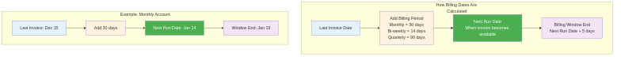
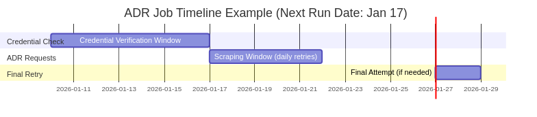
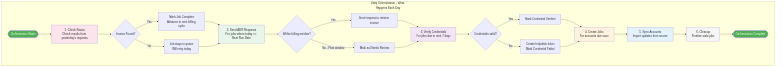
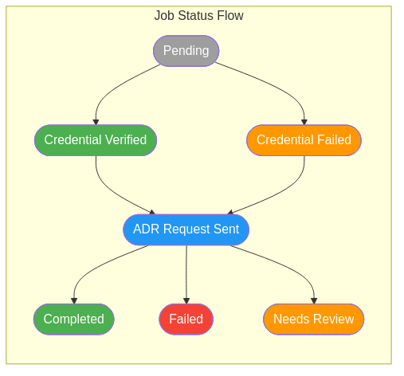

# ADR (Automated Data Retrieval) User Guide

## Overview

The Automated Data Retrieval (ADR) system automates the process of retrieving billing documents (invoices) from vendor portals. Instead of manually logging into each vendor's website to download invoices, the ADR system handles this automatically based on each account's billing cycle.

## How It Works

The ADR process runs daily and follows a 6-step workflow:

## Timing and Scheduling

The system calculates when to process each account based on billing patterns:

### Example Timeline

For an account with Next Run Date of January 17:

| Phase | Dates | What Happens |
|-------|-------|--------------|
| Credential Check | Jan 10-16 | Verify login credentials work (7 days before) |
| ADR Requests | Jan 17-21 | Send daily requests until invoice found |
| Final Retry | Jan 27-28 | One last attempt if still not found |

## Daily Orchestration Flow

Each day, the orchestration runs through these steps in order:

The order is important:
1. **Check Status First** - See if yesterday's requests succeeded before sending new ones
2. **Send ADR Requests** - Only for jobs that still need processing
3. **Verify Credentials** - For accounts coming due in the next 7 days
4. **Create Jobs** - For accounts that are now due
5. **Sync Accounts** - Import any updates from the source system
6. **Cleanup** - Finalize any stale jobs

### Step 1: Sync Accounts
The system imports vendor account information from the source database. This includes account numbers, vendor codes, and billing patterns. Accounts that have been manually corrected are preserved during sync.

### Step 2: Create Jobs
The system identifies which accounts are due for invoice retrieval based on their billing cycle. A "job" is created for each account that needs processing. Accounts marked as "Missing" (requiring research) are skipped.

### Step 3: Verify Credentials
Seven days before an account's billing date, the system verifies that the login credentials are still valid. If credentials fail, a helpdesk ticket is automatically created for the Customer Service team to update them.

### Step 4: Send ADR Requests
On the billing date, the system sends requests to retrieve the invoice documents. Requests are sent daily until either the invoice is found or the billing window closes.

### Step 5: Check Status
The system monitors the status of all pending requests. When an invoice is successfully retrieved, the job is marked as complete.

### Step 6: Cleanup
Jobs that are stuck in pending status past their billing window are finalized to prevent them from blocking future processing.

## Job Status Flow

Each job progresses through several statuses:

| Status | Description |
|--------|-------------|
| Pending | Job created, waiting for credential verification |
| Credential Verified | Login credentials confirmed working |
| Credential Failed | Login credentials need attention (helpdesk notified) |
| ADR Request Sent | Invoice retrieval request submitted |
| Completed | Invoice successfully retrieved |
| Failed | Unable to retrieve invoice after all retries |
| Needs Review | Requires manual investigation |

## Using the ADR Pages

### ADR Monitor
The Monitor page shows the current orchestration status and recent run history. Use this page to:
- See if an orchestration is currently running
- View progress of each step
- Check results of recent orchestration runs
- Start a new orchestration run (requires Execute permission)

### ADR Accounts
The Accounts page displays all vendor accounts in the system. Use this page to:
- Search for specific accounts by account number, vendor, or client
- View billing patterns and next scheduled run dates
- Edit billing information for accounts with incorrect data
- See which accounts have been manually overridden
- Export account data to Excel or CSV

### ADR Jobs
The Jobs page shows all invoice retrieval jobs. Use this page to:
- Filter jobs by status, vendor, or date range
- View job details and execution history
- Refire failed jobs for another attempt
- Check the status of pending requests
- Export job data to Excel or CSV

### ADR Rules
The Rules page manages scheduling rules for accounts. Use this page to:
- View and edit when accounts should be processed
- Set custom billing windows for specific accounts
- Enable or disable processing for individual accounts

### ADR Blacklist
The Blacklist page manages exclusions from ADR processing. Use this page to:
- Exclude specific vendors, accounts, or credentials
- Set date ranges for temporary exclusions
- View current and upcoming blacklist entries

## Email Notifications

The system sends email notifications for:

**Orchestration Summary** (sent to operations team)
- Sent at the end of each orchestration run if there were any failures
- Includes a summary of successes and failures for each step
- Detailed error list attached as a text file

**500 Error Notifications** (sent to technical team)
- Sent when unexpected system errors occur
- Includes error details and stack trace for debugging

Notification recipients are configured in Admin > ADR Configuration.

## December 2025 Features

- **Blacklist Status Indicators**: Accounts and Jobs pages show visual indicators for blacklisted items
- **Chart Click Events**: Click on chart segments to filter the Jobs page by that status
- **Sortable Grids**: Click column headers to sort data
- **User Timezone Preference**: Dates display in your preferred timezone
- **Excel/CSV Export**: Export data from all ADR pages

## January 2026 Features

- **Test Mode**: Administrators can limit ADR requests during testing (warning banners displayed when active)
- **Email Notifications**: Configurable email alerts for failures and errors
- **Account Rules**: Fine-grained control over when specific accounts are processed
- **Vendor Code Hierarchy**: Support for Primary and Master vendor codes
- **Step Duration Display**: Monitor page shows how long each step took
- **User Profile Menu**: Quick access to your profile and logout

## Permissions

Access to ADR features is controlled by permissions:

| Permission | Description |
|------------|-------------|
| adr:view | View ADR accounts, jobs, and monitor |
| adr:edit | Edit account billing data and manual overrides |
| adr:execute | Start orchestration runs and refire jobs |

Contact your administrator if you need additional permissions.

## Getting Help

If you encounter issues with the ADR system:
1. Check the Monitor page for recent orchestration errors
2. Review the Jobs page for specific job failures
3. Contact the helpdesk for credential-related issues
4. Contact the technical team for system errors

For questions about this documentation, contact your system administrator.
