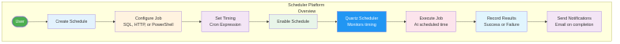
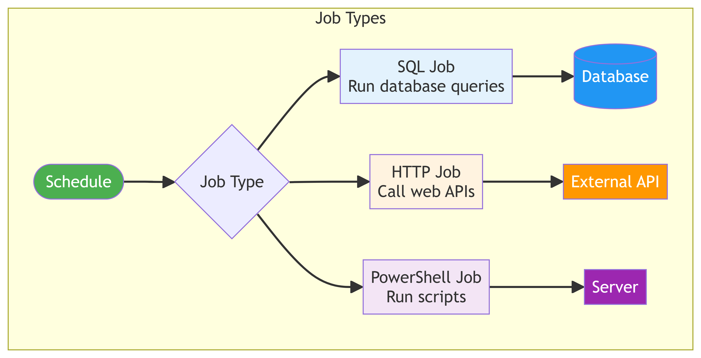
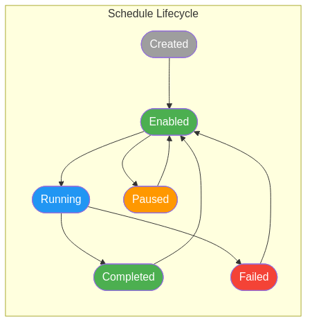
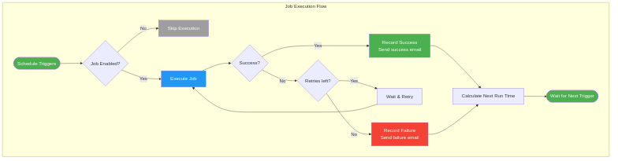

# Scheduler Platform User Guide

## Overview

The Scheduler Platform is an enterprise job scheduling system that automates recurring tasks. Instead of manually running reports, database queries, or API calls, you can create schedules that run automatically at specified times.

## How It Works

The Scheduler Platform uses Quartz.NET to manage job timing and execution:

### Key Concepts

**Schedule**: A definition of what to run and when to run it. Each schedule includes:
- A name and description
- The type of job (SQL, HTTP, or PowerShell)
- The job configuration (query, URL, or script)
- A timing pattern (cron expression)
- Notification settings

**Job Execution**: A record of a single run of a schedule. Each execution tracks:
- Start and end time
- Success or failure status
- Output or error messages
- Who triggered it (system or manual)

**Client**: An organizational unit for grouping schedules. Users can only see schedules for their assigned client(s).

## Job Types

The platform supports three types of jobs:

| Type | Description | Use Cases |
|------|-------------|-----------|
| SQL Job | Runs database queries | Reports, data cleanup, aggregations |
| HTTP Job | Calls web APIs | External integrations, webhooks |
| PowerShell Job | Runs scripts | Server maintenance, file operations |

## Schedule Lifecycle

Schedules move through different states:

| State | Description |
|-------|-------------|
| Created | Schedule defined but not yet enabled |
| Enabled | Schedule is active and will run at scheduled times |
| Running | Job is currently executing |
| Completed | Job finished successfully |
| Failed | Job encountered an error |
| Paused | Schedule temporarily disabled |

## Job Execution Flow

When a schedule triggers, the system follows this process:

1. **Trigger**: The scheduled time arrives
2. **Check**: Verify the schedule is enabled
3. **Execute**: Run the job (SQL, HTTP, or PowerShell)
4. **Result**: Determine success or failure
5. **Retry**: If failed and retries remain, wait and try again
6. **Record**: Save the execution results
7. **Notify**: Send email notifications if configured
8. **Next**: Calculate the next run time

## Using the Scheduler Pages

### Dashboard
The Dashboard shows an overview of recent activity:
- Upcoming scheduled jobs
- Recent execution results
- Success/failure statistics
- ADR metrics (if applicable)

### Schedules
The Schedules page is where you manage your scheduled jobs:
- **View**: See all schedules with their status and next run time
- **Create**: Add new schedules with the job configuration wizard
- **Edit**: Modify existing schedules (timing, configuration, notifications)
- **Trigger**: Manually run a schedule immediately
- **Pause/Resume**: Temporarily disable or re-enable a schedule
- **Delete**: Remove schedules (system schedules cannot be deleted)
- **Export**: Download schedule data to Excel or CSV

### Executions
The Executions page shows the history of job runs:
- **View**: See all execution records with status and timing
- **Filter**: Search by schedule, status, or date range
- **Details**: View output, errors, and stack traces
- **Cancel**: Stop a running execution
- **Retry**: Re-run a failed execution
- **Export**: Download execution history to Excel or CSV

### Admin Pages
Admin pages are available to administrators only:

**Users**: Manage user accounts and permissions
- Create and edit users
- Assign roles (Viewer, Editor, Admin, Super Admin)
- Set client access
- Reset passwords

**API Logs**: View application logs for troubleshooting
- Search log files
- View recent errors
- Download log files

**ADR Configuration**: Configure ADR system settings (see ADR User Guide)

## Cron Expressions

Schedules use cron expressions to define timing. Common examples:

| Expression | Description |
|------------|-------------|
| `0 0 * * *` | Every day at midnight |
| `0 8 * * 1-5` | Every weekday at 8:00 AM |
| `0 0 1 * *` | First day of every month at midnight |
| `0 */15 * * *` | Every 15 minutes |
| `0 9 * * 1` | Every Monday at 9:00 AM |

The platform includes a cron expression builder to help create these patterns.

## System Schedules

Some schedules are marked as "System" schedules. These are critical to platform operations:
- **Cannot be deleted** by any user
- **Can be edited** for timing adjustments only
- **Can be enabled/disabled** as needed

Examples of system schedules:
- ADR Full Cycle (runs the ADR orchestration)
- Data Archival (moves old data to archive tables)
- Log Cleanup (removes old log files)

## Email Notifications

Schedules can be configured to send email notifications:
- **On Success**: Email when job completes successfully
- **On Failure**: Email when job fails (recommended)
- **Recipients**: Configure who receives notifications

## Permissions

Access to scheduler features is controlled by roles:

| Role | Capabilities |
|------|--------------|
| Viewer | View schedules and executions |
| Editor | Create and edit schedules |
| Admin | Manage users, view logs, configure settings |
| Super Admin | Full access to all features |

## December 2025 Features

- **Sortable Grid Headers**: Click column headers to sort data
- **User Timezone Preference**: Dates display in your preferred timezone
- **Excel/CSV Export**: Export data from Schedules and Executions pages
- **System Schedule Protection**: Critical schedules protected from deletion
- **API Key Authentication**: Secure service-to-service communication

## January 2026 Features

- **Email Notifications**: Configurable alerts for 500 errors and failures
- **User Profile Menu**: Quick access to profile settings and logout
- **Improved Session Handling**: Better warnings when session is expiring
- **Custom Favicon**: New browser tab icon

## Getting Help

If you encounter issues:
1. Check the Executions page for error details
2. Review the Admin > API Logs for system errors
3. Contact your administrator for permission issues
4. Contact the technical team for system errors

For questions about this documentation, contact your system administrator.
