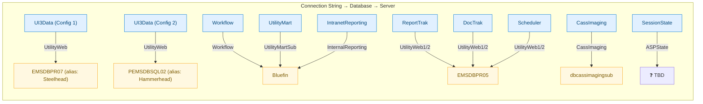
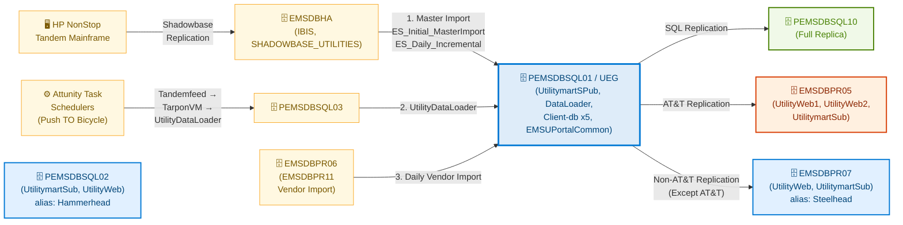
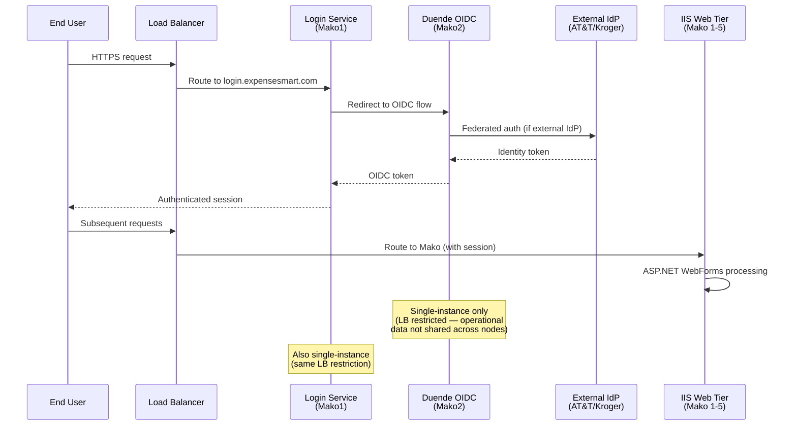
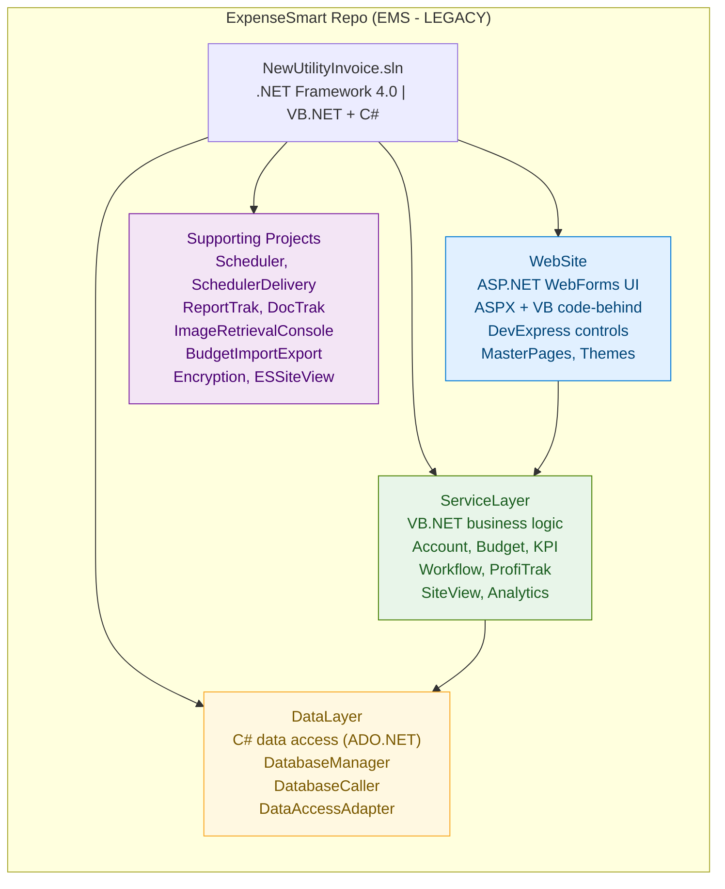

# Expensesmart 1.0 — On-Premises Server Architecture (Mermaid)

> **Cass Information Systems** | **EMS-IBIS / Utilities Division** | All On-Premises (No Azure) | IBIS Legacy Codebase
>
> Technology: ASP.NET Web Forms (VB.NET) | .NET Framework 4.0 | IIS | SQL Server
>
> Generated: March 2026

---

## Full Architecture Overview

```mermaid
graph TB
    %% ===== STYLES =====
    classDef web fill:#E1F0FF,stroke:#0078D4,stroke-width:2px,color:#004578
    classDef lb fill:#FFF0E0,stroke:#D83B01,stroke-width:2px,color:#8B2500
    classDef auth fill:#F3E5F5,stroke:#7B1FA2,stroke-width:2px,color:#4A0072
    classDef db fill:#FFF8E1,stroke:#F9A825,stroke-width:2px,color:#7A5900
    classDef dbhub fill:#DEECF9,stroke:#0078D4,stroke-width:3px,color:#004578
    classDef dbreplica fill:#F0F9E8,stroke:#498205,stroke-width:3px,color:#498205
    classDef cache fill:#E0F7FA,stroke:#00B7C3,stroke-width:2px,color:#006064
    classDef file fill:#E8F5E9,stroke:#498205,stroke-width:2px,color:#1B5E20
    classDef ext fill:#FFF3E0,stroke:#E65100,stroke-width:2px,color:#BF360C
    classDef deploy fill:#ECEFF1,stroke:#546E7A,stroke-width:2px,color:#263238
    classDef test fill:#F3E5F5,stroke:#8E24AA,stroke-width:2px,color:#4A148C
    classDef ssrs fill:#FCE4EC,stroke:#C62828,stroke-width:2px,color:#880E4F
    classDef unknown fill:#FAFAFA,stroke:#999,stroke-width:1px,stroke-dasharray:5 5,color:#888

    %% ===== END USERS =====
    Users["👤 End Users<br/>(40+ Client Orgs: AT&T, Kroger, etc.)"]

    %% ===== AUTH LAYER =====
    subgraph AUTH["🔐 Authentication & SSO Layer"]
        direction TB
        AUTH_NOTE["Duende IdentityServer handles OIDC for<br/>Expensesmart (EMS-IBIS/Utilities Division).<br/>Single-instance per component (LB restricted)."]

        subgraph AUTH_PROD["🟢 Production Auth"]
            DuendeOIDC["🔐 Duende OIDC<br/>oidc.expensesmart.com<br/>Running on Mako2 (single instance)<br/>Clients: UtilityWeb.dbo.ClientSecurity"]
            LoginSvc["🔒 Login Service<br/>login.expensesmart.com/Home/SsoRedirect<br/>Running on Mako1 (single instance)<br/>SSO redirect / OIDC flow caller"]
        end

        subgraph AUTH_TEST["🟣 Non-Prod Auth (Acme14)"]
            DuendeUAT["🔐 Duende OIDC (UAT)<br/>oidc.uat.expensesmart.com<br/>Running on Acme14"]
            LoginUAT["🔒 Login Service (UAT)<br/>login.uat.expensesmart.com/Home/SsoRedirect<br/>Running on Acme14"]
            TokenGen["🔒 SSO Test Token Generator<br/>Config: //hyde/sso/appsettings.json<br/>Generates test tokens for development"]
        end

        DuendeRepo["Duende Repo: dev.azure.com/CassInfoSys/<br/>Enterprise-Shared/_git/<br/>enterprise.services.authentication.duende"]
        ADR_NOTE["📝 Note: Enterprise ADR Scheduler<br/>(Scheduler_Platform) also links to<br/>Duende OIDC — shared Azure AD source"]
    end

    %% ===== LOAD BALANCER =====
    LB["⚙️ Load Balancer<br/>(Make/model TBD)<br/>Routes to Mako web servers"]

    %% ===== PRODUCTION WEB TIER =====
    subgraph WEB["🏠 Production Web Tier — IIS Servers"]
        direction TB
        subgraph WEB_GENERAL["General Clients (Load Balanced)"]
            Mako1["🖥️ Mako1 [LB]<br/>IIS — Expensesmart WebForms<br/>All clients except AT&T"]
            Mako2["🖥️ Mako2 [LB]<br/>IIS — Expensesmart WebForms<br/>+ Duende OIDC host<br/>All clients except AT&T"]
            Mako3["🖥️ Mako3 [LB]<br/>IIS — Expensesmart WebForms<br/>All clients except AT&T"]
        end
        subgraph WEB_ATT["AT&T Dedicated (Load Balanced)"]
            Mako4["🖥️ Mako4 [AT&T LB]<br/>IIS — Expensesmart WebForms<br/>AT&T only (dedicated)<br/>IdP: sailpoint.cso.att.com"]
            Mako5["🖥️ Mako5 [AT&T LB]<br/>IIS — Expensesmart WebForms<br/>AT&T only (dedicated)"]
        end
    end

    %% ===== TEST ENVIRONMENT =====
    subgraph TEST_ENV["🔧 Test Environment — Acme14"]
        direction TB
        Acme14["🖥️ Acme14 [NON-PROD]<br/>Test / UAT / Development Server"]
        Acme14_URLs["CASS Test URLs:<br/>:6002/ (web), :6001/webapi-identity<br/>:6010/account/login, :6001/metadata<br/>Duende: :6011/signin-oidc<br/>Other: :6003/signin-oidc"]
        EMSDBDEV02["🗄️ EMSDBDEV02 [DEV DB]<br/>All test databases on one server<br/>DBs: UtilityWeb, Workflow,<br/>CassImaging, UtilityMartPub,<br/>InternalReporting, ASPState"]
    end

    %% ===== PRODUCTION SQL TOPOLOGY =====
    subgraph SQL["🗄️ Production SQL Server Topology"]
        direction TB

        subgraph FEEDERS["Source / Feeder Servers"]
            HPTandem["🖥️ HP NonStop | Tandem<br/>Mainframe Source"]
            EMSDBHA["🗄️ EMSDBHA [SOURCE]<br/>Core EMS / Shadowbase<br/>DBs: IBIS, SHADOWBASE_UTILITIES<br/>(Fed from HP NonStop)"]
            EMSDBPR06["🗄️ EMSDBPR06 [FEEDER]<br/>Daily Vendor Import<br/>DB: EMSDBPR11 Vendor Import"]
            PEMSDBSQL03["🗄️ PEMSDBSQL03 [FEEDER]<br/>Attunity / Tandem Feed<br/>Attunity Task Schedulers<br/>(Push TO Bicycle)<br/>Tandemfeed → TarponVM →<br/>UtilityDataLoader"]
        end

        subgraph HUB["Central Processing Hub"]
            PEMSDBSQL01["🗄️ PEMSDBSQL01 / UEG [PRIMARY]<br/>Central Processing Hub<br/>Procs: ES_Initial_MasterImport,<br/>ES_Daily_Incremental_Delete_Load<br/>DBs: UtilitymartSPub, DataLoader,<br/>Client-db (x5), EMSUPortalCommon"]
            PEMSDBSQL10["🗄️ PEMSDBSQL10 [REPLICA]<br/>Full Replica (SQL Replication)<br/>Mirrors all Expensesmart databases<br/>DBs: DataLoader, Client-db (x5),<br/>EMSUPortalCommon"]
        end

        subgraph REPL["Downstream Replication Targets"]
            EMSDBPR05["🗄️ EMSDBPR05 [AT&T REPLICATION]<br/>AT&T-Specific Data<br/>DBs: UtilityWeb1, UtilityWeb2,<br/>UtilitymartSub"]
            EMSDBPR07["🗄️ EMSDBPR07 [REPLICATION]<br/>All Clients Except AT&T<br/>DBs: UtilityWeb, UtilitymartSub<br/>(DNS alias: Steelhead)"]
            PEMSDBSQL02["🗄️ PEMSDBSQL02<br/>App Data (Alternate / Failover)<br/>DBs: UtilitymartSub, UtilityWeb<br/>(DNS alias: Hammerhead)"]
        end

        subgraph OTHER_DB["Other Production Database Servers"]
            Bluefin["🗄️ Bluefin<br/>Workflow & Analytics<br/>DBs: Workflow, UtilityMartSub,<br/>InternalReporting"]
            dbcassimaging["🗄️ dbcassimagingsub<br/>Image Storage<br/>DB: CassImaging"]
        end

        subgraph SSRS_TIER["Reporting Services (SSRS)"]
            SQLDEV02["📊 SQLDEV02 [TEST]<br/>SSRS Report Server (Dev/Test)<br/>http://SQLDEV02:80/ReportServer<br/>ReportingService2005 SOAP<br/>NTLM auth"]
            SSRSProd["📊 SSRS Prod Server [PROD]<br/>Server name TBD<br/>ReportTrak uses UtilityWeb<br/>DB on EMSDBPR05"]
            SSRS_TBD["❓ TBD Items<br/>ASPState server (prod),<br/>Prod SSRS server name"]
        end
    end

    %% ===== ETL PIPELINE =====
    subgraph ETL["🔄 Data Processing Flow (Updated March 2026)"]
        direction LR
        ETL1["1️⃣ HP NonStop → EMSDBHA<br/>Shadowbase replication from<br/>Tandem mainframe"]
        ETL2["2️⃣ Attunity → PEMSDBSQL03<br/>Task Schedulers push<br/>Tandemfeed → TarponVM →<br/>UtilityDataLoader"]
        ETL3["3️⃣ EMSDBHA → PEMSDBSQL01<br/>Master Import + Daily<br/>Incremental into central hub"]
        ETL4["4️⃣ EMSDBPR06 → PEMSDBSQL01<br/>Daily Vendor Import<br/>(EMSUPortalCommon)"]
        ETL5["5️⃣ PEMSDBSQL01 → EMSDBPR05<br/>AT&T replication<br/>(UtilityWeb1/2, UtilitymartSub)"]
        ETL6["6️⃣ PEMSDBSQL01 → EMSDBPR07<br/>All other clients replication<br/>(UtilityWeb, UtilitymartSub)"]
    end

    %% ===== SUPPORTING INFRASTRUCTURE =====
    subgraph INFRA["🔧 Supporting Infrastructure"]
        direction TB
        Bonefish["⚡ Bonefish<br/>Data Cache Server<br/>DataCacheHost: port 22233"]
        B2T57V1["📁 B2T57V1<br/>Document Drop-off (DocBroker)<br/>\\B2T57V1\TempViewImage"]
        WebDev01New["📁 WebDev01New<br/>Build Output / Stored Docs<br/>\\WebDev01New\StoredDocuments"]
        NControl["📁 N:\nCONTROL<br/>Client File Share<br/>Active Clients + Report backups"]
        PerfTestWeb["📁 perftestweb02<br/>CommPortal Server<br/>http://perftestweb02:18077/"]
        Hyde16["🔧 Hyde16<br/>On-Prem Build Agent (ADO)<br/>Pool: OnPrem Hyde16 / CoLo<br/>SSO config: //hyde/sso/"]
        SMTP["📧 smtp.cassinfo.com<br/>SMTP Email Server<br/>Port 25, no SSL<br/>From: scheduler@cassinfo.com"]
        PrivPromo["🔒 privpromotion.cassibisint.com<br/>Privilege Escalation Portal<br/>ADO ticket on EMS-IBIS board"]
    end

    %% ===== EXTERNAL INTEGRATIONS =====
    subgraph EXT["🔗 External Integrations & Third-Party Services"]
        direction TB
        BillInfo["🌐 BillInfo<br/>billinfo.com/Login/LoginUser/<br/>documentviewer.billinfo.com<br/>Document viewer integration"]
        ATTIdP["🔐 AT&T IdP<br/>sailpoint.cso.att.com<br/>mylogins.cso.att.com<br/>OIDC: oidc.idp.elogin.att.com"]
        KrogerIdP["🔐 Kroger IdP<br/>PingOne Discovery endpoint<br/>auth.pingone.com/..."]
        ADRScheduler["🔄 ADR Scheduler<br/>Enterprise ADR (Scheduler_Platform)<br/>Links to Duende OIDC endpoint<br/>Shared Azure AD source"]
        JaxAPI["⚙️ jaxapi (JAX API)<br/>jaxapidev / jaxapistag / jaxapiprod<br/>External API integration layer"]
    end

    %% ===== DEPLOYMENT PIPELINE =====
    subgraph DEPLOY["🚀 Deployment Pipeline"]
        direction LR
        Dev["💻 Developer<br/>Visual Studio<br/>VB.NET / ASP.NET"]
        PR["🔄 PR to Dev Branch<br/>Azure DevOps<br/>EMS - LEGACY project"]
        ADOBuild["⚙️ ADO Build<br/>OnPrem Hyde16<br/>agent pool"]
        BuildOut["📂 WebDev01New<br/>Build artifact<br/>published here"]
        ManualPub["📦 Manual Publish<br/>Zip from VS<br/>+ web.config edits"]
        IISDeploy["🌐 IIS Deploy<br/>Mako 1-5<br/>Manual IIS update"]
    end

    %% ===== APPLICATION STRUCTURE =====
    subgraph APP["📄 Application Structure (ExpenseSmart Repo)"]
        direction LR
        APP_INFO["Repo: dev.azure.com/CassInfoSys/EMS - LEGACY/_git/ExpenseSmart<br/>Solution: NewUtilityInvoice.sln | .NET Framework 4.0 | VB.NET + C#"]
        WebSite["WebSite<br/>ASP.NET WebForms UI<br/>ASPX + VB code-behind<br/>DevExpress, MasterPages"]
        ServiceLayer["ServiceLayer<br/>VB.NET business logic<br/>Account, Budget, KPI<br/>Workflow, ProfiTrak"]
        DataLayer["DataLayer<br/>C# data access (ADO.NET)<br/>DatabaseManager<br/>DatabaseCaller"]
        SupportProj["Supporting Projects<br/>Scheduler, SchedulerDelivery<br/>ReportTrak, DocTrak<br/>ImageRetrievalConsole<br/>BudgetImportExport"]
    end

    %% ===== CONNECTIONS =====

    %% Request Flow
    Users -->|"HTTPS"| AUTH
    Users -->|"HTTPS"| LB
    DuendeOIDC -.->|"OIDC tokens"| LB
    LoginSvc -.->|"SSO redirect"| DuendeOIDC
    LB -->|"Route"| Mako1
    LB -->|"Route"| Mako2
    LB -->|"Route"| Mako3
    LB -->|"Route (AT&T)"| Mako4
    LB -->|"Route (AT&T)"| Mako5

    %% Web to DB
    Mako1 -->|"SQL"| EMSDBPR07
    Mako1 -->|"SQL"| Bluefin
    Mako1 -->|"SQL"| dbcassimaging
    Mako2 -->|"SQL"| EMSDBPR07
    Mako3 -->|"SQL"| EMSDBPR07
    Mako4 -->|"SQL"| EMSDBPR07
    Mako5 -->|"SQL"| EMSDBPR07

    %% Web to Cache/File
    Mako1 -.->|"Cache"| Bonefish
    Mako2 -.->|"Cache"| Bonefish
    Mako3 -.->|"Cache"| Bonefish

    %% Web to External
    Mako1 -.->|"API"| BillInfo
    Mako1 -.->|"API"| JaxAPI
    Mako1 -.->|"Docs"| B2T57V1

    %% Auth external
    ATTIdP -.->|"OIDC"| DuendeOIDC
    KrogerIdP -.->|"OIDC"| DuendeOIDC
    ADRScheduler -.->|"OIDC (shared Azure AD)"| DuendeOIDC

    %% Source to Hub flow
    HPTandem -->|"Shadowbase"| EMSDBHA
    EMSDBHA -->|"Master Import"| PEMSDBSQL01
    EMSDBPR06 -->|"Vendor Import"| PEMSDBSQL01
    PEMSDBSQL03 -->|"UtilityDataLoader"| PEMSDBSQL01
    PEMSDBSQL01 -->|"SQL Replication"| PEMSDBSQL10

    %% Downstream replication
    PEMSDBSQL01 -->|"AT&T Replication"| EMSDBPR05
    PEMSDBSQL01 -->|"Non-AT&T Replication"| EMSDBPR07

    %% SSRS
    EMSDBPR05 -.->|"ReportTrak queries"| SSRSProd

    %% Deployment flow
    Dev -->|"Push"| PR
    PR -->|"Trigger"| ADOBuild
    ADOBuild -->|"Publish"| BuildOut
    BuildOut -->|"Zip"| ManualPub
    ManualPub -->|"IIS update"| IISDeploy

    %% Test environment
    Acme14 --> EMSDBDEV02
    DuendeUAT -.-> Acme14
    LoginUAT -.-> Acme14

    %% Styles
    class Mako1,Mako2,Mako3 web
    class Mako4,Mako5 lb
    class DuendeOIDC,LoginSvc,DuendeUAT,LoginUAT,TokenGen auth
    class EMSDBPR05,EMSDBHA,EMSDBPR06,EMSDBPR07,PEMSDBSQL02,PEMSDBSQL03,Bluefin,dbcassimaging,EMSDBDEV02 db
    class HPTandem ext
    class PEMSDBSQL01 dbhub
    class PEMSDBSQL10 dbreplica
    class Bonefish cache
    class B2T57V1,WebDev01New,NControl,PerfTestWeb file
    class BillInfo,ATTIdP,KrogerIdP,ADRScheduler,JaxAPI ext
    class Dev,PR,ADOBuild,BuildOut,ManualPub,IISDeploy,Hyde16,PrivPromo deploy
    class Acme14 test
    class SQLDEV02 test
    class SSRSProd ssrs
    class SSRS_TBD unknown
    class LB lb
```

---

## Production Database Connection Map

---

## Data Processing Flow (Updated March 2026)

> Data flows from the HP NonStop mainframe and Attunity schedulers through a central hub (PEMSDBSQL01),
> then replicates outward to downstream servers. AT&T data is segregated to EMSDBPR05; all other clients replicate to EMSDBPR07.

---

## Authentication Flow

---

## Deployment Pipeline

```mermaid
graph LR
    classDef dev fill:#ECEFF1,stroke:#546E7A,color:#263238
    classDef build fill:#E1F0FF,stroke:#0078D4,color:#004578
    classDef manual fill:#FFF8E1,stroke:#F9A825,color:#7A5900
    classDef prod fill:#E8F5E9,stroke:#498205,color:#1B5E20

    DEV["💻 Developer<br/>Visual Studio<br/>VB.NET / ASP.NET"]
    PR["🔄 PR to Dev Branch<br/>Azure DevOps<br/>EMS - LEGACY project"]
    ADO["⚙️ ADO Build<br/>OnPrem Hyde16<br/>agent pool"]
    OUT["📂 WebDev01New<br/>Build artifact<br/>published here"]
    PUB["📦 Manual Publish<br/>Zip from VS<br/>+ web.config edits"]
    IIS["🌐 IIS Deploy<br/>Mako 1-5<br/>Manual IIS update"]

    DEV -->|"Push code"| PR
    PR -->|"Trigger build"| ADO
    ADO -->|"Publish artifact"| OUT
    OUT -->|"Zip + config"| PUB
    PUB -->|"Manual IIS update"| IIS

    class DEV dev
    class PR,ADO build
    class OUT,PUB manual
    class IIS prod
```

**Manual Deployment Steps:**
1. Request privilege escalation via ADO ticket + `privpromotion.cassibisint.com`
2. Log into target Mako server, open IIS Manager
3. Create new release folder, paste published code, copy web.config from previous release
4. Ensure workflow folder retains `.aspx.vb` code-behind files (not compiled pages)
5. Update "Physical Path" in IIS basic settings to new release folder
6. Restart site, verify in browser, then move back into load balancer
7. **Note:** WebDev01New build cannot be used directly for prod (DevExpress license issue)

---

## Application Structure

**Key Features:** Dashboard, AccountView, SiteView, Financial, Analytics, KPI, Budget, Workflow, ReportTrak, DocTrak, DepositTrak, AlerTrak, ProfiTrak, Scheduler, ImageView, MissingBill, MyReports, AdvancedSearch

---

## Open Questions / Items to Confirm

| Item | Question |
|------|----------|
| **ASPState (Prod)** | Which SQL server hosts the ASPState database for production session state? |
| ~~**Steelhead vs Hammerhead**~~ | ~~Resolved: Steelhead = EMSDBPR07, Hammerhead = PEMSDBSQL02 (old names updated to current naming convention by Infrastructure)~~ |
| **Load Balancer** | Make/model? (F5, HAProxy, etc.) VIP/hostname? |
| **SSRS Prod Server** | Production SSRS server name? (Dev/test uses SQLDEV02) |
| **Mako Server Specs** | Windows Server version and IIS version on Mako 1-5? |
| ~~**Steelhead/Hammerhead**~~ | ~~Steelhead = EMSDBPR07, Hammerhead = PEMSDBSQL02 (legacy aliases). Bluefin mapping still TBD.~~ |
| **Acme14 DB Server** | Does test point to EMSDBDEV02 for all databases or some on Acme14 locally? |
| **Network Topology** | VLAN segmentation between web tier, DB tier, and external access? |
