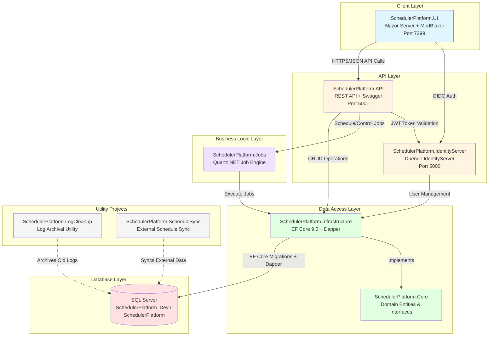
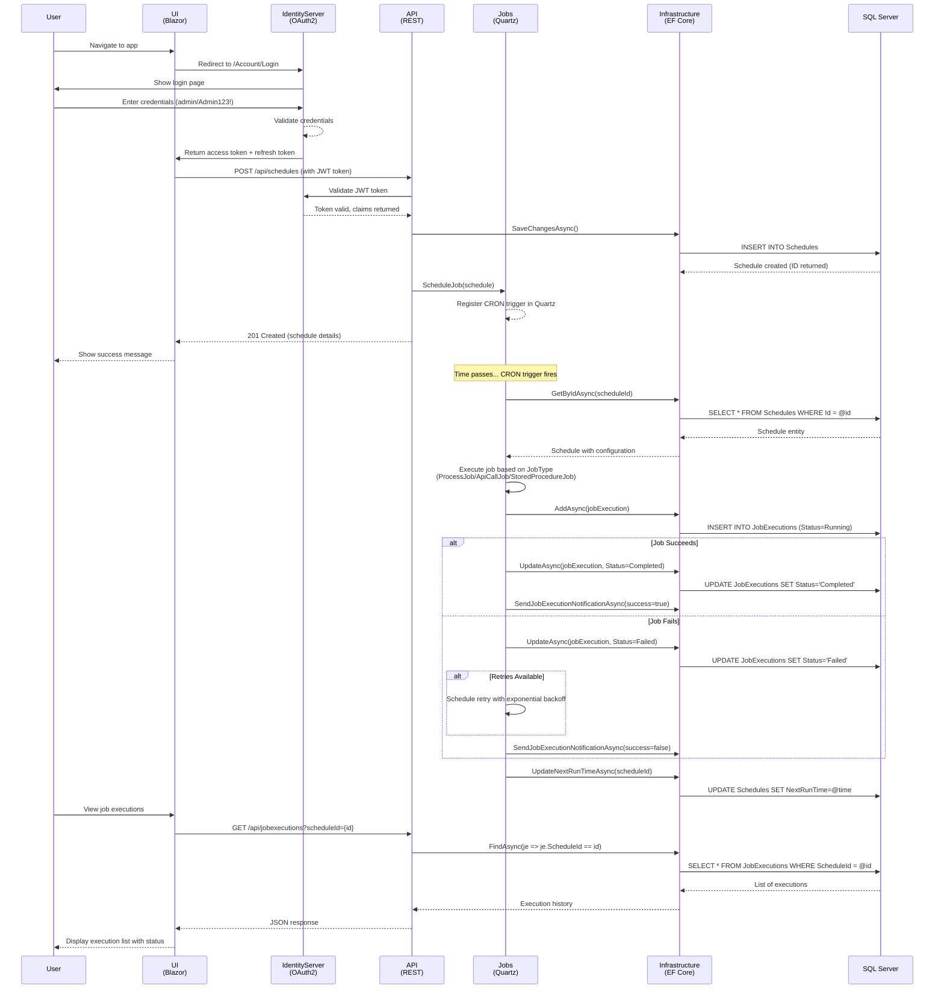

# SchedulerPlatform

## Business Overview

SchedulerPlatform is a comprehensive job scheduling system that enables organizations to automate recurring and one-time business processes. The platform provides a centralized web interface for managing scheduled tasks such as running executables, calling APIs, or executing stored procedures at specific times or intervals.

**Key Capabilities:**
- Schedule jobs to run automatically based on CRON expressions (daily, weekly, monthly, custom intervals)
- Support for multiple job types: Windows processes/executables, REST API calls, and SQL Server stored procedures
- Multi-tenant architecture supporting multiple clients with isolated data and permissions
- Real-time monitoring of job executions with detailed logs and status tracking
- Email notifications for job success/failure events
- Retry mechanism with exponential backoff for failed jobs
- Secure authentication and authorization using industry-standard OAuth2/OpenID Connect

**Business Value:**
- **Automation**: Eliminate manual intervention for recurring tasks
- **Reliability**: Built-in retry logic ensures critical processes complete successfully
- **Visibility**: Real-time dashboards show execution history and job health
- **Flexibility**: Easily add new scheduled processes without code changes
- **Security**: Enterprise-grade authentication with role-based access control

## Recent Features (2024-2025)

### Execution Management & Monitoring
- **Execution Details Dialog**: Comprehensive modal displaying job execution details including ID, schedule name, status, timestamps, duration, retry count, triggered by user, error messages, and output logs
- **Cancellation Tracking**: New `CancelledBy` field captures the username when executions are manually cancelled, providing full audit trail
- **Job Timeout Support**: Schedules now support `TimeoutMinutes` configuration to automatically terminate long-running jobs

### Dashboard Enhancements
- **Multi-Select Status Filter**: Dashboard now supports filtering by multiple execution statuses simultaneously (Running, Completed, Failed, Cancelled)
- **Execution Trends Chart**: Visualize job execution trends over time with interactive charts
- **Status Breakdown**: View execution counts by status with visual breakdown
- **Top Longest Executions**: Identify performance bottlenecks with top longest-running executions widget

### Schedule Management
- **Date Filter with Smart Alerts**: Date-based filtering on schedules page with intelligent alert system that only shows when filtering is active
- **Calendar View**: New dedicated Calendar page for visualizing scheduled jobs by date with month/week/day views
- **Bulk Schedule Creation**: `POST /api/schedules/bulk` endpoint for creating multiple schedules from a list of dates/times
- **CRON Expression Generator**: `POST /api/schedules/generate-cron` utility endpoint for generating Quartz CRON expressions from date/time arrays

### User Experience Improvements
- **Timezone Abbreviations**: Display timezone abbreviations (ET, CT, MT, PT) alongside full timezone names for better readability
- **Navigation Updates**: Renamed "Calendar Schedule" to "Calendar" for clarity
- **Button Alignment Fixes**: Improved UI consistency with properly aligned action buttons

### Authentication & Security
- **JWT Authentication Fix**: Proper claim mapping ensures `User.Identity.Name` is populated from JWT tokens
- **IdentityServer Configuration**: ApiScope now includes user claims (`name`, `role`, `email`) in access tokens for complete user context

### External Integration
- **Schedule Sync Source**: New `ScheduleSyncSource` entity enables synchronization of schedules from external systems (vendors, account numbers, frequencies)
- **Utility Projects**: 
  - `SchedulerPlatform.LogCleanup`: Automated archival of old execution logs
  - `SchedulerPlatform.ScheduleSync`: Synchronization of schedules from external data sources

### API Enhancements
- **Execution Export**: `GET /api/jobexecutions/export` endpoint for exporting execution history to CSV/Excel
- **Dashboard API**: New `DashboardController` with endpoints for overview statistics, execution trends, status breakdown, and performance metrics
- **Cancel Execution**: `POST /api/jobexecutions/{id}/cancel` endpoint for programmatically cancelling running jobs

## Architecture Overview



## End-to-End Process Flow



## Getting Started

### Prerequisites
- .NET 8.0 SDK
- SQL Server 2019+ (LocalDB or full instance)
- Visual Studio 2022 or JetBrains Rider
- Node.js 18+ and npm (for any UI tooling if needed)

### Setup Instructions

1. **Clone the repository:**
   ```bash
   git clone https://dev.azure.com/CassInfoSys/Telecom/_git/Net%20Applications
   cd "Net Applications/SchedulerPlatform"
   ```

2. **Configure connection strings:**
   
   Update `appsettings.Development.json` in each project:
   - **SchedulerPlatform.API**: API database connection
   - **SchedulerPlatform.IdentityServer**: Identity database connection
   - **SchedulerPlatform.UI**: Not needed (uses API)
   
   Example connection string:
   ```json
   {
     "ConnectionStrings": {
       "DefaultConnection": "Server=(localdb)\\mssqllocaldb;Database=SchedulerPlatform;Trusted_Connection=True;MultipleActiveResultSets=true;TrustServerCertificate=True"
     }
   }
   ```

3. **Run database migrations:**
   ```bash
   cd src/SchedulerPlatform.Infrastructure
   dotnet ef database update --startup-project ../SchedulerPlatform.API
   ```

4. **Configure CORS (if using different ports):**
   
   Update `appsettings.Development.json` in **SchedulerPlatform.API**:
   ```json
   {
     "Cors": {
       "AllowedOrigins": ["https://localhost:7299"]
     }
   }
   ```

5. **Start the applications (in order):**
   
   Terminal 1 - IdentityServer:
   ```bash
   cd src/SchedulerPlatform.IdentityServer
   dotnet run
   # Runs on https://localhost:5000
   ```
   
   Terminal 2 - API:
   ```bash
   cd src/SchedulerPlatform.API
   dotnet run
   # Runs on https://localhost:5001
   ```
   
   Terminal 3 - UI:
   ```bash
   cd src/SchedulerPlatform.UI
   dotnet run
   # Runs on https://localhost:7299
   ```

6. **Access the application:**
   - UI: https://localhost:7299
   - API Swagger: https://localhost:5001/swagger
   - IdentityServer Discovery: https://localhost:5000/.well-known/openid-configuration

7. **Test credentials:**
   - **Admin User**: Username: `admin` / Password: `Admin123!`
   - **Client User**: Username: `client1` / Password: `Client123!`

## Project Structure

### [SchedulerPlatform.Core](src/SchedulerPlatform.Core/README.md)
**Domain Layer** - Pure domain entities, enums, and interfaces with no external dependencies.
- Entities: Schedule, Client, JobExecution, JobParameter, NotificationSetting, User, UserPermission, VendorCredential, AuditLog
- Enums: JobType, JobStatus, ScheduleFrequency
- Interfaces: IRepository<T>, IUnitOfWork, IScheduleRepository, IJobExecutionRepository, IEmailService

### [SchedulerPlatform.Infrastructure](src/SchedulerPlatform.Infrastructure/README.md)
**Data Access Layer** - Implements data persistence using Entity Framework Core and Dapper.
- SchedulerDbContext with all entity configurations
- Repository pattern implementations
- UnitOfWork for transaction management
- EmailService for notifications
- Database migrations

### [SchedulerPlatform.Jobs](src/SchedulerPlatform.Jobs/README.md)
**Job Execution Engine** - Quartz.NET integration for scheduling and executing jobs.
- Job implementations: ProcessJob, ApiCallJob, StoredProcedureJob
- SchedulerService for managing Quartz scheduler
- QuartzJobFactory for dependency injection
- Retry logic with exponential backoff

### [SchedulerPlatform.API](src/SchedulerPlatform.API/README.md)
**REST API** - ASP.NET Core Web API with Swagger documentation.
- Controllers: Schedules, Clients, JobExecutions, NotificationSettings, VendorCredentials
- JWT Bearer authentication
- Authorization policies (Admin, Client roles)
- CORS configuration for UI
- Serilog logging

### [SchedulerPlatform.IdentityServer](src/SchedulerPlatform.IdentityServer/README.md)
**Authentication Service** - Duende IdentityServer for OAuth2/OIDC authentication.
- Client configurations (scheduler-blazor)
- API resources and scopes
- Test users for development
- Account pages (Login, Logout, Consent)
- ProfileService for custom claims

### [SchedulerPlatform.UI](src/SchedulerPlatform.UI/README.md)
**Web Interface** - Blazor Server application with MudBlazor components.
- Pages: Schedules (Index, Form), Job Executions, Dashboard, Calendar, Home
- Components: CronBuilder, JsonEditorDialog, ExecutionDetailsDialog, NavMenu
- Services: ScheduleService, ClientService, JobExecutionService, DashboardService
- OIDC authentication integration

### SchedulerPlatform.LogCleanup
**Log Archival Utility** - Console application for cleaning up old execution logs.
- Configurable retention periods
- Automated archival to history tables
- Can be scheduled as a system job

### SchedulerPlatform.ScheduleSync
**External Schedule Synchronization** - Console application for syncing schedules from external sources.
- Reads from ScheduleSyncSource table
- Creates/updates schedules based on external data
- Supports multiple vendors and account numbers

## Technology Stack

| Component | Technology | Version |
|-----------|-----------|---------|
| Framework | .NET | 8.0 |
| ORM | Entity Framework Core | 9.0.10 |
| Query Library | Dapper | 2.1.66 |
| Job Scheduling | Quartz.NET | 3.15.0 |
| Authentication | Duende IdentityServer | 7.3.2 |
| UI Framework | Blazor Server | .NET 8 |
| UI Components | MudBlazor | 8.13.0 |
| Database | SQL Server | 2019+ |
| Logging | Serilog | Latest |
| API Documentation | Swagger/OpenAPI | Latest |
| HTTP Client | IHttpClientFactory | .NET 8 |

## How to Implement New Scheduled Processes

This guide shows how to add new job types to the scheduler with complete examples for each supported job type.

### Overview of Job Types

The SchedulerPlatform supports three job types:
1. **ProcessJob (JobType = 1)**: Execute Windows processes/executables
2. **StoredProcedureJob (JobType = 2)**: Execute SQL Server stored procedures
3. **ApiCallJob (JobType = 3)**: Call external REST APIs

### Example 1: Process Job (Run Executable)

**Use Case**: Schedule a nightly batch file to process invoices

**Step 1**: Create a schedule via the API:
```json
POST https://localhost:5001/api/schedules
Authorization: Bearer {your-jwt-token}
Content-Type: application/json

{
  "name": "Nightly Invoice Processor",
  "description": "Processes pending invoices at 2 AM every night",
  "clientId": 1,
  "jobType": 1,
  "frequency": 1,
  "cronExpression": "0 0 2 * * ?",
  "isEnabled": true,
  "timeZone": "America/Chicago",
  "maxRetries": 3,
  "retryDelayMinutes": 5,
  "jobConfiguration": "{\"ExecutablePath\":\"C:\\\\BatchJobs\\\\InvoiceProcessor.exe\",\"Arguments\":\"-mode production -date {CurrentDate}\",\"WorkingDirectory\":\"C:\\\\BatchJobs\",\"TimeoutMinutes\":30}"
}
```

**JobConfiguration Schema for ProcessJob**:
```json
{
  "ExecutablePath": "Full path to .exe, .bat, or .cmd file",
  "Arguments": "Command line arguments (supports placeholders like {CurrentDate})",
  "WorkingDirectory": "Directory to run the process in",
  "TimeoutMinutes": 30
}
```

**Step 2**: Add job parameters (optional):
```json
POST https://localhost:5001/api/jobparameters
Content-Type: application/json

{
  "scheduleId": 123,
  "parameterName": "CurrentDate",
  "parameterType": "string",
  "parameterValue": "",
  "sourceQuery": "SELECT CONVERT(VARCHAR(10), GETDATE(), 120)",
  "sourceConnectionString": "Server=localhost;Database=Scheduler;Trusted_Connection=True;",
  "isDynamic": true,
  "displayOrder": 1
}
```

**How ProcessJob Works**:
1. Quartz trigger fires based on CRON expression
2. ProcessJob.Execute() is called
3. Reads JobConfiguration JSON to get ExecutablePath, Arguments, etc.
4. Replaces parameter placeholders in Arguments with dynamic values
5. Starts process using System.Diagnostics.Process
6. Captures StandardOutput and StandardError
7. Waits for process completion (with timeout)
8. Records execution status, output, and duration
9. Sends email notification if configured
10. Schedules retry if failed and retries available

### Example 2: Stored Procedure Job

**Use Case**: Run a stored procedure to archive old records daily

**Step 1**: Create the stored procedure in SQL Server:
```sql
CREATE PROCEDURE [dbo].[usp_ArchiveOldRecords]
    @DaysOld INT,
    @TableName NVARCHAR(100),
    @ArchiveDate DATETIME
AS
BEGIN
    SET NOCOUNT ON;
    
    -- Archive logic here
    DECLARE @RowsArchived INT;
    
    IF @TableName = 'JobExecutions'
    BEGIN
        INSERT INTO JobExecutions_Archive
        SELECT * FROM JobExecutions
        WHERE StartTime < DATEADD(DAY, -@DaysOld, @ArchiveDate);
        
        SET @RowsArchived = @@ROWCOUNT;
        
        DELETE FROM JobExecutions
        WHERE StartTime < DATEADD(DAY, -@DaysOld, @ArchiveDate);
    END
    
    SELECT @RowsArchived AS RowsArchived;
END
```

**Step 2**: Create a schedule:
```json
POST https://localhost:5001/api/schedules
Content-Type: application/json

{
  "name": "Daily Archive Old Job Executions",
  "description": "Archives job executions older than 90 days",
  "clientId": 1,
  "jobType": 2,
  "frequency": 1,
  "cronExpression": "0 0 3 * * ?",
  "isEnabled": true,
  "timeZone": "UTC",
  "maxRetries": 2,
  "retryDelayMinutes": 10,
  "jobConfiguration": "{\"ConnectionString\":\"Server=localhost;Database=SchedulerPlatform;Trusted_Connection=True;TrustServerCertificate=True;\",\"ProcedureName\":\"usp_ArchiveOldRecords\",\"TimeoutSeconds\":600,\"ReturnValue\":true}"
}
```

**JobConfiguration Schema for StoredProcedureJob**:
```json
{
  "ConnectionString": "SQL Server connection string",
  "ProcedureName": "Name of stored procedure (without EXEC)",
  "TimeoutSeconds": 600,
  "ReturnValue": true
}
```

**Step 3**: Add stored procedure parameters:
```json
POST https://localhost:5001/api/jobparameters (repeat for each parameter)

{
  "scheduleId": 124,
  "parameterName": "DaysOld",
  "parameterType": "int",
  "parameterValue": "90",
  "isDynamic": false,
  "displayOrder": 1
}

{
  "scheduleId": 124,
  "parameterName": "TableName",
  "parameterType": "string",
  "parameterValue": "JobExecutions",
  "isDynamic": false,
  "displayOrder": 2
}

{
  "scheduleId": 124,
  "parameterName": "ArchiveDate",
  "parameterType": "datetime",
  "parameterValue": "",
  "sourceQuery": "SELECT GETUTCDATE()",
  "sourceConnectionString": "Server=localhost;Database=SchedulerPlatform;Trusted_Connection=True;",
  "isDynamic": true,
  "displayOrder": 3
}
```

**How StoredProcedureJob Works**:
1. Trigger fires from Quartz
2. StoredProcedureJob.Execute() is called
3. Opens SQL connection using ConnectionString
4. Creates SqlCommand with ProcedureName and CommandType.StoredProcedure
5. Loads all job parameters from database
6. For dynamic parameters, executes SourceQuery to get runtime value
7. Adds each parameter to SqlCommand with correct SqlDbType
8. Executes stored procedure (ExecuteScalarAsync if ReturnValue=true, otherwise ExecuteNonQueryAsync)
9. Records result, duration, and status
10. Sends notifications and handles retries

### Example 3: API Call Job

**Use Case**: Call a third-party API to sync customer data hourly

**Step 1**: Create a schedule:
```json
POST https://localhost:5001/api/schedules
Content-Type: application/json

{
  "name": "Hourly Customer Data Sync",
  "description": "Syncs customer data from external CRM API",
  "clientId": 1,
  "jobType": 3,
  "frequency": 1,
  "cronExpression": "0 0 * * * ?",
  "isEnabled": true,
  "timeZone": "America/New_York",
  "maxRetries": 3,
  "retryDelayMinutes": 5,
  "jobConfiguration": "{\"Url\":\"https://api.example.com/v1/customers/sync\",\"Method\":\"POST\",\"Headers\":{\"X-API-Key\":\"your-api-key-here\"},\"AuthorizationType\":\"Bearer\",\"AuthorizationValue\":\"your-bearer-token\",\"RequestBody\":\"{\\\"syncDate\\\":\\\"{SyncDate}\\\",\\\"clientId\\\":{ClientId}}\",\"ContentType\":\"application/json\",\"TimeoutSeconds\":300}"
}
```

**JobConfiguration Schema for ApiCallJob**:
```json
{
  "Url": "https://api.example.com/endpoint",
  "Method": "GET|POST|PUT|PATCH|DELETE",
  "Headers": {
    "Header-Name": "Header-Value",
    "X-Custom-Header": "Value"
  },
  "AuthorizationType": "Bearer|Basic",
  "AuthorizationValue": "token-or-credentials",
  "RequestBody": "JSON string with {parameter} placeholders",
  "ContentType": "application/json",
  "TimeoutSeconds": 300
}
```

**Step 2**: Add API parameters for dynamic values:
```json
POST https://localhost:5001/api/jobparameters

{
  "scheduleId": 125,
  "parameterName": "SyncDate",
  "parameterType": "string",
  "parameterValue": "",
  "sourceQuery": "SELECT CONVERT(VARCHAR(10), GETDATE(), 120)",
  "sourceConnectionString": "Server=localhost;Database=SchedulerPlatform;Trusted_Connection=True;",
  "isDynamic": true,
  "displayOrder": 1
}

{
  "scheduleId": 125,
  "parameterName": "ClientId",
  "parameterType": "string",
  "parameterValue": "12345",
  "isDynamic": false,
  "displayOrder": 2
}
```

**How ApiCallJob Works**:
1. Trigger fires from Quartz
2. ApiCallJob.Execute() is called
3. Deserializes JobConfiguration JSON
4. Creates HttpClient with configured timeout
5. Creates HttpRequestMessage with Method and Url
6. Adds Headers from configuration
7. Sets Authorization header if AuthorizationType/Value provided
8. For POST/PUT/PATCH: loads job parameters, replaces placeholders in RequestBody
9. Sends HTTP request using HttpClient.SendAsync()
10. Reads response content
11. Validates response status (throws on non-success)
12. Records response status, body, and duration
13. Sends notifications and handles retries

### Using the UI to Create Schedules

The Blazor UI provides a user-friendly interface for creating schedules:

1. Navigate to https://localhost:7299
2. Log in with admin credentials
3. Click "Schedules" in the navigation menu
4. Click "Create New Schedule" button
5. Fill in the form:
   - Name and Description
   - Select Client
   - Choose Job Type (Process/Stored Procedure/API Call)
   - Set Frequency (Manual, Daily, Weekly, Monthly, Custom)
   - Configure CRON Expression (use CronBuilder component)
   - Enter Job Configuration JSON
6. Click "Add Parameter" to configure job parameters
7. Enable notifications if desired
8. Click "Save" to create the schedule

The UI includes a CRON builder component that helps construct valid CRON expressions visually.

### Monitoring Job Executions

**Via UI**:
- Navigate to "Job Executions" page
- Filter by schedule, status, or date range
- Click on an execution to view detailed output, error messages, and stack traces

**Via API**:
```bash
GET https://localhost:5001/api/jobexecutions?scheduleId=123&status=Failed
```

### Best Practices

1. **Always test jobs manually** before enabling automatic scheduling
2. **Use meaningful names and descriptions** for easy identification
3. **Configure appropriate timeouts** based on expected execution time
4. **Set up retry logic** for critical processes (MaxRetries + RetryDelayMinutes)
5. **Enable email notifications** for failures on production schedules
6. **Use dynamic parameters** for date/time values rather than hardcoding
7. **Monitor job executions regularly** for failures or performance issues
8. **Document job configurations** in a wiki or knowledge base
9. **Use UTC timezone** for schedules unless business rules require local time
10. **Test CRON expressions** at https://www.freeformatter.com/cron-expression-generator-quartz.html

## For Business Users

### What Can I Schedule?

- **Automated Reports**: Generate and email reports on a schedule
- **Data Integration**: Sync data between systems hourly/daily
- **Batch Processing**: Process files, records, or transactions in bulk
- **Database Maintenance**: Archive old records, cleanup temp data
- **API Integrations**: Push/pull data from third-party services
- **File Operations**: Move, copy, or transform files on a schedule
- **Notifications**: Send scheduled alerts or reminders

### Key Features

- **Flexible Scheduling**: Run jobs once, daily, weekly, monthly, or custom CRON schedules
- **Reliability**: Automatic retries with smart backoff for transient failures
- **Transparency**: Complete execution history with logs and error details
- **Notifications**: Email alerts for job success/failure
- **Multi-Tenant**: Isolate schedules and data by client organization
- **Security**: Role-based access control - admins manage all schedules, clients see only theirs

## For Developers

### Development Workflow

1. **Local Development**: Run all three applications (IdentityServer, API, UI) in separate terminals
2. **Testing**: Use Swagger UI at https://localhost:5001/swagger to test API endpoints
3. **Debugging**: Attach debugger to any of the three processes
4. **Database**: Use SQL Server Management Studio or Azure Data Studio to inspect data

### Adding a New Job Type

If the three existing job types don't meet your needs, you can add a new one:

1. **Add enum value** in `SchedulerPlatform.Core/Domain/Enums/JobType.cs`:
   ```csharp
   public enum JobType
   {
       Process = 1,
       StoredProcedure = 2,
       ApiCall = 3,
       CustomJobType = 4  // Your new type
   }
   ```

2. **Create job class** in `SchedulerPlatform.Jobs/Jobs/`:
   ```csharp
   [DisallowConcurrentExecution]
   public class CustomJob : IJob
   {
       private readonly ILogger<CustomJob> _logger;
       private readonly IUnitOfWork _unitOfWork;
       
       public CustomJob(ILogger<CustomJob> logger, IUnitOfWork unitOfWork)
       {
           _logger = logger;
           _unitOfWork = unitOfWork;
       }
       
       public async Task Execute(IJobExecutionContext context)
       {
           var scheduleId = context.MergedJobDataMap.GetInt("ScheduleId");
           var schedule = await _unitOfWork.Schedules.GetByIdAsync(scheduleId);
           
           // Your job logic here
           
           // Record execution
           var execution = new JobExecution
           {
               ScheduleId = scheduleId,
               StartTime = DateTime.UtcNow,
               Status = JobStatus.Running
           };
           await _unitOfWork.JobExecutions.AddAsync(execution);
           await _unitOfWork.SaveChangesAsync();
           
           try
           {
               // Execute your custom logic
               
               execution.Status = JobStatus.Completed;
               execution.EndTime = DateTime.UtcNow;
           }
           catch (Exception ex)
           {
               execution.Status = JobStatus.Failed;
               execution.ErrorMessage = ex.Message;
               throw;
           }
           finally
           {
               await _unitOfWork.JobExecutions.UpdateAsync(execution);
               await _unitOfWork.SaveChangesAsync();
           }
       }
   }
   ```

3. **Register in SchedulerService** (`SchedulerPlatform.Jobs/Services/SchedulerService.cs`):
   ```csharp
   private Type GetJobType(JobType jobType)
   {
       return jobType switch
       {
           JobType.Process => typeof(ProcessJob),
           JobType.StoredProcedure => typeof(StoredProcedureJob),
           JobType.ApiCall => typeof(ApiCallJob),
           JobType.CustomJobType => typeof(CustomJob),
           _ => throw new ArgumentException($"Unknown job type: {jobType}")
       };
   }
   ```

4. **Update UI** to show new job type in dropdowns

### Testing Strategy

**Unit Tests**: (To be implemented)
- Test domain entities and business logic
- Test repository methods with in-memory database
- Test job execution logic with mocked dependencies

**Integration Tests**: (To be implemented)
- Test API endpoints end-to-end
- Test database migrations
- Test Quartz job scheduling

**Manual Testing**:
- Use Swagger UI to test API endpoints
- Create test schedules with short CRON expressions (every minute)
- Verify job executions in the UI
- Check email notifications are sent
- Test retry logic by forcing failures

### Deployment

**Azure DevOps CI/CD**:
- Build pipeline compiles all projects
- Cannot build locally due to repository path containing spaces
- Use Azure DevOps pipelines for all builds

**Database Deployment**:
- **EF Core Migrations Only**: All database schema changes are managed through Entity Framework Core migrations
- Apply migrations: `dotnet ef database update --startup-project ../SchedulerPlatform.API`
- Generate new migration: `dotnet ef migrations add MigrationName --startup-project ../SchedulerPlatform.API`
- The database schema is created entirely from EF migration files in the Infrastructure project

**Configuration**:
- Update connection strings in appsettings.Production.json
- Configure CORS origins for production UI URL
- Set up SMTP settings for email notifications
- Update IdentityServer client RedirectUris for production URLs

## Project Status

**Current Status**: Proof of Concept (POC)

This project documents the current state of the SchedulerPlatform. The technology stack changed mid-development from Angular (SPA) to Blazor Server with MudBlazor components. The system is functional but not fully production-ready.

**What Works**:
- Authentication via Duende IdentityServer
- Schedule CRUD operations
- Job execution for all three job types (Process, StoredProcedure, ApiCall)
- Real-time job execution monitoring
- Email notifications
- Retry mechanism with exponential backoff
- CRON expression builder UI

**Known Limitations**:
- See individual project README files for project-specific known issues
- Limited test coverage
- Some error handling could be more robust
- Performance optimizations needed for large-scale deployments

## Known Issues

### Environment Issues

1. **Local Build Failure**
   - **Issue**: Cannot build solution locally due to repository path containing spaces
   - **Path**: `Net Applications/SchedulerPlatform` causes MSBuild errors
   - **Workaround**: Use Azure DevOps CI pipelines for all builds
   - **Impact**: Developers cannot compile locally, must push to test builds

### Documentation

1. **Incomplete API Documentation**
   - **Issue**: Some API endpoints lack XML documentation comments
   - **Impact**: Swagger UI descriptions may be unclear
   - **TODO**: Add comprehensive XML comments to all controller actions

2. **Missing User Guide**
   - **Issue**: No comprehensive user guide for business users
   - **TODO**: Create step-by-step guide for common tasks

### Testing

1. **No Unit Tests**
   - **Issue**: Project currently has no unit test coverage
   - **Impact**: Risk of regressions when making changes
   - **TODO**: Add xUnit test projects for each layer

2. **No Integration Tests**
   - **Issue**: No automated API endpoint testing
   - **TODO**: Add integration test project

### Deployment

1. **Manual Deployment Process**
   - **Issue**: No automated deployment pipeline configured
   - **TODO**: Set up Azure DevOps release pipeline

2. **Missing Health Checks**
   - **Issue**: No comprehensive health check endpoints
   - **Impact**: Difficult to monitor application health in production
   - **TODO**: Implement health checks for database, Quartz scheduler, etc.

### Security

1. **Hardcoded Secrets in Development**
   - **Issue**: Test user passwords and client secrets in Config.cs
   - **Impact**: Security risk if deployed to production
   - **TODO**: Move to Azure Key Vault or environment variables

2. **No Rate Limiting**
   - **Issue**: API has no rate limiting or throttling
   - **Impact**: Vulnerable to abuse/DoS
   - **TODO**: Implement rate limiting middleware

### Performance

1. **No Caching Strategy**
   - **Issue**: Frequent database queries for read-heavy operations
   - **Impact**: Potential performance issues at scale
   - **TODO**: Implement Redis or in-memory caching

2. **Large Execution History**
   - **Issue**: JobExecutions table grows indefinitely
   - **Impact**: Query performance degrades over time
   - **TODO**: Implement archival strategy for old executions

For project-specific known issues, see the README.md file in each project directory.

## Contributing

1. Create a feature branch from `sprint/2025/Rel_20250912`
2. Make your changes
3. Test thoroughly (use Azure DevOps CI for builds)
4. Create a pull request with detailed description
5. Request review from team lead

## Support

For questions or issues:
- Contact: Lee Cassin (@lcassin)
- Azure DevOps: https://dev.azure.com/CassInfoSys/Telecom
- Repository: dev.azure.com/CassInfoSys/Telecom/_git/Net%20Applications

## License

Internal use only - Cass Information Systems, Inc.
