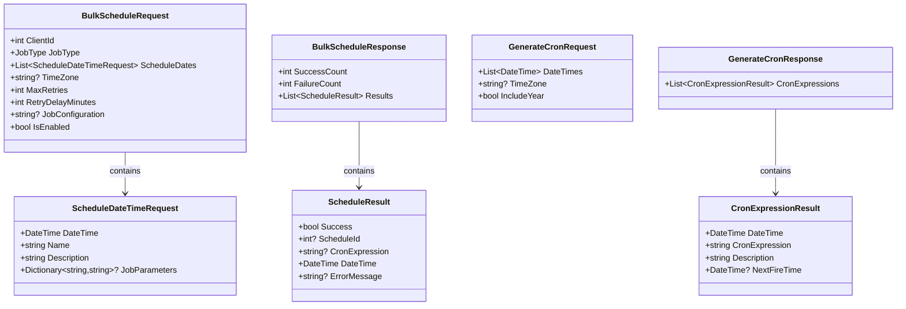

# SchedulerPlatform.API

## Recent Updates (November 2025)

- **Upgraded to .NET 10**: Complete upgrade from .NET 9 to .NET 10 with all packages updated
- **Schedule Hydration Service**: Background service that loads all enabled schedules into Quartz on API startup, ensuring schedules fire automatically 24/7 without requiring user login
- **Permission-Based Authorization**: JWT tokens now include custom claims for granular permission checking (Create, Read, Update, Delete, Execute per resource)
- **Admin User Management**: New UsersController with endpoints for managing users and permissions (system admin only)
- **Service Account Authentication**: OAuth2 Client Credentials flow support for external systems to access the API
- **NextRunDateTime Calculation Fix**: Manual schedule triggers no longer incorrectly advance NextRunDateTime
- **Deleted Schedule Filtering**: Soft-deleted schedules are properly filtered and no longer execute

## Recent Updates (December 2025)

- **ADR Orchestration API**: Complete orchestration endpoints for automated invoice scraping workflow (sync accounts, create jobs, verify credentials, process scraping, check statuses)
- **API Key Authentication**: Added API key authentication for scheduler-to-API calls (SOC2 compliant service account pattern)
- **System Schedule Protection**: Critical system schedules (like ADR sync) are protected from deletion and have restricted editing
- **EF Core Retry-on-Failure**: Added automatic retry logic for Azure SQL transient failures
- **Database Indexes**: Added comprehensive indexes on AdrAccount and AdrJob tables for improved query performance
- **Batched Processing**: ADR sync and orchestration services use batched database operations for handling 200k+ accounts
- **In-Progress Status Pattern**: Jobs track in-progress state to prevent double-billing on crashes or restarts
- **Progress Logging**: Detailed progress logging during parallel API calls for ADR orchestration
- **Client Sync**: ADR account sync now includes client synchronization with ExternalClientId mapping

## Recent Updates (January 2026)

- **Global Exception Handler Middleware**: New middleware catches all unhandled exceptions and sends email notifications with stack trace attachments to configurable recipients
- **Orchestration Summary Notifications**: Consolidated email sent at end of each orchestration run summarizing all failures across all phases
- **Database-Configurable Notification Recipients**: Email recipients for 500 errors and orchestration failures are now stored in AdrConfiguration and managed via Admin UI
- **Health Endpoint**: Added `/health` endpoint returning "Healthy" to eliminate Azure health probe 404 errors
- **Test Mode Public Endpoint**: New `GET /api/adr/configuration/test-mode-status` endpoint (no auth required) for test mode banner visibility
- **ADR Account Rules Endpoints**: New endpoints for managing account-level scheduling rules
- **PrimaryVendorCode/MasterVendorCode Support**: All ADR endpoints now support filtering by both Primary and Master Vendor Codes
- **Stale Pending Jobs Finalization**: Orchestration cleanup phase finalizes jobs stuck in Pending/CredentialCheckInProgress past their billing window
- **Orchestration Recovery**: StartupRecoveryService detects and resumes orphaned orchestration runs after application restart
- **Configurable Timeouts**: Added configurable orchestration timeout and database command timeout settings
- **Concurrent Orchestration Prevention**: Fixed issue where multiple orchestrations could be triggered simultaneously
- **Generic PagedResponse<T>**: Standardized pagination responses across all API endpoints
- **Claims Enrichment**: External identity provider claims enriched with application-specific permissions
- **Multiple Audience Support**: JWT validation now supports multiple audiences for Duende IdentityServer
- **Quartz Retry Fix**: Fixed retry trigger collision by making scheduling idempotent

## Business Overview

The API project is the "control center" of the SchedulerPlatform - it provides the web interface that allows users and applications to manage schedules, monitor job executions, and configure system settings. Think of it as the front door through which all external interactions happen.

**What It Provides:**
- **REST API Endpoints**: HTTP-based interface for creating, reading, updating, and managing schedules
- **Authentication & Authorization**: Secure access control using JWT tokens and role-based permissions
- **Real-Time Job Control**: Start, stop, pause, and resume scheduled jobs on demand
- **Execution Monitoring**: View job history, check status, analyze failures
- **Multi-Tenant Support**: Each client organization has isolated data and schedules
- **API Documentation**: Interactive Swagger UI for exploring and testing endpoints

**Why It Matters:**
This is how users interact with the scheduling system. Whether through a web UI, mobile app, or automated scripts, all operations go through this API. It enforces security rules, validates requests, and coordinates between the different system components to fulfill user requests.

**Business Value:**
- **Accessibility**: RESTful design means any platform can integrate (web, mobile, desktop, scripts)
- **Security**: JWT authentication ensures only authorized users can access data
- **Reliability**: Built-in validation and error handling prevent invalid operations
- **Observability**: Comprehensive logging and monitoring for operational insight
- **Flexibility**: Easy to add new endpoints for evolving business needs

## Key Components

### Controllers (API Endpoints)

#### SchedulesController
**Purpose**: Manage job schedules - the core functionality of the platform.

**Endpoints:**

**GET /api/schedules**
- Retrieve all schedules (optionally filtered by clientId)
- Supports pagination and search
- Returns: List of Schedule entities
- Authorization: Authenticated users

**GET /api/schedules/{id}**
- Get specific schedule by ID
- Returns: Schedule entity with related data
- Authorization: Authenticated users

**POST /api/schedules**
- Create new schedule
- Request body: Schedule entity with JobConfiguration JSON
- Returns: Created schedule with generated ID
- Authorization: Authenticated users
- Also calls SchedulerService.ScheduleJob() to activate in Quartz

**PUT /api/schedules/{id}**
- Update existing schedule
- Request body: Complete Schedule entity
- Returns: 204 No Content on success
- Authorization: Authenticated users
- Updates Quartz trigger if CRON expression changed

**DELETE /api/schedules/{id}**
- Soft delete schedule (sets IsDeleted=true)
- Also unschedules job from Quartz
- Returns: 204 No Content
- Authorization: Authenticated users

**POST /api/schedules/{id}/trigger**
- Manually trigger job execution immediately
- Bypasses CRON schedule
- Request body: { "triggeredBy": "username" }
- Returns: 200 OK
- Authorization: Authenticated users
- Use case: Testing, urgent processing, retry after fix

**POST /api/schedules/{id}/pause**
- Pause scheduled job (stops automatic execution)
- Job remains configured but won't run
- Returns: 204 No Content
- Authorization: Authenticated users

**POST /api/schedules/{id}/resume**
- Resume paused job
- Job resumes automatic execution based on CRON
- Returns: 204 No Content
- Authorization: Authenticated users

**POST /api/schedules/bulk**
- Create multiple schedules from list of dates/times
- Request body: BulkScheduleRequest with ScheduleDates array
- Automatically generates CRON expressions for each date
- Returns: BulkScheduleResponse with success/failure counts
- Authorization: Authenticated users
- Use case: Bulk import from external systems, one-time events

**POST /api/schedules/generate-cron**
- Generate CRON expressions from dates without creating schedules
- Request body: GenerateCronRequest with DateTimes array
- Returns: GenerateCronResponse with CRON expressions and next fire times
- Authorization: Can be anonymous (utility endpoint)
- Use case: Preview CRON expressions, validate schedules before creation

#### ClientsController
**Purpose**: Manage client organizations (multi-tenancy).

**Endpoints:**

**GET /api/clients**
- List all client organizations
- Returns: Array of Client entities
- Authorization: Authenticated users

**GET /api/clients/{id}**
- Get specific client by ID
- Returns: Client entity
- Authorization: Authenticated users

**POST /api/clients**
- Create new client organization
- Request body: Client entity (Name, Description, ClientCode)
- Returns: Created client with ID
- Authorization: **Admin role only**
- Use case: Onboarding new customer/department

**PUT /api/clients/{id}**
- Update existing client
- Request body: Complete Client entity
- Returns: 204 No Content
- Authorization: **Admin role only**
- Note: Cannot delete clients if they have schedules or users

#### JobExecutionsController
**Purpose**: Monitor and analyze job execution history.

**Endpoints:**

**GET /api/jobexecutions**
- List job executions (optionally filtered)
- Query params: ?scheduleId=123&status=Failed
- Returns: Array of JobExecution entities
- Authorization: Authenticated users
- Use case: Monitoring dashboard, troubleshooting

**GET /api/jobexecutions/{id}**
- Get specific execution details
- Returns: JobExecution with Output, ErrorMessage, StackTrace
- Authorization: Authenticated users
- Use case: Debugging failures, audit trail

**GET /api/jobexecutions/schedule/{scheduleId}/latest**
- Get most recent execution for a schedule
- Returns: JobExecution entity
- Authorization: Authenticated users
- Use case: Quick status check, "what happened last time?"

**GET /api/jobexecutions/schedule/{scheduleId}/failed**
- Get all failed executions for a schedule
- Returns: Array of failed JobExecution entities
- Authorization: Authenticated users
- Use case: Failure analysis, pattern detection

**POST /api/jobexecutions/{id}/cancel**
- Cancel a running job execution
- Captures username in `CancelledBy` field for audit trail
- Returns: 200 OK if successful
- Authorization: Authenticated users
- Use case: Stop long-running or stuck jobs

**GET /api/jobexecutions/export**
- Export execution history to CSV or Excel format
- Query params: ?scheduleId=123&status=Failed&format=csv
- Returns: File download (CSV or Excel)
- Authorization: Authenticated users
- Use case: Reporting, data analysis, compliance audits

#### DashboardController
**Purpose**: Provide dashboard statistics and analytics for monitoring system health.

**Endpoints:**

**GET /api/dashboard/overview**
- Get dashboard overview statistics
- Returns: Total schedules, active schedules, execution counts by status, recent failures
- Authorization: Authenticated users
- Use case: Dashboard home page, system health check

**GET /api/dashboard/execution-trends**
- Get execution trends over time
- Query params: ?days=30 (default: 7 days)
- Returns: Array of ExecutionTrendItem with date and counts by status
- Authorization: Authenticated users
- Use case: Trend analysis charts, identifying patterns

**GET /api/dashboard/status-breakdown**
- Get execution count breakdown by status
- Query params: ?days=7
- Returns: Array of StatusBreakdownItem with status and count
- Authorization: Authenticated users
- Use case: Status distribution pie charts

**GET /api/dashboard/top-longest**
- Get top longest-running executions
- Query params: ?count=10 (default: 10)
- Returns: Array of TopLongestExecutionItem with schedule name and duration
- Authorization: Authenticated users
- Use case: Performance optimization, identifying bottlenecks

#### NotificationSettingsController
**Purpose**: Configure email notifications for job completion/failure.

**Endpoints:**

**GET /api/notificationsettings/schedule/{scheduleId}**
- Get notification settings for a schedule
- Returns: NotificationSetting entity
- Authorization: Authenticated users

**POST /api/notificationsettings**
- Create notification settings for a schedule
- Request body: NotificationSetting entity
- Returns: Created settings
- Authorization: Authenticated users

**PUT /api/notificationsettings/{id}**
- Update notification settings
- Request body: NotificationSetting entity
- Returns: 204 No Content
- Authorization: Authenticated users

**DELETE /api/notificationsettings/{id}**
- Remove notification settings
- Returns: 204 No Content
- Authorization: Authenticated users

**Configuration Options:**
- EnableSuccessNotifications: Send email on success
- EnableFailureNotifications: Send email on failure
- SuccessEmailRecipients: Comma-separated email addresses
- FailureEmailRecipients: Comma-separated email addresses
- SuccessEmailSubject / FailureEmailSubject: Custom subjects
- IncludeExecutionDetails: Include timing, duration in email
- IncludeOutput: Include job output in email body

#### VendorCredentialsController (Inferred)
**Purpose**: Securely manage API keys and credentials for external services.

**Typical Endpoints:**
- GET /api/vendorcredentials: List credentials for current client
- GET /api/vendorcredentials/{id}: Get specific credential
- POST /api/vendorcredentials: Create new credential
- PUT /api/vendorcredentials/{id}: Update credential
- DELETE /api/vendorcredentials/{id}: Delete credential

**Use Case:**
- Store API keys for ApiCallJob without embedding in JobConfiguration
- Store database connection strings for StoredProcedureJob
- Centralized credential management with encryption

#### AdrController
**Purpose**: Manage ADR (Automated Document Retrieval) process for automated invoice scraping from vendor portals.

For the complete workflow diagram, see [ADR Workflow Diagram](../../../Documents/Technical/diagrams/adr-workflow.png).
For the sequence diagram, see [ADR Sequence Diagram](../../../Documents/Technical/diagrams/adr-sequence-orchestration.png).

**Account Endpoints:**

**GET /api/adr/accounts**
- List ADR accounts with filtering and pagination
- Query params: ?search=term&clientId=1&vendorCode=ABC&overrideFilter=all|overridden|not-overridden&page=1&pageSize=50
- Returns: Paged list of AdrAccount entities
- Authorization: `adr:view` permission

**GET /api/adr/accounts/{id}**
- Get specific ADR account by ID
- Returns: AdrAccount entity with related data
- Authorization: `adr:view` permission

**PUT /api/adr/accounts/{id}/billing**
- Update billing data for an account (manual override)
- Request body: { lastInvoiceDateTime, periodType, periodDays, expectedNextDateTime, expectedRangeStartDateTime, expectedRangeEndDateTime }
- Sets IsManuallyOverridden=true, OverriddenBy, OverriddenDateTime
- Returns: 200 OK
- Authorization: `adr:edit` permission

**DELETE /api/adr/accounts/{id}/override**
- Clear manual override flag (allow sync to update again)
- Sets IsManuallyOverridden=false
- Returns: 200 OK
- Authorization: `adr:edit` permission

**Job Endpoints:**

**GET /api/adr/jobs**
- List ADR jobs with filtering and pagination
- Query params: ?search=term&status=Pending&latestPerAccount=true&page=1&pageSize=50
- Returns: Paged list of AdrJob entities
- Authorization: `adr:view` permission

**GET /api/adr/jobs/{id}**
- Get specific ADR job by ID
- Returns: AdrJob entity with executions
- Authorization: `adr:view` permission

**POST /api/adr/jobs/{id}/refire**
- Force refire a job (bypass idempotency check)
- Use case: Re-run a job that failed or needs to be re-processed
- Returns: 200 OK with new execution result
- Authorization: `adr:execute` permission

**Orchestration Endpoints:**

**POST /api/adr/orchestrate/sync-accounts**
- Sync accounts from VendorCredNewUAT database
- Preserves manual overrides during sync
- Returns: { inserted, updated, total }
- Authorization: `adr:execute` permission

**POST /api/adr/orchestrate/create-jobs**
- Create jobs for accounts with NextRunStatus = "Run Now" or "Due Soon"
- Excludes accounts with HistoricalBillingStatus = "Missing"
- Prevents duplicate jobs via unique constraint
- Returns: { created, skipped }
- Authorization: `adr:execute` permission

**POST /api/adr/orchestrate/run-full-cycle**
- Run complete orchestration synchronously (for testing)
- Steps: Sync Accounts → Create Jobs → Verify Credentials → Process Scraping → Check Statuses
- Returns: Complete orchestration results
- Authorization: `adr:execute` permission
- Note: Use run-background for production

**POST /api/adr/orchestrate/run-background**
- Queue orchestration to run in background (for scheduled jobs)
- Returns immediately with requestId
- Progress tracked in AdrOrchestrationRun table
- Returns: { requestId }
- Authorization: `adr:execute` permission

**GET /api/adr/orchestrate/current**
- Get current orchestration status
- Returns: AdrOrchestrationRun with progress (currentStep, processedItems, totalItems)
- Authorization: `adr:view` permission

**GET /api/adr/orchestrate/history**
- Get orchestration run history with pagination
- Query params: ?page=1&pageSize=10
- Returns: Paged list of AdrOrchestrationRun entities
- Authorization: `adr:view` permission

**Monitoring Endpoints:**

**GET /api/adr/missing-accounts**
- Get accounts with HistoricalBillingStatus = "Missing"
- Returns: List of accounts needing research
- Authorization: `adr:view` permission

**GET /api/adr/job-status-summary**
- Get job counts by status for dashboard charts
- Returns: { pending, credentialVerified, credentialFailed, completed, failed, needsReview }
- Authorization: `adr:view` permission

**ADR API Integration Notes:**
- External ADR API returns IndexId (64-bit integer) on success
- Request payload must include AccountId (VMAccountId) and InterfaceAccountId
- Idempotency: Check AdrJobExecution before making API calls to prevent duplicate charges
- Parallel processing: Configurable worker threads (default: 15) via AdrParallelWorkers setting

### Request/Response Models

#### BulkScheduleRequest
**Purpose**: Request model for creating multiple schedules at once.

**Properties:**
```csharp
public class BulkScheduleRequest
{
    public int ClientId { get; set; }
    public JobType JobType { get; set; }
    public List<ScheduleDateTimeRequest> ScheduleDates { get; set; }
    public string? TimeZone { get; set; } = "UTC";
    public int MaxRetries { get; set; } = 3;
    public int RetryDelayMinutes { get; set; } = 5;
    public string? JobConfiguration { get; set; }
    public bool IsEnabled { get; set; } = true;
}

public class ScheduleDateTimeRequest
{
    public DateTime DateTime { get; set; }
    public string Name { get; set; }
    public string Description { get; set; }
    public Dictionary<string, string>? JobParameters { get; set; }
}
```

**Example Request:**
```json
{
  "clientId": 1,
  "jobType": 1,
  "scheduleDates": [
    {
      "dateTime": "2025-10-25T14:30:00Z",
      "name": "Invoice Process - Oct 25",
      "description": "Monthly invoice generation",
      "jobParameters": {
        "Month": "October",
        "Year": "2025"
      }
    }
  ],
  "timeZone": "America/Chicago",
  "isEnabled": true
}
```

#### BulkScheduleResponse
**Purpose**: Response model showing results of bulk schedule creation.

**Properties:**
```csharp
public class BulkScheduleResponse
{
    public int SuccessCount { get; set; }
    public int FailureCount { get; set; }
    public List<ScheduleResult> Results { get; set; }
}

public class ScheduleResult
{
    public bool Success { get; set; }
    public int? ScheduleId { get; set; }
    public string? CronExpression { get; set; }
    public DateTime DateTime { get; set; }
    public string? ErrorMessage { get; set; }
}
```

#### GenerateCronRequest
**Purpose**: Request model for CRON expression generation utility.

**Properties:**
```csharp
public class GenerateCronRequest
{
    public List<DateTime> DateTimes { get; set; }
    public string? TimeZone { get; set; } = "UTC";
    public bool IncludeYear { get; set; } = true;
}
```

#### GenerateCronResponse
**Purpose**: Response model with generated CRON expressions.

**Properties:**
```csharp
public class GenerateCronResponse
{
    public List<CronExpressionResult> CronExpressions { get; set; }
}

public class CronExpressionResult
{
    public DateTime DateTime { get; set; }
    public string CronExpression { get; set; }
    public string Description { get; set; }
    public DateTime? NextFireTime { get; set; }
}
```

### Filters

#### ModelStateLoggingFilter
**Purpose**: Logs model validation errors for debugging.

**When It Runs:** Before controller action execution, if ModelState is invalid

**What It Does:**
- Logs all validation errors with field names and error messages
- Helps diagnose why requests are being rejected
- Particularly useful for complex request models

**Example Log Output:**
```
Model validation failed for SchedulesController.CreateSchedule:
  - CronExpression: The CronExpression field is required.
  - JobType: The value '5' is not valid for JobType.
```

### Configuration (Program.cs)

#### Authentication & Authorization
**JWT Bearer Authentication**:
```csharp
builder.Services.AddAuthentication(JwtBearerDefaults.AuthenticationScheme)
    .AddJwtBearer(options =>
    {
        options.Authority = "https://localhost:5001"; // IdentityServer URL
        options.Audience = "scheduler-api";
        options.RequireHttpsMetadata = true;
        options.TokenValidationParameters = new TokenValidationParameters
        {
            ValidateIssuer = true,
            ValidateAudience = true,
            ValidateLifetime = true,
            ValidateIssuerSigningKey = true,
            ClockSkew = TimeSpan.FromMinutes(5)
        };
    });
```

**Role-Based Authorization**:
- **Admin**: Full access (create clients, manage all schedules)
- **Client**: Limited access (manage own schedules only)
- Enforced via `[Authorize(Roles = "Admin")]` attribute

#### CORS Configuration
**AllowUI Policy**:
```csharp
builder.Services.AddCors(options =>
{
    options.AddPolicy("AllowUI", policy =>
    {
        policy.WithOrigins("https://localhost:7299") // Blazor UI
              .AllowAnyMethod()
              .AllowAnyHeader()
              .AllowCredentials();
    });
});
```

**Purpose**: Allow Blazor UI to call API with cookies/tokens

#### Swagger/OpenAPI
**API Documentation**:
```csharp
builder.Services.AddSwaggerGen(options =>
{
    options.SwaggerDoc("v1", new OpenApiInfo
    {
        Title = "SchedulerPlatform API",
        Version = "v1",
        Description = "Job scheduling and management API"
    });
    
    // JWT authentication in Swagger UI
    options.AddSecurityDefinition("Bearer", new OpenApiSecurityScheme
    {
        Type = SecuritySchemeType.Http,
        Scheme = "bearer",
        BearerFormat = "JWT"
    });
});
```

**Access**: Navigate to https://localhost:5000/swagger

#### Dependency Injection Registration
```csharp
// Database
builder.Services.AddDbContext<SchedulerDbContext>(options =>
    options.UseSqlServer(connectionString));

// Unit of Work & Repositories
builder.Services.AddScoped<IUnitOfWork, UnitOfWork>();
builder.Services.AddScoped<IScheduleRepository, ScheduleRepository>();
builder.Services.AddScoped<IJobExecutionRepository, JobExecutionRepository>();

// Services
builder.Services.AddScoped<ISchedulerService, SchedulerService>();
builder.Services.AddScoped<IEmailService, EmailService>();

// Quartz.NET
builder.Services.AddQuartz(/* ... */);
builder.Services.AddQuartzHostedService();
```

#### Logging Configuration
**Serilog Integration**:
```csharp
Log.Logger = new LoggerConfiguration()
    .ReadFrom.Configuration(builder.Configuration)
    .WriteTo.Console()
    .WriteTo.File("logs/api-.txt", rollingInterval: RollingInterval.Day)
    .CreateLogger();

builder.Host.UseSerilog();
```

**Structured Logging**: All controller actions log with correlation IDs

## For Developers

### API Request Flow


The diagram above illustrates the complete journey of an API request through the system, from initial CORS validation through authentication, authorization, model validation, controller execution, database operations, and finally the response back to the client.


### Authentication Flow


This diagram shows how users authenticate through the OAuth2/OpenID Connect flow, from initial login through token issuance and API access with JWT validation.


### UML Class Diagrams

#### Controllers Layer


#### Request/Response Models


This diagram illustrates the data transfer objects (DTOs) used for API requests and responses, showing how data flows between the client and server.



#### Filters & Middleware

##### GlobalExceptionHandlerMiddleware
**Purpose**: Catches all unhandled exceptions and sends email notifications with detailed error information.

**Key Features:**
- Catches any unhandled exception in the request pipeline
- Sends HTML-formatted email with error details (error ID, timestamp, request info, exception message)
- Attaches full stack trace as a .txt file
- Recipients configurable via Admin > ADR Configuration page (stored in database)
- Falls back to appsettings.json if database config not available
- Logs all errors with unique error ID for correlation

**Configuration (AdrConfiguration table):**
- `ErrorNotificationsEnabled`: Toggle email notifications on/off
- `ErrorNotificationRecipients`: Semicolon-separated email addresses (e.g., "user1@example.com;user2@example.com")

**Email Content:**
- Error ID (GUID for correlation with logs)
- Timestamp (UTC)
- Request method and path
- Exception type and message
- Stack trace preview (first 500 chars in email body)
- Full stack trace as attachment


### Authorization Policies

**Role-Based Authorization**:
```csharp
[Authorize] // Any authenticated user
public async Task<ActionResult> GetSchedules() { }

[Authorize(Roles = "Admin")] // Admin role required
public async Task<ActionResult> CreateClient() { }

[Authorize(Roles = "Admin,Client")] // Either role
public async Task<ActionResult> UpdateSchedule() { }
```

**Custom Policy** (Future Enhancement):
```csharp
services.AddAuthorization(options =>
{
    options.AddPolicy("CanManageSchedules", policy =>
        policy.RequireClaim("permission", "schedules:manage"));
    
    options.AddPolicy("ClientOwnership", policy =>
        policy.Requirements.Add(new ClientOwnershipRequirement()));
});
```

### Error Handling Strategy

**Standard Error Responses**:
```csharp
try
{
    // Controller logic
}
catch (Exception ex)
{
    _logger.LogError(ex, "Error context with {Parameters}", parameters);
    return StatusCode(500, "User-friendly error message");
}
```

**Validation Errors** (ModelState):
```json
{
  "type": "https://tools.ietf.org/html/rfc7231#section-6.5.1",
  "title": "One or more validation errors occurred.",
  "status": 400,
  "errors": {
    "CronExpression": ["The CronExpression field is required."],
    "JobType": ["The value '5' is not valid."]
  }
}
```

**Custom Error Response** (Future):
```csharp
public class ApiError
{
    public string Message { get; set; }
    public string ErrorCode { get; set; }
    public Dictionary<string, string[]> ValidationErrors { get; set; }
    public string TraceId { get; set; }
}
```

### API Endpoint Summary

| Endpoint | Method | Purpose | Auth | Role |
|----------|--------|---------|------|------|
| /api/schedules | GET | List schedules | ✓ | Any |
| /api/schedules/{id} | GET | Get schedule | ✓ | Any |
| /api/schedules | POST | Create schedule | ✓ | Any |
| /api/schedules/{id} | PUT | Update schedule | ✓ | Any |
| /api/schedules/{id} | DELETE | Delete schedule | ✓ | Any |
| /api/schedules/{id}/trigger | POST | Trigger manually | ✓ | Any |
| /api/schedules/{id}/pause | POST | Pause job | ✓ | Any |
| /api/schedules/{id}/resume | POST | Resume job | ✓ | Any |
| /api/schedules/bulk | POST | Bulk create | ✓ | Any |
| /api/schedules/generate-cron | POST | Generate CRON | Optional | Any |
| /api/clients | GET | List clients | ✓ | Any |
| /api/clients/{id} | GET | Get client | ✓ | Any |
| /api/clients | POST | Create client | ✓ | **Admin** |
| /api/clients/{id} | PUT | Update client | ✓ | **Admin** |
| /api/jobexecutions | GET | List executions | ✓ | Any |
| /api/jobexecutions/{id} | GET | Get execution | ✓ | Any |
| /api/jobexecutions/schedule/{id}/latest | GET | Latest execution | ✓ | Any |
| /api/jobexecutions/schedule/{id}/failed | GET | Failed executions | ✓ | Any |
| /api/notificationsettings/schedule/{id} | GET | Get settings | ✓ | Any |
| /api/notificationsettings | POST | Create settings | ✓ | Any |
| /api/notificationsettings/{id} | PUT | Update settings | ✓ | Any |
| /api/notificationsettings/{id} | DELETE | Delete settings | ✓ | Any |

## Dependencies

| Package | Version | Purpose |
|---------|---------|---------|
| Microsoft.AspNetCore.App | 8.0 | ASP.NET Core framework |
| Microsoft.AspNetCore.Authentication.JwtBearer | 8.0 | JWT token authentication |
| Swashbuckle.AspNetCore | 6.5.0 | Swagger/OpenAPI documentation |
| Serilog.AspNetCore | 8.0.0 | Structured logging |
| Serilog.Sinks.Console | 5.0.0 | Console log output |
| Serilog.Sinks.File | 5.0.0 | File log output |
| SchedulerPlatform.Core | (project reference) | Domain entities and interfaces |
| SchedulerPlatform.Infrastructure | (project reference) | UnitOfWork and repositories |
| SchedulerPlatform.Jobs | (project reference) | SchedulerService for Quartz operations |

## Integration

**Consumed By:**
- `SchedulerPlatform.UI`: Blazor UI calls API endpoints for all user interactions
- External applications: Any system that can make HTTP requests

**Consumes:**
- `SchedulerPlatform.Infrastructure`: Database operations via UnitOfWork
- `SchedulerPlatform.Jobs`: Job scheduling via ISchedulerService
- `SchedulerPlatform.IdentityServer`: JWT token validation

**External Dependencies:**
- **IdentityServer**: For JWT token validation (Authority URL)
- **SQL Server**: Via Infrastructure/EF Core
- **Quartz.NET**: Via Jobs/SchedulerService

## Known Issues

### Authentication & Authorization Issues

1. **No Client-Scoped Data Access Control**
   - **Issue**: Controllers don't filter by current user's ClientId automatically
   - **Impact**: Users can potentially access other clients' data if they know IDs
   - **Example**: User from Client A can call GET /api/schedules/123 to view Client B's schedule
   - **Recommendation**: Add global authorization filter to check ClientId claim matches entity.ClientId
   - **Estimated Effort**: 1-2 days
   - **Security Risk**: HIGH

2. **JWT Token Refresh Not Implemented**
   - **Issue**: No endpoint to refresh expired access tokens using refresh token
   - **Impact**: Users must re-login when token expires (typically 1 hour)
   - **Recommendation**: Add POST /api/auth/refresh endpoint
   - **Estimated Effort**: 4 hours

3. **No API Key Authentication Option**
   - **Issue**: Only JWT bearer tokens supported
   - **Impact**: Difficult to integrate with external systems (cron jobs, scripts)
   - **Recommendation**: Add API key authentication scheme for non-interactive clients
   - **Estimated Effort**: 1 day

4. **Password Not Required for Test Users**
   - **Issue**: TestUsers in IdentityServer allow login with username only
   - **Impact**: Security risk if exposed to internet
   - **Mitigation**: Test users are for development only; replace with real user database
   - **TODO**: Document how to integrate with Active Directory or ASP.NET Identity

### API Design Issues

1. **No Versioning Strategy**
   - **Issue**: API version hardcoded to "v1", no plan for breaking changes
   - **Impact**: Difficult to evolve API without breaking existing clients
   - **Recommendation**: Implement URL versioning (api/v2/schedules) or header versioning
   - **Estimated Effort**: 4 hours

2. **Missing HATEOAS Links**
   - **Issue**: Responses don't include links to related resources
   - **Example**: Schedule response should include links to executions, client, notification settings
   - **Impact**: Clients must construct URLs themselves
   - **Recommendation**: Add "_links" section to responses
   - **Estimated Effort**: 2-3 days

3. **No Pagination on All Endpoints**
   - **Issue**: GET /api/jobexecutions can return thousands of records
   - **Impact**: Slow responses, memory issues, poor UX
   - **Files**: JobExecutionsController.cs, NotificationSettingsController.cs
   - **Recommendation**: Add pagination to all list endpoints
   - **Estimated Effort**: 1 day

4. **Inconsistent Error Responses**
   - **Issue**: Some errors return plain strings, others return JSON objects
   - **Impact**: Difficult for clients to handle errors uniformly
   - **Example**: 500 errors return string, validation errors return JSON
   - **Recommendation**: Create standard ApiError response model
   - **Estimated Effort**: 1 day

### Validation Issues

1. **No Input Sanitization**
   - **Issue**: User input not sanitized before processing
   - **Impact**: Potential XSS in logs, SQL injection if raw SQL used
   - **Mitigation**: EF Core parameterizes queries (safe from SQL injection)
   - **TODO**: Add input validation attributes to all models
   - **Estimated Effort**: 2 days

2. **CRON Expression Not Validated**
   - **Issue**: Invalid CRON expressions accepted in POST /api/schedules
   - **Impact**: Job scheduling fails at runtime with unclear error
   - **Recommendation**: Add CronExpression validation attribute using Quartz CronExpression.IsValidExpression()
   - **Estimated Effort**: 2 hours

3. **No File Upload Size Limits**
   - **Issue**: If adding file upload (e.g., for ProcessJob scripts), no size limits configured
   - **Impact**: Could exhaust server memory or disk
   - **Recommendation**: Configure Kestrel max request body size
   - **Estimated Effort**: 1 hour

### Performance Issues

1. **No Response Caching**
   - **Issue**: Every request hits database even for rarely-changing data
   - **Impact**: Unnecessary database load, slower response times
   - **Recommendation**: Add [ResponseCache] attributes to GET endpoints for static data (Clients)
   - **Estimated Effort**: 4 hours

2. **No Rate Limiting**
   - **Issue**: No protection against excessive requests
   - **Impact**: API can be overwhelmed by DoS or misbehaving clients
   - **Recommendation**: Implement rate limiting using AspNetCoreRateLimit package
   - **Estimated Effort**: 1 day

3. **Synchronous Controller Actions**
   - **Issue**: All actions return Task, but some might have synchronous code
   - **Impact**: Thread pool exhaustion under heavy load
   - **TODO**: Audit all controller actions for proper async/await usage
   - **Files**: All controllers

4. **No Database Connection Pooling Config**
   - **Issue**: Using default connection pool settings
   - **Impact**: May exhaust connections under high load
   - **Recommendation**: Configure Max Pool Size in connection string based on load testing
   - **Example**: `Max Pool Size=100;Min Pool Size=10`

### CORS Issues

1. **Single Origin Hardcoded**
   - **Issue**: AllowUI policy allows only localhost:7299
   - **Impact**: Can't call API from production UI URL or mobile apps
   - **File**: Program.cs line 130-139
   - **Recommendation**: Load allowed origins from configuration, support multiple origins
   - **Example**: `appsettings.json` → `Cors:AllowedOrigins: ["https://ui.example.com", "https://mobile.example.com"]`

2. **Credentials Required But Not Always Needed**
   - **Issue**: AllowCredentials() required for all CORS requests
   - **Impact**: Can't use API from simple AJAX calls without credentials
   - **Recommendation**: Create separate CORS policy for public endpoints (generate-cron)

### Logging Issues

1. **Sensitive Data in Logs**
   - **Issue**: Request/response bodies logged without redaction
   - **Impact**: Passwords, API keys, personal data exposed in log files
   - **Example**: POST /api/schedules logs entire JobConfiguration including credentials
   - **Recommendation**: Implement log redaction for sensitive fields
   - **Estimated Effort**: 2 days

2. **No Correlation IDs**
   - **Issue**: Can't trace single request across multiple services (API → Jobs → Infrastructure)
   - **Impact**: Difficult to debug distributed failures
   - **Recommendation**: Add correlation ID middleware, pass to all downstream calls
   - **Estimated Effort**: 1 day

3. **Log Levels Not Configurable Per Endpoint**
   - **Issue**: Can't enable verbose logging for specific problematic endpoint
   - **Impact**: Must enable verbose logging for entire application (too much noise)
   - **Recommendation**: Use Serilog filters to configure logging per namespace/controller

### Swagger/Documentation Issues

1. **Missing Example Requests**
   - **Issue**: Swagger UI doesn't show example JSON for request bodies
   - **Impact**: Users don't know correct format for JobConfiguration, job parameters
   - **Recommendation**: Add XML documentation comments and [SwaggerSchema] attributes
   - **Estimated Effort**: 1 day

2. **No Response Codes Documented**
   - **Issue**: Swagger doesn't show all possible HTTP status codes
   - **Recommendation**: Add [ProducesResponseType] attributes to all actions
   - **Example**:
     ```csharp
     [ProducesResponseType(typeof(Schedule), 200)]
     [ProducesResponseType(typeof(ProblemDetails), 400)]
     [ProducesResponseType(401)]
     [ProducesResponseType(typeof(string), 500)]
     public async Task<ActionResult<Schedule>> CreateSchedule(...)
     ```

3. **Swagger UI Not Secured**
   - **Issue**: Swagger endpoint accessible in production
   - **Impact**: Exposes API structure to attackers
   - **Recommendation**: Disable Swagger in production or protect with authentication
   - **Example**: `if (app.Environment.IsDevelopment()) { app.UseSwagger(); }`

### Testing Issues

1. **No Integration Tests**
   - **Issue**: Controllers not tested with real database or authentication
   - **Impact**: Risk of bugs in authorization, data access, CORS
   - **Recommendation**: Add integration tests using WebApplicationFactory
   - **Estimated Effort**: 2 weeks

2. **No Unit Tests for Controllers**
   - **Issue**: Controller logic not tested in isolation
   - **Impact**: Hard to verify error handling, validation logic
   - **Recommendation**: Add unit tests with mocked IUnitOfWork and ISchedulerService
   - **Estimated Effort**: 1 week

3. **No Load Testing**
   - **Issue**: Unknown performance characteristics under load
   - **Impact**: May fail in production during peak usage
   - **Recommendation**: Use tools like k6, JMeter, or NBomber for load testing
   - **Estimated Effort**: 1 week

### Security Issues

1. **No Request Size Limits**
   - **Issue**: Bulk schedule creation could accept huge arrays
   - **Impact**: Memory exhaustion, DoS vulnerability
   - **Recommendation**: Add [MaxLength] validation to ScheduleDates array
   - **Example**: Maximum 1000 schedules per bulk request

2. **No HTTPS Redirect in Production**
   - **Issue**: API might accept HTTP requests
   - **Impact**: Credentials and tokens transmitted in clear text
   - **Recommendation**: Enforce HTTPS redirection and HSTS
   - **Example**: `app.UseHttpsRedirection(); app.UseHsts();`

3. **No Content Security Policy**
   - **Issue**: No CSP headers configured
   - **Impact**: Vulnerable to certain types of attacks if API serves HTML
   - **Mitigation**: API is JSON-only, but should add CSP headers anyway
   - **Recommendation**: Add security headers middleware

## Best Practices for API Development

1. **Always Use Async/Await**: All database and external service calls must be async
2. **Validate Early**: Check parameters and model state before processing
3. **Log Strategically**: Log entry/exit of actions, important business events, and all errors
4. **Return Appropriate Status Codes**: 200/201 for success, 400 for validation, 404 for not found, 500 for errors
5. **Use Structured Logging**: Include context (IDs, usernames) in log messages
6. **Handle Exceptions Gracefully**: Never expose stack traces or internal details to clients
7. **Test Authorization**: Verify that role restrictions actually work
8. **Document with Swagger**: Add XML comments and attributes for comprehensive API docs
9. **Version Your API**: Plan for breaking changes from day one
10. **Secure by Default**: Require authentication unless explicitly marking endpoint as [AllowAnonymous]

## Future Improvements

1. **Add GraphQL Endpoint**: For flexible querying by UI
2. **Implement WebSocket Updates**: Real-time job execution status
3. **Add Batch Operations**: Update/delete multiple schedules at once
4. **Implement API Throttling**: Per-client rate limits
5. **Add Export Functionality**: Export schedules/executions to CSV, Excel
6. **Create Admin Dashboard API**: System health, statistics, metrics
7. **Implement Audit Logging**: Track all API calls for compliance
8. **Add Webhook Support**: Notify external systems of job completion
9. **Implement Circuit Breaker**: For calls to SchedulerService if Quartz overloaded
10. **Add Health Check Endpoints**: /health, /health/ready, /health/live for orchestration
