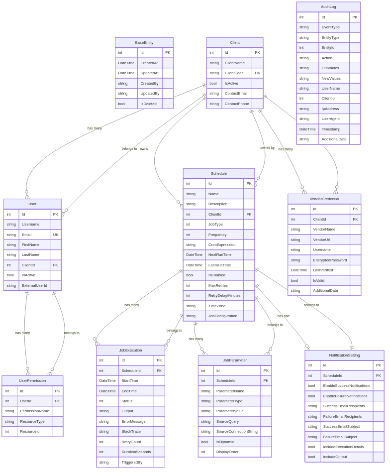
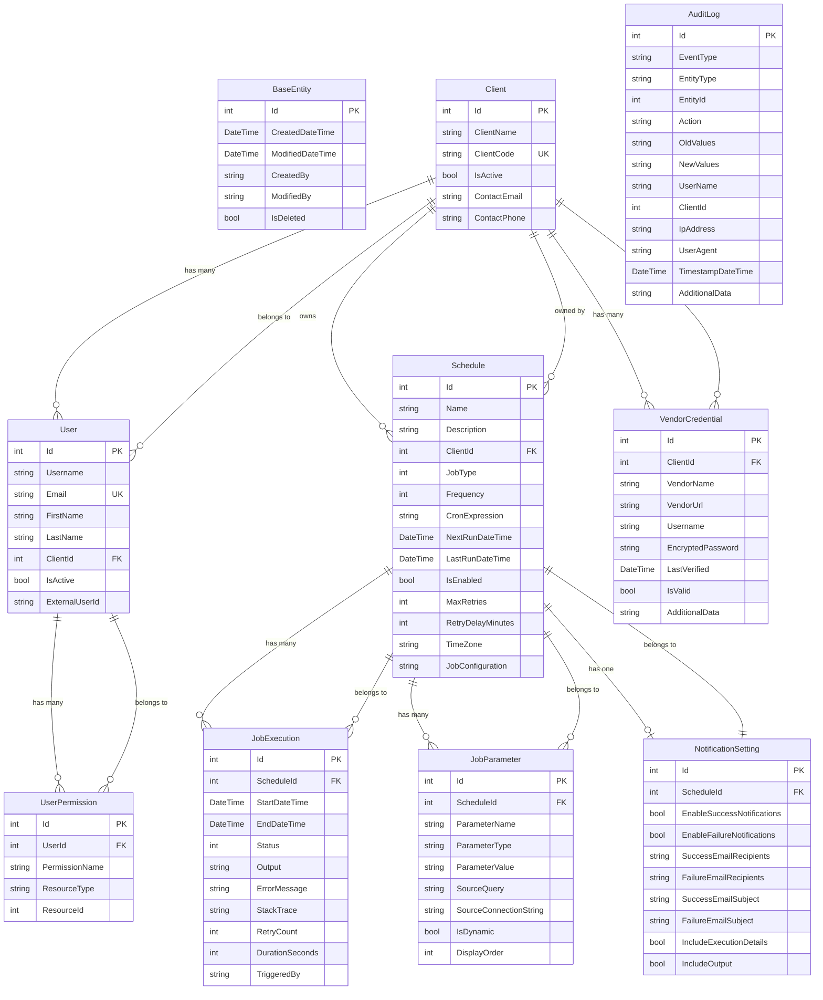
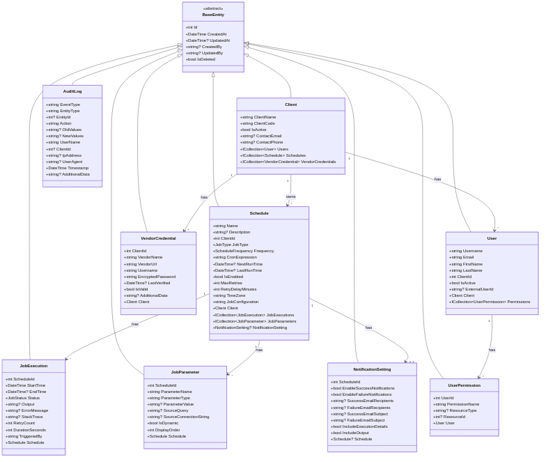
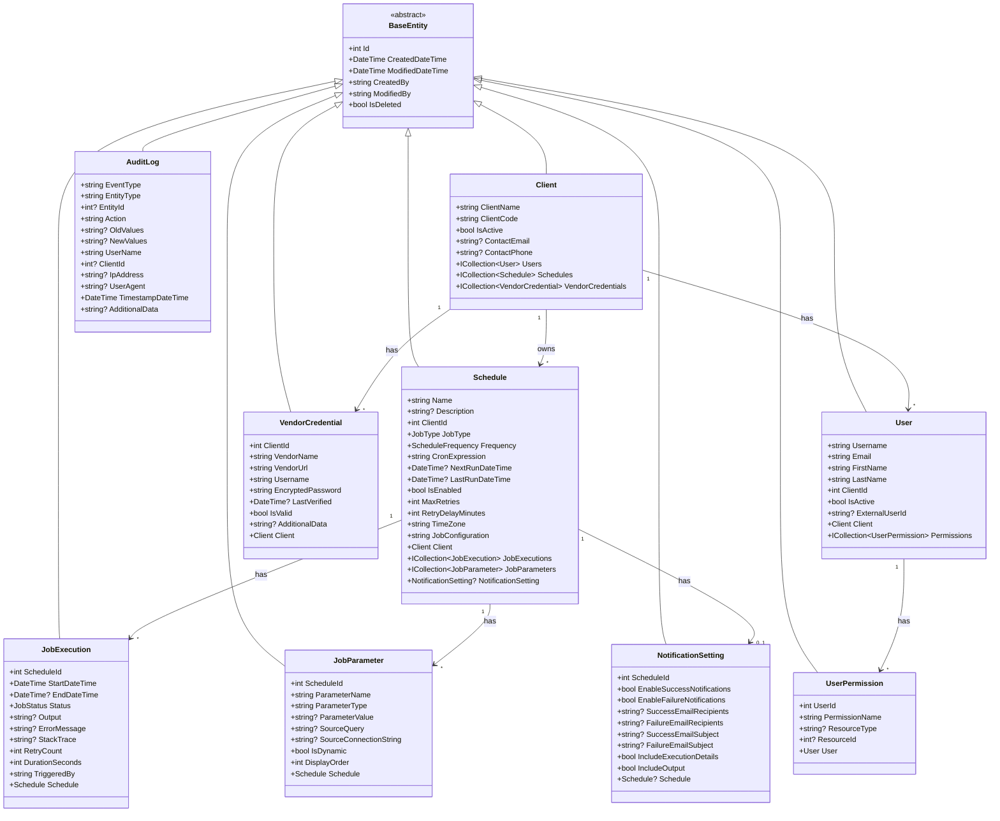
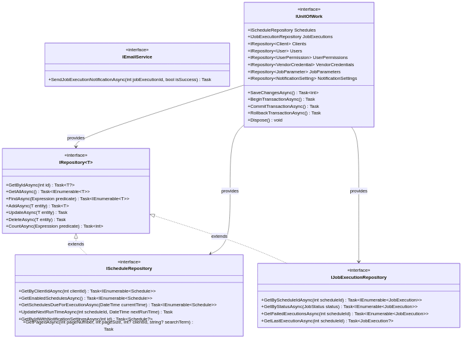
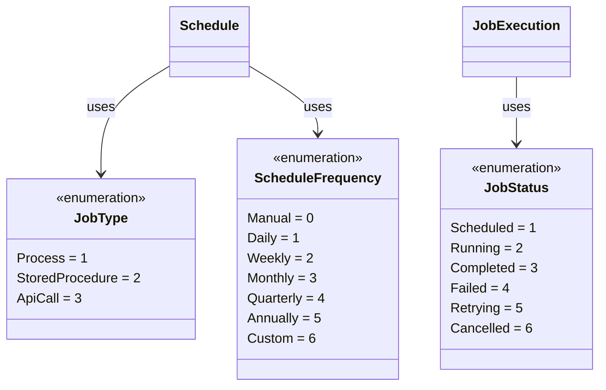
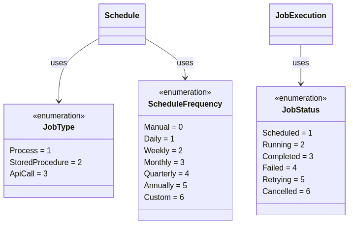
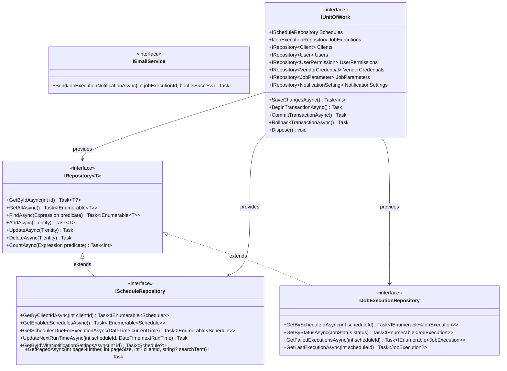

# SchedulerPlatform.Core

## Recent Updates (November 2025)

- **Upgraded to .NET 10**: Complete upgrade from .NET 9 to .NET 10
- **User Entity Enhancements**: Added PasswordHash, IsSystemAdmin, ExternalIssuer, LastLoginAt properties
- **PasswordHistory Entity**: New entity to track password history for preventing reuse
- **UserPermission Enhancements**: Added CanCreate, CanRead, CanUpdate, CanDelete, CanExecute properties for granular permissions
- **JobExecution CancelledBy**: Added CancelledBy property to track who cancelled running executions
- **Schedule TimeoutMinutes**: Added TimeoutMinutes property for job execution timeouts

## Business Overview

The Core project is the heart of the SchedulerPlatform, containing the fundamental business entities and rules that define what the system can do. Think of it as the "dictionary" of the application - it defines what a Schedule is, what a Job Execution means, and what types of jobs we can run.

**What It Provides:**
- **Domain Entities**: Definitions of all business objects (schedules, clients, job executions, etc.)
- **Business Rules**: Validation logic and entity behaviors
- **Contracts (Interfaces)**: Defines what operations the system needs without implementing them
- **Enumerations**: Standard lists of values (job types, statuses, frequencies)

**Why It Matters:**
This project has zero dependencies on external frameworks or libraries - it's pure business logic. This makes it easy to understand, test, and maintain without worrying about database connections, web APIs, or UI frameworks. Any changes to core business concepts start here.

## Key Components

### Domain Entities

All entities inherit from `BaseEntity` which provides common tracking fields:

#### BaseEntity (Abstract Base Class)
- `Id` (int): Unique identifier
- `CreatedDateTime` (DateTime): When the record was created
- `ModifiedDateTime` (DateTime): When the record was last modified
- `CreatedBy` (string): Username who created the record
- `ModifiedBy` (string): Username who last updated the record
- `IsDeleted` (bool): Soft delete flag

**Note:** `ModifiedDateTime` and `ModifiedBy` are non-nullable and default to the same values as `CreatedDateTime` and `CreatedBy` when a record is first created.

#### Schedule
**Purpose**: Represents a scheduled job with its configuration and timing.

**Properties:**
- `Name` (string): Display name for the schedule
- `Description` (string?): Detailed description of what this schedule does
- `ClientId` (int): Which client this schedule belongs to
- `JobType` (JobType enum): Type of job (Process=1, StoredProcedure=2, ApiCall=3)
- `Frequency` (ScheduleFrequency enum): How often it runs (Manual, Daily, Weekly, Monthly, etc.)
- `CronExpression` (string): Quartz CRON expression defining when to run
- `NextRunDateTime` (DateTime?): When the job will execute next
- `LastRunDateTime` (DateTime?): When the job last executed
- `IsEnabled` (bool): Whether the schedule is active
- `MaxRetries` (int): How many times to retry on failure
- `RetryDelayMinutes` (int): Minutes to wait between retries
- `TimeZone` (string): Timezone for CRON expression evaluation
- `TimeoutMinutes` (int?): Maximum execution time in minutes before job is terminated
- `JobConfiguration` (string): JSON configuration specific to the job type

**Navigation Properties:**
- `Client`: The client who owns this schedule
- `JobExecutions`: History of all executions for this schedule
- `JobParameters`: Dynamic parameters for job execution
- `NotificationSetting`: Email notification configuration

#### Client
**Purpose**: Represents a tenant/customer in the multi-tenant system.

**Properties:**
- `ClientName` (string): Full name of the client organization
- `ClientCode` (string): Unique code identifier
- `IsActive` (bool): Whether the client account is active
- `ContactEmail` (string?): Primary contact email
- `ContactPhone` (string?): Primary contact phone

**Navigation Properties:**
- `Users`: Users belonging to this client
- `Schedules`: All schedules owned by this client
- `VendorCredentials`: Third-party API credentials for this client

#### JobExecution
**Purpose**: Records the result of a single job execution.

**Properties:**
- `ScheduleId` (int): Which schedule this execution belongs to
- `StartDateTime` (DateTime): When execution started
- `EndDateTime` (DateTime?): When execution completed
- `Status` (JobStatus enum): Current status (Scheduled, Running, Completed, Failed, etc.)
- `Output` (string?): Success output or result data
- `ErrorMessage` (string?): Error message if failed
- `StackTrace` (string?): Full stack trace for debugging failures
- `RetryCount` (int): How many times this execution has been retried
- `DurationSeconds` (int): How long the execution took
- `TriggeredBy` (string): Who/what triggered this execution (Scheduler, Manual, Retry)
- `CancelledBy` (string?): Username who manually cancelled this execution (if cancelled)

**Navigation Properties:**
- `Schedule`: The schedule this execution belongs to

#### JobParameter
**Purpose**: Defines dynamic parameters for job execution.

**Properties:**
- `ScheduleId` (int): Which schedule this parameter belongs to
- `ParameterName` (string): Name of the parameter (e.g., "AccountId")
- `ParameterType` (string): Data type (int, string, datetime, etc.)
- `ParameterValue` (string?): Static value or default value
- `SourceQuery` (string?): SQL query to get dynamic value at runtime
- `SourceConnectionString` (string?): Database connection for dynamic query
- `IsDynamic` (bool): Whether to execute SourceQuery at runtime
- `DisplayOrder` (int): Order to display in UI

**Navigation Properties:**
- `Schedule`: The schedule this parameter belongs to

#### NotificationSetting
**Purpose**: Email notification configuration for job execution results.

**Properties:**
- `ScheduleId` (int): Which schedule these settings apply to
- `EnableSuccessNotifications` (bool): Send email on successful execution
- `EnableFailureNotifications` (bool): Send email on failed execution (default: true)
- `SuccessEmailRecipients` (string?): Comma-separated email addresses for success
- `FailureEmailRecipients` (string?): Comma-separated email addresses for failure
- `SuccessEmailSubject` (string?): Custom subject line for success emails
- `FailureEmailSubject` (string?): Custom subject line for failure emails
- `IncludeExecutionDetails` (bool): Include execution time, duration in email
- `IncludeOutput` (bool): Include job output in email body

**Navigation Properties:**
- `Schedule`: The schedule these settings belong to (one-to-one)

#### User
**Purpose**: Represents a user account in the system.

**Properties:**
- `Username` (string): Login username
- `Email` (string): User's email address (unique)
- `FirstName` (string): First name
- `LastName` (string): Last name
- `ClientId` (int): Which client this user belongs to
- `IsActive` (bool): Whether the account is active
- `ExternalUserId` (string?): ID from external identity provider (if using SSO)

**Navigation Properties:**
- `Client`: The client organization this user belongs to
- `Permissions`: List of permissions assigned to this user

#### UserPermission
**Purpose**: Defines what actions a user can perform.

**Properties:**
- `UserId` (int): Which user this permission is for
- `PermissionName` (string): Name of the permission (e.g., "ViewSchedules", "EditSchedules")
- `ResourceType` (string?): Type of resource (e.g., "Schedule", "Client")
- `ResourceId` (int?): Specific resource ID (for row-level security)

**Navigation Properties:**
- `User`: The user this permission belongs to

#### VendorCredential
**Purpose**: Stores encrypted credentials for third-party API integrations.

**Properties:**
- `ClientId` (int): Which client owns these credentials
- `VendorName` (string): Name of the vendor/service
- `VendorUrl` (string): API base URL
- `Username` (string): API username or client ID
- `EncryptedPassword` (string): Encrypted password or API key
- `LastVerified` (DateTime?): When credentials were last validated
- `IsValid` (bool): Whether credentials are currently valid
- `AdditionalData` (string?): JSON for extra vendor-specific config

**Navigation Properties:**
- `Client`: The client who owns these credentials

#### ScheduleSyncSource
**Purpose**: Stores external schedule source data for synchronization with third-party systems.

**Properties:**
- `ClientId` (int): Which client owns this sync source
- `Vendor` (string): Name of the external vendor/system
- `AccountNumber` (string): Account or identifier in the external system
- `ScheduleFrequency` (int): How often the schedule should run (maps to ScheduleFrequency enum)
- `ScheduleDate` (DateTime): Specific date/time for the scheduled execution
- `CreatedDateTime` (DateTime): When this sync source was created
- `ModifiedDateTime` (DateTime): When this sync source was last updated
- `CreatedBy` (string): Username who created this record
- `ModifiedBy` (string): Username who last updated this record
- `IsDeleted` (bool): Soft delete flag

**Navigation Properties:**
- `Client`: The client who owns this sync source

**Use Case:**
- Import schedules from external billing systems, vendor portals, or data warehouses
- Bulk schedule creation from external date/time lists
- Maintain mapping between internal schedules and external system identifiers

#### AuditLog
**Purpose**: Tracks all changes to entities for compliance and debugging.

**Properties:**
- `EventType` (string): Type of event (e.g., "EntityChanged", "LoginAttempt")
- `EntityType` (string): Type of entity changed (e.g., "Schedule")
- `EntityId` (int?): ID of the entity changed
- `Action` (string): Action performed (Create, Update, Delete)
- `OldValues` (string?): JSON snapshot of entity before change
- `NewValues` (string?): JSON snapshot of entity after change
- `UserName` (string): Username who made the change
- `ClientId` (int?): Client context for the change
- `IpAddress` (string?): IP address of the user
- `UserAgent` (string?): Browser/client user agent
- `TimestampDateTime` (DateTime): When the event occurred
- `AdditionalData` (string?): Extra context data in JSON

### ADR Domain Model

The ADR (Automated Data Retrieval) domain model supports automated invoice scraping from vendor portals. These entities track accounts, jobs, executions, and orchestration runs for the ADR process.

For the complete ER diagram, see [ADR ER Diagram](../../../Documents/Technical/diagrams/adr-er-diagram.png).

#### AdrAccount
**Purpose**: Represents a vendor account synced from the external VendorCredNewUAT database. Tracks billing patterns and scraping schedules.

**Properties:**
- `VMAccountId` (long): External account ID from VendorCred database (can have duplicates as account numbers change over time)
- `VMAccountNumber` (string): Vendor account number string
- `InterfaceAccountId` (string?): Bank payment/tracking ID for invoices
- `ClientId` (int?): FK to Client table
- `ClientName` (string?): Client name (denormalized for display)
- `CredentialId` (int): Current active credential ID used by ADR
- `VendorCode` (string?): Vendor identifier code
- `PeriodType` (string?): Billing frequency type (Bi-Weekly, Monthly, Bi-Monthly, Quarterly, Semi-Annually, Annually)
- `PeriodDays` (int?): Standard days between invoices for this period type
- `MedianDays` (double?): Calculated median interval between invoices
- `InvoiceCount` (int): Number of historical invoices found
- `LastInvoiceDateTime` (DateTime?): Most recent invoice date found
- `ExpectedNextDateTime` (DateTime?): Expected next invoice date based on billing pattern
- `ExpectedRangeStartDateTime` (DateTime?): Search window start for expected invoice
- `ExpectedRangeEndDateTime` (DateTime?): Search window end for expected invoice
- `NextRunDateTime` (DateTime?): Scheduled scrape date
- `NextRangeStartDateTime` (DateTime?): Scrape window start date
- `NextRangeEndDateTime` (DateTime?): Scrape window end date
- `DaysUntilNextRun` (int?): Days until NextRunDateTime
- `NextRunStatus` (string?): Status for next run (Run Now, Due Soon, Upcoming, Future)
- `HistoricalBillingStatus` (string?): Historical billing status (Missing, Overdue, Due Now, Due Soon, Upcoming, Future)
- `LastSyncedDateTime` (DateTime?): Last time this account was synced from external database
- `IsManuallyOverridden` (bool): Flag indicating if billing dates/frequency have been manually overridden
- `OverriddenBy` (string?): User who manually overrode the billing data
- `OverriddenDateTime` (DateTime?): Date/time when billing data was manually overridden

**Navigation Properties:**
- `Client`: The client who owns this account
- `AdrJobs`: Collection of scraping jobs for this account

**Business Rules:**
- VMAccountId can have duplicates because account numbers can change over time
- When `IsManuallyOverridden` is true, account sync skips updating: LastInvoiceDateTime, PeriodType, PeriodDays, MedianDays, ExpectedNextDateTime, ExpectedRangeStartDateTime, ExpectedRangeEndDateTime
- Manual overrides preserve operator corrections when historical data is incorrect

#### AdrJob
**Purpose**: Represents a single ADR scraping job for one account/billing period. Each billing period for an account gets its own Job record.

**Properties:**
- `AdrAccountId` (int): FK to AdrAccount table
- `VMAccountId` (long): External account ID (denormalized for queries)
- `VMAccountNumber` (string): Vendor account number (denormalized for queries)
- `VendorCode` (string?): Vendor code (denormalized for queries and schedule linking)
- `CredentialId` (int): Credential ID used for this job
- `PeriodType` (string?): Billing period type (e.g., Monthly, Quarterly)
- `BillingPeriodStartDateTime` (DateTime): Start of the billing period this Job targets
- `BillingPeriodEndDateTime` (DateTime): End of the billing period this Job targets
- `NextRunDateTime` (DateTime?): Expected scrape date
- `NextRangeStartDateTime` (DateTime?): Search window start for scraping
- `NextRangeEndDateTime` (DateTime?): Search window end for scraping
- `Status` (string): Current job status (Pending, CredentialVerified, CredentialFailed, Scraping, Completed, Failed, NeedsReview)
- `IsMissing` (bool): Flag for missing accounts
- `AdrStatusId` (int?): Latest ADR status ID from the API
- `AdrStatusDescription` (string?): Latest ADR status description
- `AdrIndexId` (long?): Index ID returned from ADR API
- `CredentialVerifiedDateTime` (DateTime?): Date/time credential verification was completed
- `ScrapingCompletedDateTime` (DateTime?): Date/time scraping was completed
- `ErrorMessage` (string?): Error message if job failed
- `RetryCount` (int): Number of scrape retry attempts

**Navigation Properties:**
- `AdrAccount`: The account this job belongs to
- `AdrJobExecutions`: Collection of execution attempts for this job

**Business Rules:**
- Unique constraint on (AdrAccountId, BillingPeriodStartDateTime, BillingPeriodEndDateTime) WHERE IsDeleted = 0 prevents duplicate jobs for the same billing period
- Credential verification runs within 7 days BEFORE NextRunDateTime
- Scraping begins ON NextRunDateTime, not before
- Jobs with CredentialFailed status still proceed to scraping (ADR API creates helpdesk tickets for credential issues)

#### AdrJobExecution
**Purpose**: Represents an individual execution attempt for an ADR job. Records login checks, scrape requests, and status polls.

**Properties:**
- `AdrJobId` (int): FK to AdrJob table
- `AdrRequestTypeId` (int): Type of ADR request (1 = Attempt Login, 2 = Download Invoice)
- `StartDateTime` (DateTime): Execution start time
- `EndDateTime` (DateTime?): Execution end time
- `AdrStatusId` (int?): ADR status ID returned from API
- `AdrStatusDescription` (string?): ADR status description
- `IsError` (bool): Whether this status indicates an error
- `IsFinal` (bool): Whether this status is final (complete or needs review)
- `AdrIndexId` (long?): Index ID returned from ADR API
- `HttpStatusCode` (int?): HTTP status code from API response
- `IsSuccess` (bool): Success or failure
- `ErrorMessage` (string?): Error message if execution failed
- `ApiResponse` (string?): Full API response (JSON)
- `RequestPayload` (string?): Request payload sent to API (JSON)

**Navigation Properties:**
- `AdrJob`: The job this execution belongs to

**Business Rules:**
- Used for idempotency checking - prevents duplicate API calls for paid external services
- Execution history is checked before making credential verification or scraping API calls

#### AdrOrchestrationRun
**Purpose**: Represents a single ADR orchestration run with step-by-step progress tracking. Persisted to database to survive application restarts.

**Properties:**
- `RequestId` (string): Unique identifier for this orchestration run (GUID)
- `RequestedBy` (string): User who requested the orchestration run
- `RequestedDateTime` (DateTime): When the orchestration was requested/queued
- `StartedDateTime` (DateTime?): When the orchestration actually started processing
- `CompletedDateTime` (DateTime?): When the orchestration completed (success or failure)
- `Status` (string): Current status (Queued, Running, Completed, Failed, Cancelled)
- `CurrentStep` (string?): Current step being executed (for running orchestrations)
- `CurrentProgress` (string?): Current progress within the step (e.g., "150/500")
- `TotalItems` (int?): Total items to process in current step
- `ProcessedItems` (int?): Items processed so far in current step
- `ErrorMessage` (string?): Error message if the run failed
- Step 1 Results: `SyncAccountsInserted`, `SyncAccountsUpdated`, `SyncAccountsTotal`
- Step 2 Results: `JobsCreated`, `JobsSkipped`
- Step 3 Results: `CredentialsVerified`, `CredentialsFailed`
- Step 4 Results: `ScrapingRequested`, `ScrapingFailed`
- Step 5 Results: `StatusesChecked`, `StatusesFailed`

**Business Rules:**
- Only one orchestration can run at a time
- Progress is updated in real-time and persisted to database
- History is preserved for auditing and troubleshooting

### Enumerations

#### JobType
Defines the types of jobs that can be scheduled:
- `Process = 1`: Execute a Windows process/executable
- `StoredProcedure = 2`: Execute a SQL Server stored procedure
- `ApiCall = 3`: Call an external REST API

#### JobStatus
Tracks the lifecycle of a job execution:
- `Scheduled = 1`: Job is scheduled but not started yet
- `Running = 2`: Job is currently executing
- `Completed = 3`: Job finished successfully
- `Failed = 4`: Job failed with an error
- `Retrying = 5`: Job is being retried after failure
- `Cancelled = 6`: Job was cancelled by user

#### ScheduleFrequency
Defines common scheduling patterns (used for UI display):
- `Manual = 0`: Only runs when manually triggered
- `Daily = 1`: Runs every day
- `Weekly = 2`: Runs every week
- `Monthly = 3`: Runs every month
- `Quarterly = 4`: Runs every quarter
- `Annually = 5`: Runs every year
- `Custom = 6`: Uses custom CRON expression

**Note**: The actual scheduling logic uses CRON expressions; this enum helps users select common patterns in the UI.

### Interfaces

#### IRepository<T>
Generic repository interface for data access operations:
- `GetByIdAsync(int id)`: Retrieve entity by ID
- `GetAllAsync()`: Retrieve all entities
- `FindAsync(Expression<Func<T, bool>> predicate)`: Query entities
- `AddAsync(T entity)`: Add new entity
- `UpdateAsync(T entity)`: Update existing entity
- `DeleteAsync(T entity)`: Delete entity
- `CountAsync(Expression<Func<T, bool>>? predicate)`: Count entities matching criteria

#### IScheduleRepository : IRepository<Schedule>
Extended repository for schedule-specific operations:
- `GetByClientIdAsync(int clientId)`: Get all schedules for a client
- `GetEnabledSchedulesAsync()`: Get all active schedules
- `GetSchedulesDueForExecutionAsync(DateTime currentTime)`: Get schedules ready to run
- `UpdateNextRunTimeAsync(int scheduleId, DateTime nextRunTime)`: Update next execution time
- `GetByIdWithNotificationSettingsAsync(int id)`: Get schedule with notification config
- `GetPagedAsync(...)`: Get paginated list with filtering

#### IJobExecutionRepository : IRepository<JobExecution>
Extended repository for execution tracking:
- `GetByScheduleIdAsync(int scheduleId)`: Get execution history for a schedule
- `GetByStatusAsync(JobStatus status)`: Get all executions with specific status
- `GetFailedExecutionsAsync(int scheduleId)`: Get failed executions for retry analysis
- `GetLastExecutionAsync(int scheduleId)`: Get most recent execution

#### IEmailService
Interface for sending email notifications:
- `SendJobExecutionNotificationAsync(int jobExecutionId, bool isSuccess)`: Send notification after job completes

### Services

#### CronExpressionGenerator
**Purpose**: Utility service for generating Quartz CRON expressions from dates/times.

**Methods:**
- `GenerateCronExpression(DateTime dateTime, bool includeYear = true)`: Generates a Quartz CRON expression for a specific date/time
  - Format: `"0 {minute} {hour} {day} {month} ? [{year}]"`
  - Example: `"0 30 14 25 10 ? 2025"` for October 25, 2025 at 2:30 PM
- `GenerateCronDescription(DateTime dateTime)`: Generates a human-readable description of the CRON schedule
  - Example: "Runs once on October 25, 2025 at 2:30 PM"

**Use Cases:**
- Bulk schedule creation from external date/time lists
- CRON expression preview in UI before schedule creation
- Integration with external scheduling systems

#### IUnitOfWork
Manages transactions and provides access to all repositories:
- `Schedules`: IScheduleRepository property
- `JobExecutions`: IJobExecutionRepository property
- `Clients`: IRepository<Client> property
- `Users`: IRepository<User> property
- `UserPermissions`: IRepository<UserPermission> property
- `VendorCredentials`: IRepository<VendorCredential> property
- `JobParameters`: IRepository<JobParameter> property
- `NotificationSettings`: IRepository<NotificationSetting> property
- `SaveChangesAsync()`: Commit all changes in transaction
- `BeginTransactionAsync()`: Start explicit transaction
- `CommitTransactionAsync()`: Commit explicit transaction
- `RollbackTransactionAsync()`: Rollback explicit transaction

## For Developers

### Architecture Patterns

**Domain-Driven Design (DDD)**:
- Pure domain layer with no infrastructure concerns
- Rich domain entities with behavior (not anemic data models)
- Clear separation between domain logic and infrastructure

**Repository Pattern**:
- Abstracts data access behind interfaces
- Allows swapping data sources without changing business logic
- Supports unit testing with mock repositories

**Unit of Work Pattern**:
- Manages transactions across multiple repository operations
- Ensures atomic commits (all-or-nothing)
- Centralizes SaveChanges logic

**Dependency Inversion**:
- Core defines interfaces, Infrastructure implements them
- No dependencies on external libraries or frameworks
- Enables testability and flexibility

### Entity Relationships

This entity-relationship diagram shows how all the core business entities (Client, User, Schedule, JobExecution, etc.) relate to each other, including foreign key relationships and cardinality.

### UML Class Diagrams

#### Core Domain Entities

This class diagram illustrates the structure of core domain entities, showing inheritance from BaseEntity, properties, and navigation relationships.

#### Domain Enums

This diagram shows the enumeration types (JobType, JobStatus, ScheduleFrequency) that define valid values for various domain properties.

#### Repository Interfaces

This diagram shows the repository pattern interfaces, including the generic IRepository<T>, specialized repositories, and the IUnitOfWork that coordinates them.

### Design Decisions

**Why No Business Logic in Entities?**
- Current implementation uses anemic domain model (data-only entities)
- Business logic is in service layer (Jobs, API controllers)
- Could be refactored to rich domain model with entity methods
- Trade-off: Simplicity vs. encapsulation

**Why Soft Deletes (IsDeleted)?**
- Audit trail: Never lose historical data
- Regulatory compliance: Maintain records for legal requirements
- Data recovery: Easily restore accidentally deleted items
- Queries must filter on `IsDeleted = false`

**Why String JSON for JobConfiguration?**
- Flexibility: Each job type has different configuration needs
- No schema changes: Add new config fields without migrations
- Easy to version: Store different config versions side-by-side
- Trade-off: Type safety vs. flexibility

**Why CRON Expressions Instead of Simple Schedules?**
- Power: CRON expressions handle complex schedules (e.g., "2nd Tuesday of each month")
- Industry standard: Quartz.NET uses CRON, familiar to ops teams
- Flexibility: Single format for all schedule types
- UI provides helpers: CronBuilder component makes it user-friendly

## Dependencies

**None!** This is a pure domain layer with zero external dependencies.

**Framework**: .NET 10.0 (System.Text.Json for serialization attributes)

## Integration

**Referenced By:**
- `SchedulerPlatform.Infrastructure`: Implements repositories and data access
- `SchedulerPlatform.Jobs`: Uses entities for job execution
- `SchedulerPlatform.API`: Uses entities and interfaces for controllers
- `SchedulerPlatform.IdentityServer`: Uses User and Client entities

**References:** None (pure domain layer)

## Known Issues

### Design Issues

1. **Anemic Domain Model**
   - **Issue**: Entities are just data containers with no behavior
   - **Impact**: Business logic scattered across services instead of encapsulated in entities
   - **Recommendation**: Consider refactoring to rich domain model with entity methods (e.g., `Schedule.CalculateNextRunTime()`)

2. **JobConfiguration as String JSON**
   - **Issue**: No compile-time type safety for job configurations
   - **Impact**: Runtime errors if JSON structure is wrong
   - **Mitigation**: Strict validation in job execution, schema documentation
   - **Alternative**: Consider polymorphic JobConfiguration base class with typed subclasses

3. **No Value Objects**
   - **Issue**: Primitives used for complex concepts (e.g., CronExpression, Email)
   - **Impact**: No validation at domain level, easy to pass invalid values
   - **Recommendation**: Create value objects: `CronExpression`, `EmailAddress`, `TimeZone`

### Missing Features

1. **No Audit Trail in Entities**
   - **Issue**: AuditLog is separate; entities don't track their own history
   - **Impact**: Can't easily see entity change history
   - **TODO**: Consider adding `HistoryChanges` collection to BaseEntity

2. **No Domain Events**
   - **Issue**: No way for entities to publish events (e.g., "ScheduleCreated")
   - **Impact**: Hard to trigger side effects (send notifications, log events)
   - **Recommendation**: Implement domain events pattern

3. **Limited Validation**
   - **Issue**: Minimal validation logic in entity properties
   - **Impact**: Invalid data can be created
   - **TODO**: Add data annotation attributes or FluentValidation

### Multi-Tenancy

1. **Client Isolation Not Enforced**
   - **Issue**: No built-in query filters for ClientId
   - **Impact**: Developers must remember to filter by ClientId in every query
   - **Risk**: Potential data leaks between clients
   - **Recommendation**: Implement EF Core global query filters in Infrastructure layer

2. **No Client Context Awareness**
   - **Issue**: Entities don't know current user's ClientId
   - **Impact**: Must pass ClientId explicitly in every operation
   - **TODO**: Consider IClientContext service injected via constructor

### Security

1. **Passwords in VendorCredential**
   - **Issue**: Encryption handled outside Core layer
   - **Impact**: Core doesn't enforce encryption
   - **TODO**: Document encryption requirements clearly

2. **No Permission Validation in Core**
   - **Issue**: UserPermission entities exist but no validation logic
   - **Impact**: Permission checks must be done in API/UI layers
   - **Recommendation**: Add `User.HasPermission(string permissionName)` method

### Performance

1. **Lazy Loading Not Configured**
   - **Issue**: All navigation properties must be explicitly included
   - **Impact**: Risk of N+1 query problems
   - **Mitigation**: Always use `.Include()` in repositories
   - **Alternative**: Enable lazy loading proxies (with caution)

2. **Large Collections**
   - **Issue**: `Schedule.JobExecutions` can grow to thousands of records
   - **Impact**: Loading a schedule with all executions is slow
   - **TODO**: Implement pagination in repository queries

### Testing

1. **No Unit Tests**
   - **Issue**: Core project has no test coverage
   - **Impact**: Risk of breaking changes
   - **TODO**: Add xUnit project with entity tests

2. **No Validation Tests**
   - **Issue**: Can't verify business rules are enforced
   - **TODO**: Test invalid entity creation scenarios

## Best Practices for Using Core

1. **Never Reference Infrastructure**: Core should never depend on Infrastructure, API, or Jobs
2. **Use Interfaces**: Always program against IRepository, IUnitOfWork, never concrete implementations
3. **Keep It Pure**: No database concerns, no HTTP concerns, no UI concerns in Core
4. **Validate Early**: Add validation logic to entity constructors or factory methods
5. **Document Enums**: Add XML comments explaining when to use each enum value
6. **Test Entities**: Write unit tests for entity behavior and validation rules

## Future Improvements

1. Migrate to rich domain model with entity behaviors
2. Implement domain events for loose coupling
3. Add value objects for complex primitives
4. Implement specification pattern for complex queries
5. Add comprehensive validation using FluentValidation
6. Create factory methods for complex entity creation
7. Add integration events for cross-bounded-context communication
