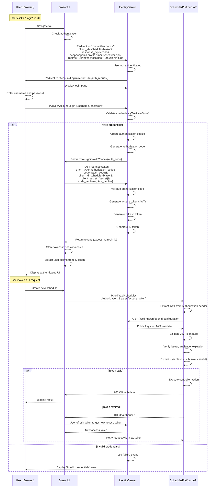
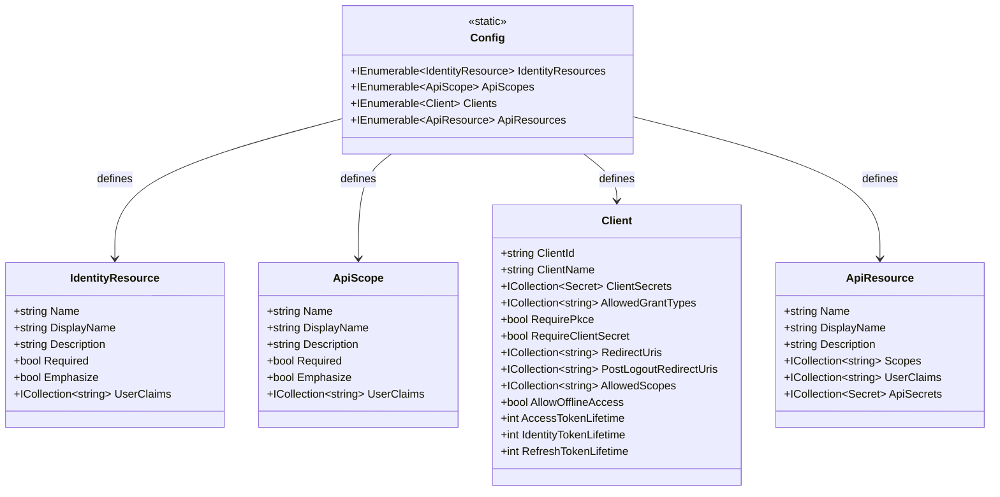
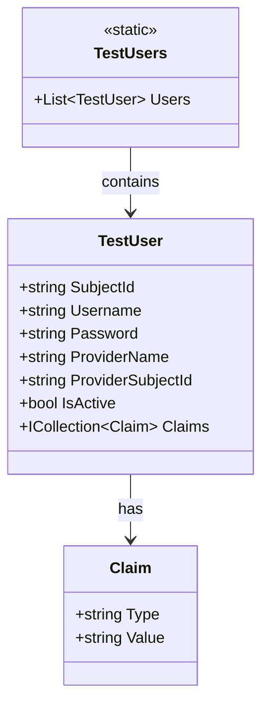
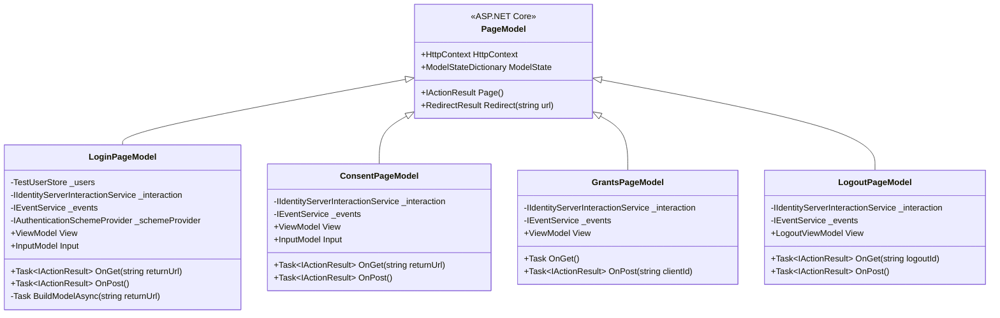
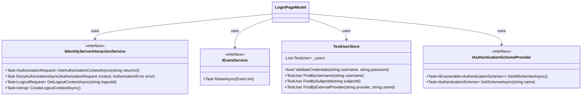

# SchedulerPlatform.IdentityServer

## Recent Updates (November 2025)

- **Upgraded to .NET 10**: Complete upgrade from .NET 9 to .NET 10 with Duende IdentityServer 7.3.2
- **Custom Claims in Access Tokens**: ProfileService now injects permission and is_system_admin claims into JWT tokens
- **Database-Backed Users**: Integrated with Users table for authentication instead of only TestUsers
- **Local Password Authentication**: BCrypt password hashing for development environment users
- **Service Account Support**: OAuth2 Client Credentials flow configured for svc-adrscheduler service account
- **Permission Claims**: Access tokens now include granular permission claims for API authorization

## Business Overview

The IdentityServer project is the "security gate" of the SchedulerPlatform - it handles user authentication and controls who can access what. When users log in to the scheduling system, this component verifies their identity and issues security tokens that prove they are who they claim to be.

**What It Provides:**
- **Single Sign-On (SSO)**: Users log in once and gain access to both the API and UI
- **OAuth2/OpenID Connect**: Industry-standard authentication protocols
- **JWT Token Issuance**: Secure tokens that API validates for each request
- **User Management**: Test users for development (will integrate with your user database in production)
- **Client Registration**: Defines which applications (UI, API) can request authentication
- **Scope-Based Access Control**: Controls what resources each client can access

**Why It Matters:**
This is the foundation of security for the entire platform. Without proper authentication, anyone could access schedules, trigger jobs, or view sensitive data. IdentityServer acts as a trusted authority that both the UI and API rely on to verify user identity.

**Business Value:**
- **Security**: Centralized authentication reduces security vulnerabilities
- **Compliance**: OAuth2/OIDC are industry standards required by many regulations
- **User Experience**: Single sign-on means users don't need multiple passwords
- **Scalability**: Can integrate with Active Directory, LDAP, or external identity providers
- **Audit Trail**: All authentication events are logged for security analysis

## Key Components

### Configuration (Config.cs)

#### IdentityResources
**Purpose**: Define which user claims (profile information) can be requested.

**Standard Resources**:
```csharp
public static IEnumerable<IdentityResource> IdentityResources =>
    new IdentityResource[]
    {
        new IdentityResources.OpenId(),      // Required: subject ID
        new IdentityResources.Profile(),     // Name, email, etc.
        new IdentityResources.Email()        // Email address
    };
```

**What They Mean**:
- `OpenId`: Enables OpenID Connect, provides user's unique subject ID (sub claim)
- `Profile`: Provides user profile information (name, username, display name)
- `Email`: Provides email address claim

#### ApiScopes
**Purpose**: Define what operations or resources clients can access in the API.

**Configured Scopes**:
```csharp
public static IEnumerable<ApiScope> ApiScopes =>
    new ApiScope[]
    {
        new ApiScope("scheduler-api", "SchedulerPlatform API")
        {
            UserClaims = { "name", "role", "email" }
        }
    };
```

**Recent Enhancement (JWT Authentication Fix)**:
The `scheduler-api` ApiScope now includes `UserClaims = { "name", "role", "email" }` to ensure these user claims are included in JWT access tokens. This fix allows the API to properly identify users when they trigger or cancel job executions, enabling features like:
- Tracking who triggered manual job executions (`TriggeredBy` field)
- Tracking who cancelled running job executions (`CancelledBy` field)
- Proper population of `User.Identity.Name` in API controllers

**Usage**: When UI requests token, it specifies `scope=scheduler-api` to indicate it needs API access

#### Clients
**Purpose**: Register applications that can request authentication tokens.

**scheduler-blazor Client** (Current Configuration):
```csharp
new Client
{
    ClientId = "scheduler-blazor",
    ClientName = "Scheduler Blazor UI",
    ClientSecrets = { new Secret("secret".Sha256()) },
    
    AllowedGrantTypes = GrantTypes.Code,  // Authorization Code flow (most secure)
    RequirePkce = true,                   // Proof Key for Code Exchange (security)
    RequireClientSecret = true,
    
    RedirectUris = {
        "https://localhost:7299/signin-oidc"  // Where IdentityServer redirects after login
    },
    PostLogoutRedirectUris = {
        "https://localhost:7299/signout-callback-oidc"  // Where to redirect after logout
    },
    
    AllowedScopes = {
        IdentityServerConstants.StandardScopes.OpenId,
        IdentityServerConstants.StandardScopes.Profile,
        IdentityServerConstants.StandardScopes.Email,
        "scheduler-api"  // Can access the API
    },
    
    AllowOfflineAccess = true  // Can request refresh tokens
}
```

**Key Settings Explained**:
- **ClientSecrets**: Password for the client (in production, use secure secret storage)
- **AllowedGrantTypes.Code**: Uses Authorization Code flow (user redirected to login page)
- **RequirePkce**: Adds extra security layer to prevent token interception
- **AllowOfflineAccess**: Enables refresh tokens so users don't need to re-login frequently
- **RedirectUris**: Must match exactly what the UI application expects

**Removed Configuration** (Angular cleanup):
- `scheduler-angular` client was removed as the project converted to Blazor

#### ApiResources (Inferred)
**Purpose**: Define protected APIs that require tokens.

**Typical Configuration**:
```csharp
new ApiResource("scheduler-api", "SchedulerPlatform API")
{
    Scopes = { "scheduler-api" },
    UserClaims = { "role", "clientId" }  // Include these claims in access token
}
```

### Test Users (Pages/TestUsers.cs)

**Purpose**: Provide development/testing user accounts without requiring a real user database.

**Alice User**:
```csharp
new TestUser
{
    SubjectId = "1",
    Username = "alice",
    Password = "alice",
    Claims = new[]
    {
        new Claim(JwtClaimTypes.Name, "Alice Smith"),
        new Claim(JwtClaimTypes.GivenName, "Alice"),
        new Claim(JwtClaimTypes.FamilyName, "Smith"),
        new Claim(JwtClaimTypes.Email, "AliceSmith@email.com"),
        new Claim(JwtClaimTypes.EmailVerified, "true", ClaimValueTypes.Boolean),
        new Claim(JwtClaimTypes.WebSite, "http://alice.com"),
        new Claim(JwtClaimTypes.Address, JsonSerializer.Serialize(address))
    }
}
```

**Bob User**:
```csharp
new TestUser
{
    SubjectId = "2",
    Username = "bob",
    Password = "bob",
    Claims = new[]
    {
        new Claim(JwtClaimTypes.Name, "Bob Smith"),
        new Claim(JwtClaimTypes.GivenName, "Bob"),
        new Claim(JwtClaimTypes.FamilyName, "Smith"),
        new Claim(JwtClaimTypes.Email, "BobSmith@email.com"),
        new Claim(JwtClaimTypes.EmailVerified, "true", ClaimValueTypes.Boolean),
        new Claim(JwtClaimTypes.WebSite, "http://bob.com"),
        new Claim(JwtClaimTypes.Address, JsonSerializer.Serialize(address))
    }
}
```

**Note**: These are the standard Duende IdentityServer quickstart test users. For the SchedulerPlatform, you may want to customize these users with appropriate role and clientId claims for testing.

**Standard Claims Provided**:
- `sub` (SubjectId): Unique user identifier (1 for alice, 2 for bob)
- `name`: Display name for UI (Alice Smith, Bob Smith)
- `given_name`: First name
- `family_name`: Last name
- `email`: User's email address
- `email_verified`: Email verification status
- `website`: User's website URL
- `address`: Full address as JSON

**Missing for SchedulerPlatform**:
- `role`: Authorization role (Admin or Client) - **Not configured in current test users**
- `clientId`: Multi-tenancy identifier - **Not configured in current test users**

**Recommendation**: Update TestUsers.cs to add role and clientId claims for proper authorization and multi-tenancy support.

**Security Warning**: Test users are for development only. In production, integrate with:
- ASP.NET Core Identity
- Active Directory / LDAP
- External identity providers (Google, Microsoft, etc.)

### UI Pages

#### Login Page (Pages/Account/Login/Index.cshtml)
**Purpose**: Present login form and handle credentials validation.

**Key Features**:
- Username/password input form
- "Remember me" checkbox (persistent cookie)
- External authentication provider buttons (if configured)
- Cancel button for user-initiated cancellation
- Validates credentials against TestUserStore
- Issues authentication cookie on success
- Raises login success/failure events for auditing

**Login Flow**:
1. User navigates to /Account/Login?returnUrl={original_url}
2. Page displays login form
3. User enters username and password
4. POST to /Account/Login validates credentials
5. If valid: Issue authentication cookie, redirect to returnUrl
6. If invalid: Display error message

**Code Highlights**:
```csharp
// Validate credentials
if (_users.ValidateCredentials(Input.Username, Input.Password))
{
    var user = _users.FindByUsername(Input.Username);
    
    // Raise success event
    await _events.RaiseAsync(new UserLoginSuccessEvent(
        user.Username, user.SubjectId, user.Username, 
        clientId: context?.Client.ClientId));
    
    // Issue authentication cookie
    var isuser = new IdentityServerUser(user.SubjectId)
    {
        DisplayName = user.Username
    };
    await HttpContext.SignInAsync(isuser, props);
    
    // Redirect back to application
    return Redirect(Input.ReturnUrl ?? "~/");
}
```

#### Consent Page (Pages/Consent/Index.cshtml)
**Purpose**: Ask user permission before sharing their information with client application.

**When It Shows**: 
- First time user logs in to a client
- When client requests new scopes
- Can be skipped if client has `RequireConsent = false`

**What It Does**:
- Lists identity resources being requested (OpenId, Profile, Email)
- Lists API scopes being requested (scheduler-api)
- User can allow or deny
- Remember consent option for future logins

#### Grants Page (Pages/Grants/Index.cshtml)
**Purpose**: Let users view and revoke previously granted consent.

**Features**:
- Lists all clients user has granted access to
- Shows granted scopes for each client
- Revoke button to remove consent
- User can re-authenticate to grant access again

#### Logout Page (Pages/Account/Logout/Index.cshtml - Inferred)
**Purpose**: Sign user out of IdentityServer and all connected applications.

**Logout Flow**:
1. User clicks logout in UI
2. UI redirects to /Account/Logout
3. IdentityServer signs user out
4. Redirects to PostLogoutRedirectUri
5. UI clears local session

### Program.cs Configuration

#### Duende IdentityServer Registration
```csharp
builder.Services.AddIdentityServer(options =>
{
    options.Events.RaiseErrorEvents = true;
    options.Events.RaiseInformationEvents = true;
    options.Events.RaiseFailureEvents = true;
    options.Events.RaiseSuccessEvents = true;
})
.AddInMemoryIdentityResources(Config.IdentityResources)
.AddInMemoryApiScopes(Config.ApiScopes)
.AddInMemoryClients(Config.Clients)
.AddTestUsers(TestUsers.Users);  // For development only
```

**Key Configuration**:
- **Event Raising**: Logs all authentication events for auditing
- **InMemory Stores**: Configuration stored in memory (for production, use EF Core or database)
- **TestUsers**: Development-only user store

#### CORS Configuration
```csharp
builder.Services.AddCors(options =>
{
    options.AddPolicy("AllowUI", policy =>
    {
        policy.WithOrigins("https://localhost:7299")  // Blazor UI
              .AllowAnyMethod()
              .AllowAnyHeader()
              .AllowCredentials();
    });
});

app.UseCors("AllowUI");
```

**Purpose**: Allow Blazor UI to call IdentityServer endpoints for token requests

**Note**: Policy renamed from "AllowAngular" to "AllowUI" during Angular cleanup

#### Razor Pages & Static Files
```csharp
builder.Services.AddRazorPages();  // For login, consent, grants pages

app.UseStaticFiles();  // Serve CSS, JS, images
app.UseRouting();
app.UseCors("AllowUI");
app.UseIdentityServer();  // Add IdentityServer middleware
app.UseAuthorization();
```

**Middleware Order**: Critical that UseIdentityServer comes after UseRouting and UseCors

## For Developers

### Authentication Flow



### Token Contents

**ID Token** (for UI, contains user identity):
```json
{
  "iss": "https://localhost:5001",
  "aud": "scheduler-blazor",
  "exp": 1729814400,
  "iat": 1729810800,
  "sub": "1",
  "name": "Admin User",
  "email": "admin@schedulerplatform.local",
  "role": "Admin",
  "clientId": "1"
}
```

**Access Token** (for API, contains permissions):
```json
{
  "iss": "https://localhost:5001",
  "aud": "scheduler-api",
  "exp": 1729814400,
  "iat": 1729810800,
  "sub": "1",
  "scope": "openid profile email scheduler-api",
  "role": "Admin",
  "clientId": "1"
}
```

**Refresh Token**: Opaque string used to obtain new access tokens without re-authentication

### UML Class Diagrams

#### Configuration Classes



#### Test Users & Claims



#### Page Models



#### IdentityServer Services (Duende Framework)



### OIDC Endpoints (Duende IdentityServer)

**Discovery Endpoint**:
- `GET /.well-known/openid-configuration`
- Returns: Issuer, endpoints, supported features
- Used by: API to discover public keys for JWT validation

**Authorization Endpoint**:
- `GET /connect/authorize`
- Parameters: client_id, response_type, scope, redirect_uri, state, nonce
- Returns: Authorization code (redirected to client)

**Token Endpoint**:
- `POST /connect/token`
- Grant types: authorization_code, refresh_token
- Returns: access_token, id_token, refresh_token

**UserInfo Endpoint**:
- `GET /connect/userinfo`
- Authorization: Bearer {access_token}
- Returns: User claims (sub, name, email, etc.)

**End Session Endpoint**:
- `GET /connect/endsession`
- Parameters: id_token_hint, post_logout_redirect_uri
- Returns: Redirect to logout page, then to application

**Introspection Endpoint**:
- `POST /connect/introspect`
- Parameters: token, token_type_hint
- Returns: Token validity and claims

**Revocation Endpoint**:
- `POST /connect/revoke`
- Parameters: token, token_type_hint
- Returns: 200 OK (token revoked)

## Dependencies

| Package | Version | Purpose |
|---------|---------|---------|
| Duende.IdentityServer | 7.3.2 | OAuth2/OIDC server implementation |
| Duende.IdentityServer.AspNetIdentity | 7.3.2 | ASP.NET Identity integration (optional) |
| Microsoft.AspNetCore.Authentication.OpenIdConnect | 8.0 | OIDC client authentication |
| Serilog.AspNetCore | 8.0.0 | Structured logging |
| Serilog.Sinks.Console | 5.0.0 | Console log output |
| Serilog.Sinks.File | 5.0.0 | File log output |

## Integration

**Consumed By:**
- `SchedulerPlatform.UI`: Redirects users to IdentityServer for login, receives tokens
- `SchedulerPlatform.API`: Validates JWT tokens issued by IdentityServer

**External Dependencies:**
- **None**: Self-contained authentication server
- **Future**: May integrate with Active Directory, LDAP, or external identity providers

**Data Storage** (Current):
- Clients, scopes, resources: In-memory (Config.cs)
- Users: In-memory (TestUsers.cs)
- Operational data: In-memory (session, consent)

**Data Storage** (Production):
- Should use EF Core with SQL Server for persistence
- Add Duende.IdentityServer.EntityFramework package
- Migrate from TestUsers to ASP.NET Core Identity or custom user store

## Known Issues

### Security Issues

1. **Test Users in Production**
   - **Issue**: TestUserStore with hardcoded passwords active
   - **Impact**: CRITICAL SECURITY RISK if deployed to production
   - **Passwords**: alice/alice, bob/bob (publicly visible in code and extremely weak)
   - **Recommendation**: Replace TestUsers with ASP.NET Core Identity or Active Directory integration
   - **Estimated Effort**: 1-2 weeks
   - **Files**: TestUsers.cs, Program.cs (AddTestUsers call)

2. **Client Secret Not Secure**
   - **Issue**: Client secret "secret" stored in plain text in Config.cs
   - **Impact**: Anyone with code access can impersonate the client
   - **Recommendation**: Store in Azure Key Vault, environment variables, or secure configuration
   - **Example**: Use `builder.Configuration["ClientSecrets:scheduler-blazor"]`
   - **Estimated Effort**: 4 hours

3. **In-Memory Configuration**
   - **Issue**: All configuration (clients, scopes, users) stored in memory
   - **Impact**: Lost on application restart, can't update without redeployment
   - **Recommendation**: Use Duende.IdentityServer.EntityFramework for database persistence
   - **Estimated Effort**: 2-3 days

4. **No Account Lockout**
   - **Issue**: Unlimited login attempts allowed
   - **Impact**: Vulnerable to brute force password attacks
   - **Recommendation**: Implement account lockout after N failed attempts
   - **Estimated Effort**: 1 day

5. **No Password Complexity Requirements**
   - **Issue**: TestUsers allow weak passwords
   - **Impact**: Easy to guess passwords
   - **Recommendation**: When migrating to real user store, enforce password policies
   - **Example**: Minimum 8 characters, requires uppercase, lowercase, number, symbol

6. **No Multi-Factor Authentication (MFA)**
   - **Issue**: Only username/password authentication
   - **Impact**: Compromised credentials = full account access
   - **Recommendation**: Add MFA support (SMS, authenticator app, email codes)
   - **Estimated Effort**: 1-2 weeks

### Configuration Issues

1. **Single Client Configuration**
   - **Issue**: Only scheduler-blazor client configured
   - **Impact**: Can't add mobile apps, external integrations, or third-party clients
   - **Recommendation**: Add client registration UI or API
   - **Estimated Effort**: 1 week

2. **No Client Secrets Rotation**
   - **Issue**: Client secrets never expire
   - **Impact**: Compromised secret remains valid indefinitely
   - **Recommendation**: Implement secret expiration and rotation
   - **Estimated Effort**: 2-3 days

3. **Hardcoded Redirect URIs**
   - **Issue**: localhost URLs hardcoded for development
   - **Impact**: Must update Config.cs for each environment (dev, test, prod)
   - **Recommendation**: Load redirect URIs from configuration per environment
   - **Example**: `appsettings.Production.json` → RedirectUris array

4. **No Dynamic Client Registration**
   - **Issue**: Must modify code to add new clients
   - **Impact**: Can't onboard new applications without deployment
   - **Recommendation**: Add admin UI for client management or use EF Core store

### Token Issues

1. **Long Token Lifetimes**
   - **Issue**: Default access token lifetime may be too long
   - **Impact**: Compromised token valid for extended period
   - **Recommendation**: Review and shorten token lifetimes based on security requirements
   - **Typical Values**: Access token: 1 hour, ID token: 5 minutes, Refresh token: 30 days

2. **No Token Encryption**
   - **Issue**: Tokens are signed but not encrypted
   - **Impact**: Anyone can read token contents (though can't modify)
   - **Mitigation**: Tokens only contain user ID and role, no sensitive data
   - **Recommendation**: If adding sensitive claims, enable token encryption

3. **No Token Revocation Implementation**
   - **Issue**: Revocation endpoint exists but not integrated with application
   - **Impact**: Can't forcibly logout users or invalidate tokens
   - **Recommendation**: Implement token revocation list or use reference tokens

### UI/UX Issues

1. **Basic UI Styling**
   - **Issue**: Quickstart UI pages use minimal styling
   - **Impact**: Inconsistent branding with Blazor application
   - **File**: wwwroot/css/material-theme.css
   - **Recommendation**: Customize login/consent pages to match main application design
   - **Estimated Effort**: 2-3 days

2. **No Password Reset Flow**
   - **Issue**: Users can't reset forgotten passwords
   - **Impact**: Admin must manually reset passwords
   - **Recommendation**: Add password reset pages with email verification
   - **Estimated Effort**: 1 week

3. **No User Registration**
   - **Issue**: No self-service account creation
   - **Impact**: Admin must create all accounts manually
   - **Recommendation**: Add registration page (if appropriate for your use case)
   - **Estimated Effort**: 1 week

4. **No External Authentication Configured**
   - **Issue**: Only local username/password login enabled
   - **Impact**: Can't use Microsoft, Google, or other external identity providers
   - **Recommendation**: Configure external authentication schemes in Program.cs
   - **Example**: Add Microsoft, Google, Azure AD authentication
   - **Estimated Effort**: 2-3 days

### Logging & Monitoring Issues

1. **Insufficient Audit Logging**
   - **Issue**: Events raised but not all logged to persistent storage
   - **Impact**: Can't track who logged in, when, from where
   - **Recommendation**: Implement comprehensive audit logging to database
   - **Example**: Log all login attempts (success/failure), token issuance, consent grants
   - **Estimated Effort**: 3-4 days

2. **No Failed Login Alerts**
   - **Issue**: No alerting on suspicious login patterns
   - **Impact**: Brute force attacks may go unnoticed
   - **Recommendation**: Add alerting for multiple failed logins from same IP
   - **Estimated Effort**: 1 day

3. **No Session Monitoring**
   - **Issue**: Can't view active user sessions
   - **Impact**: Can't see who's currently logged in or force logout
   - **Recommendation**: Add session management UI
   - **Estimated Effort**: 1 week

### CORS Issues

1. **Single Origin Allowed**
   - **Issue**: CORS policy allows only localhost:7299
   - **Impact**: Can't call IdentityServer from production UI or other origins
   - **File**: Program.cs line 65-73
   - **Recommendation**: Load allowed origins from configuration
   - **Example**: `appsettings.json` → Cors:AllowedOrigins array

2. **Credentials Required**
   - **Issue**: AllowCredentials() required for all requests
   - **Impact**: Can't use OIDC from simple AJAX clients
   - **Mitigation**: OAuth2/OIDC flows require credentials for security

### Deployment Issues

1. **No Health Checks**
   - **Issue**: No health check endpoints for monitoring
   - **Impact**: Orchestration tools can't detect if IdentityServer is healthy
   - **Recommendation**: Add /health endpoint
   - **Example**: `builder.Services.AddHealthChecks(); app.MapHealthChecks("/health");`
   - **Estimated Effort**: 2 hours

2. **No Signing Key Rotation**
   - **Issue**: Signing key for JWT tokens doesn't rotate
   - **Impact**: Compromised key remains valid indefinitely
   - **Recommendation**: Implement automatic key rotation
   - **Estimated Effort**: 1 week

3. **No Load Balancer Support**
   - **Issue**: Session stored in-memory, won't work with multiple instances
   - **Impact**: Can't scale horizontally
   - **Recommendation**: Use distributed session store (Redis) or server-side sessions
   - **Estimated Effort**: 2-3 days

### Testing Issues

1. **No Unit Tests**
   - **Issue**: No tests for login logic, token generation, claim transformation
   - **Impact**: Risk of regressions when making changes
   - **Recommendation**: Add unit tests for key scenarios
   - **Estimated Effort**: 1-2 weeks

2. **No Integration Tests**
   - **Issue**: No tests for full authentication flow
   - **Impact**: Can't verify end-to-end authentication works
   - **Recommendation**: Add integration tests using WebApplicationFactory
   - **Estimated Effort**: 1 week

## Best Practices for IdentityServer Configuration

1. **Always Use HTTPS**: Never allow HTTP in production
2. **Secure Client Secrets**: Use Key Vault or secure configuration
3. **Minimize Token Lifetimes**: Shorter lifetimes reduce risk window
4. **Implement Token Refresh**: Use refresh tokens instead of long-lived access tokens
5. **Enable Event Logging**: Track all authentication events for audit
6. **Validate Redirect URIs**: Never use wildcard or allow arbitrary redirects
7. **Require PKCE**: Enable for all public clients (SPAs, mobile apps)
8. **Regular Security Updates**: Keep Duende.IdentityServer package updated
9. **Test Token Validation**: Verify API correctly validates tokens
10. **Monitor Failed Logins**: Alert on brute force attempts

## Migration Path to Production

**Step 1: Replace Test Users**
- Install ASP.NET Core Identity
- Create user database tables
- Migrate test users to Identity
- Update login page to use Identity UserManager

**Step 2: Persist Configuration**
- Install Duende.IdentityServer.EntityFramework
- Create configuration database
- Migrate Config.cs to database
- Add admin UI for client management

**Step 3: Secure Secrets**
- Move client secrets to Key Vault
- Implement secret rotation
- Update Config.cs to load from secure store

**Step 4: Add Production Features**
- Implement password reset
- Add multi-factor authentication
- Enable external authentication
- Add account lockout

**Step 5: Monitoring & Auditing**
- Implement audit logging
- Add health checks
- Set up alerting
- Enable performance monitoring

## Future Improvements

1. **ASP.NET Core Identity Integration**: Replace TestUsers with real user database
2. **External Authentication**: Add Microsoft, Google, Azure AD login
3. **Multi-Factor Authentication**: SMS codes, authenticator apps
4. **Account Management UI**: Password reset, profile editing, MFA enrollment
5. **Admin Dashboard**: Manage users, clients, view audit logs
6. **Custom Claims**: Add custom business claims to tokens
7. **API Resources Management**: Dynamic API resource registration
8. **Session Management**: View active sessions, force logout
9. **Rate Limiting**: Prevent brute force attacks on login endpoint
10. **Distributed Caching**: Redis for session storage in multi-instance deployments
