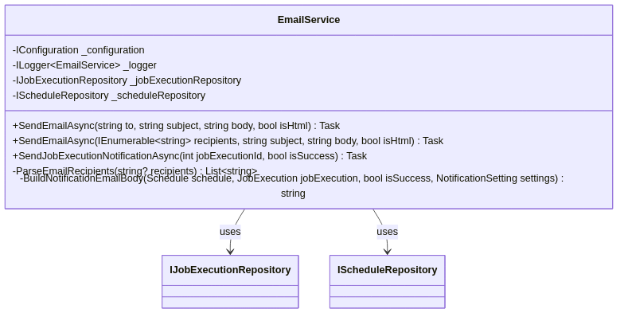
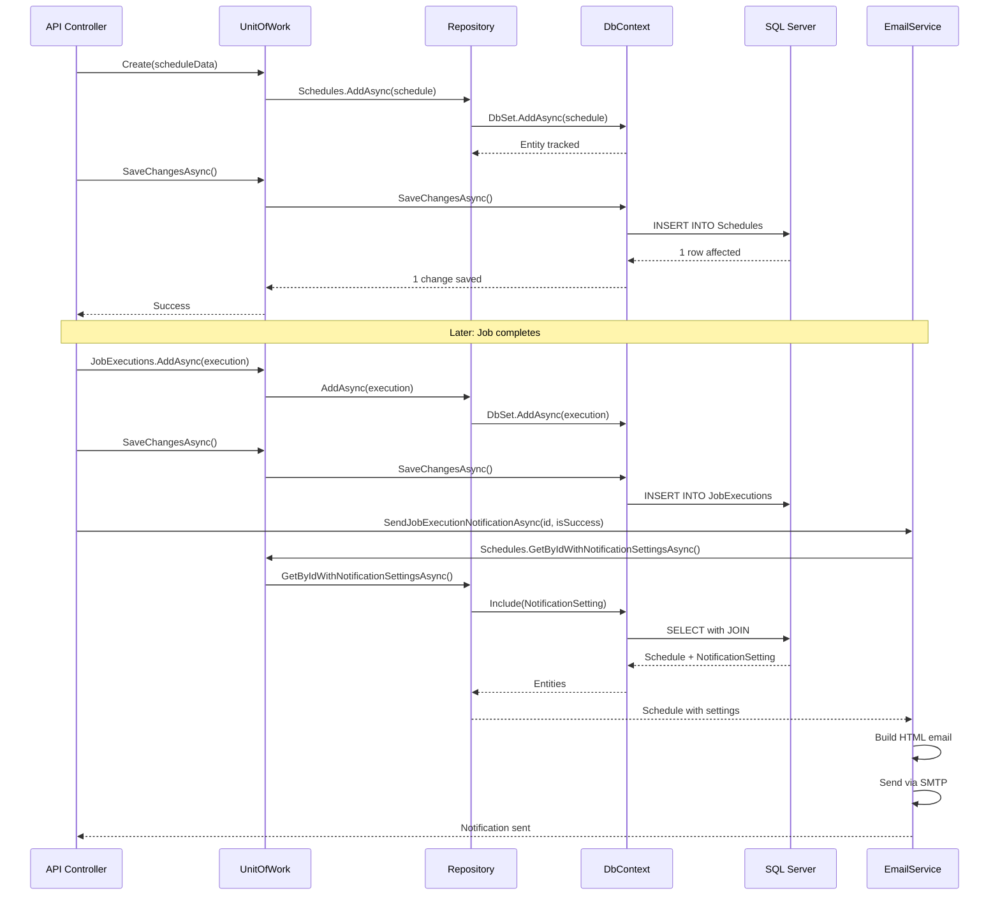
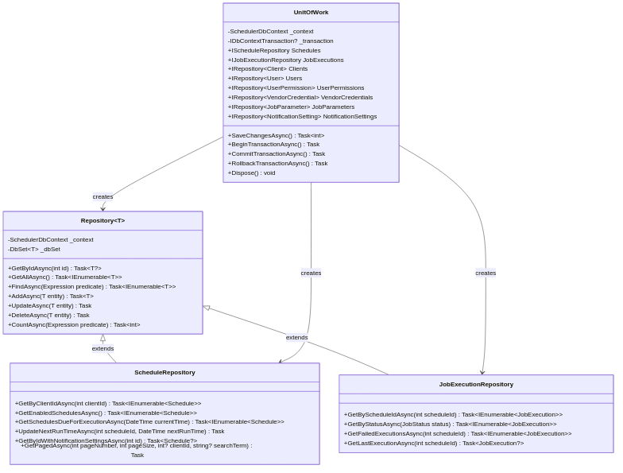
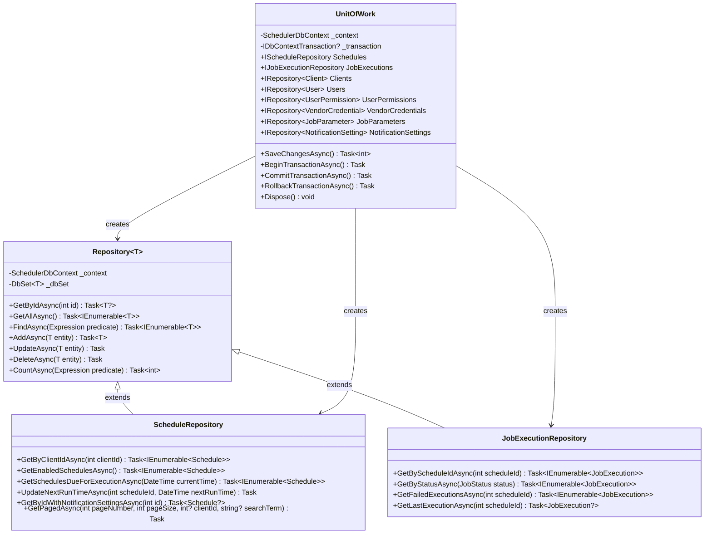
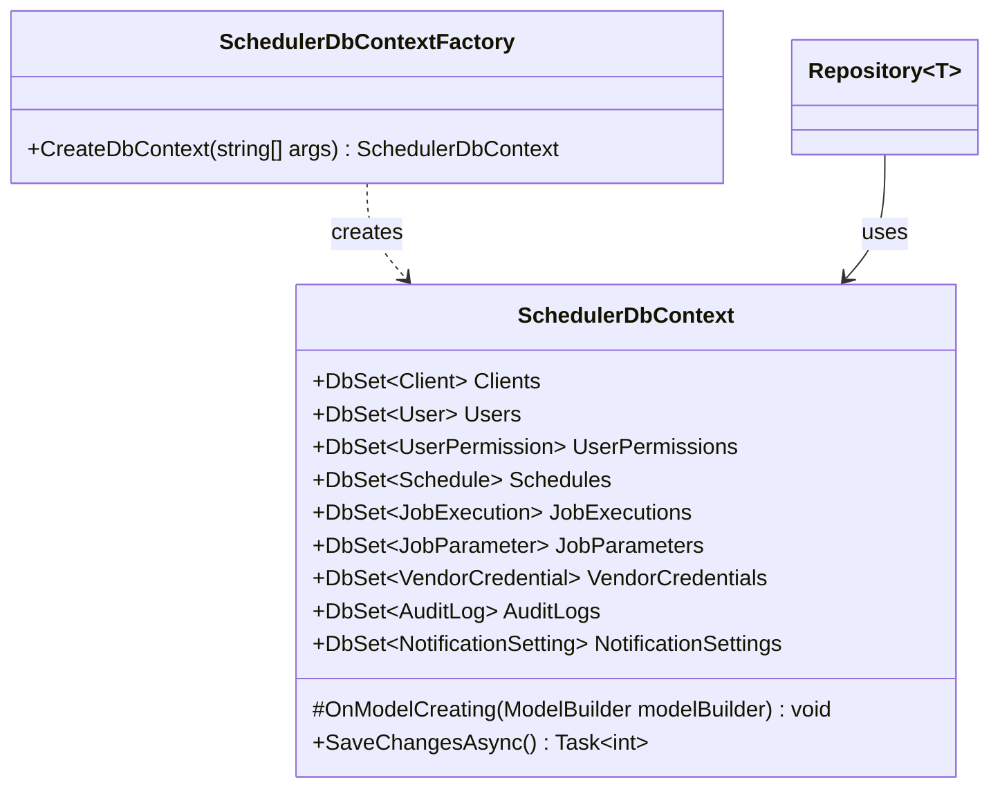
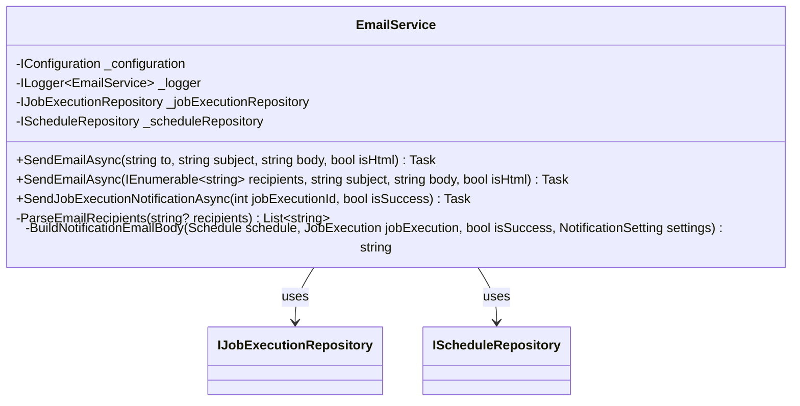

# SchedulerPlatform.Infrastructure

## Recent Updates (November 2025)

- **Upgraded to .NET 10**: Complete upgrade from .NET 9 to .NET 10 with Entity Framework Core 10.0.0
- **User Authentication Tables**: Added Users.PasswordHash, Users.IsSystemAdmin, Users.ExternalIssuer, Users.LastLoginDateTime columns
- **Password History Tracking**: New PasswordHistories table to prevent password reuse (last 10 passwords)
- **UserPermissions Table**: Granular permission tracking with CanCreate, CanRead, CanUpdate, CanDelete, CanExecute per resource
- **Deleted Schedule Filtering**: ScheduleRepository.GetAllAsync() now filters out soft-deleted schedules
- **CancelledBy Tracking**: JobExecutions table now tracks who cancelled running executions
- **SQL_Database_Creation.sql Updated**: Production creation script includes all latest migrations and user seeding

## Recent Updates (December 2025)

- **AdrAccount Table**: New table for vendor accounts synced from VendorCredNewUAT with billing patterns and scrape schedules
- **AdrJob Table**: New table for individual scraping jobs per account/billing period with unique filtered index
- **AdrJobExecution Table**: New table for execution history (credential checks, scrape requests) supporting idempotency
- **AdrOrchestrationRun Table**: New table for orchestration run history with step-by-step progress tracking
- **AdrConfiguration Table**: New table for global ADR settings (parallel workers, timeouts, etc.)
- **Database Indexes**: Added comprehensive indexes on AdrAccount and AdrJob tables for improved query performance with large datasets
- **EF Core Retry-on-Failure**: Added automatic retry logic for Azure SQL transient failures
- **Batched Processing**: ADR sync and orchestration services use batched database operations for handling 200k+ accounts
- **Client ExternalClientId Column**: Added ExternalClientId column to Clients table for external system mapping
- **User TimeZone Column**: Added TimeZone column to Users table for timezone preference

## Recent Updates (January 2026)

- **AdrConfiguration Table Updates**: Added email notification settings (ErrorNotificationsEnabled, ErrorNotificationRecipients, OrchestrationNotificationsEnabled, OrchestrationNotificationRecipients) and test mode settings (TestModeEnabled, TestModeMaxScrapingJobs, TestModeMaxCredentialChecks)
- **AdrAccountBlacklist Table**: New table for excluding vendors, accounts, or credentials from ADR processing with flexible date ranges and exclusion types
- **AdrAccountRule Table**: New table for account-level scheduling rules per job type, separating scheduling configuration from account identity
- **AdrJobType Table**: New table for database-driven job type definitions (credential check, document download)
- **PrimaryVendorCode/MasterVendorCode Columns**: Renamed VendorCode to PrimaryVendorCode and added MasterVendorCode across AdrAccount and AdrJob tables
- **AdrJob Rule Tracking**: Added AdrAccountRuleId column to AdrJob table for tracking which rule created each job
- **AdrJob Manual Request Columns**: Added IsManualRequest and IsHighPriority columns for manual ADR requests
- **AdrOrchestrationRun Step Tracking**: Added step duration and sub-step progress columns
- **EmailService Enhancements**: Added methods for sending error notifications with attachments and orchestration summary emails
- **SQL Migration Scripts**: Added `SQL_Migration_NotificationRecipients.sql` for adding email notification columns to AdrConfiguration
- **Archive Tables**: Added AdrJobArchive, AdrJobExecutionArchive, JobExecutionArchive, AuditLogArchive tables for data archival
- **AuditLogInterceptor**: EF Core SaveChanges interceptor automatically logging all entity changes

## Business Overview

The Infrastructure project is the "data warehouse" of the SchedulerPlatform - it handles all interactions with the SQL Server database and external services like email. When the application needs to save a schedule, retrieve job execution history, or send an email notification, this project does the work.

**What It Provides:**
- **Database Access**: Reads and writes all data to SQL Server
- **Transaction Management**: Ensures data changes are atomic (all-or-nothing)
- **Email Notifications**: Sends formatted emails when jobs succeed or fail
- **Data Migrations**: Manages database schema changes over time
- **Query Optimization**: Uses both EF Core and Dapper for optimal performance

**Why It Matters:**
This project implements the data access patterns defined in the Core project. It translates business operations (like "find all enabled schedules") into actual database queries. It also handles technical concerns like connection pooling, transaction isolation, and email delivery that the business logic layer doesn't need to worry about.

## Key Components

### Data Access Layer

#### SchedulerDbContext
**Purpose**: Entity Framework Core database context that manages all database operations.

**Key Features:**
- Configures all entity mappings and relationships
- Defines indexes for query performance
- Sets up foreign key constraints
- Manages connection lifecycle

**DbSets (Database Tables)**:
- `Clients`: Client organizations
- `Users`: User accounts
- `UserPermissions`: Permission assignments
- `Schedules`: Job schedules
- `JobExecutions`: Execution history
- `JobParameters`: Dynamic job parameters
- `VendorCredentials`: Third-party API credentials
- `ScheduleSyncSources`: External schedule synchronization sources
- `AuditLogs`: Change tracking
- `NotificationSettings`: Email configuration
- `AdrAccounts`: ADR vendor accounts with billing patterns
- `AdrJobs`: ADR scraping jobs per account/billing period
- `AdrJobExecutions`: ADR job execution history (credential checks, scrape requests)
- `AdrOrchestrationRuns`: ADR orchestration run history with step progress

**Entity Configurations**:
- Client: Unique ClientCode index, required fields
- User: Unique Email index, client relationship with Restrict delete
- Schedule: Client relationship, indexes on common query fields
- JobExecution: Indexes on StartTime and Status for fast queries
- JobParameter: Cascade delete with Schedule
- NotificationSetting: One-to-one relationship with Schedule

#### SchedulerDbContextFactory
**Purpose**: Design-time factory for EF Core migrations and tooling.

**Usage**: Enables `dotnet ef` commands to work without running the full application.

### Repository Pattern Implementation

#### Repository<T>
**Purpose**: Generic base repository providing standard CRUD operations for all entities.

**Methods:**
- `GetByIdAsync(int id)`: Find entity by primary key
- `GetAllAsync()`: Retrieve all entities (use with caution on large tables)
- `FindAsync(Expression<Func<T, bool>> predicate)`: Query with LINQ expressions
- `AddAsync(T entity)`: Insert new entity
- `UpdateAsync(T entity)`: Update existing entity (handles detached entities)
- `DeleteAsync(T entity)`: Remove entity
- `CountAsync(Expression<Func<T, bool>>? predicate)`: Count entities

**Features:**
- Generic implementation works for any BaseEntity subclass
- Handles entity tracking and detached entity scenarios
- Provides async operations for scalability

#### ScheduleRepository : Repository<Schedule>
**Purpose**: Extended repository with schedule-specific queries.

**Additional Methods:**
- `GetByClientIdAsync(int clientId)`: Get all schedules for a specific client with related data
- `GetEnabledSchedulesAsync()`: Find all active schedules (IsEnabled=true, IsDeleted=false)
- `GetSchedulesDueForExecutionAsync(DateTime currentTime)`: Find schedules ready to run
- `UpdateNextRunTimeAsync(int scheduleId, DateTime nextRunTime)`: Update execution timing
- `GetByIdWithNotificationSettingsAsync(int id)`: Load schedule with notification config
- `GetPagedAsync(pageNumber, pageSize, clientId?, searchTerm?)`: Paginated list with filtering

**Performance Optimizations:**
- Uses `.Include()` to eagerly load related entities
- Indexes on IsEnabled and IsDeleted for fast filtering
- Supports server-side paging to avoid loading all schedules

#### JobExecutionRepository : Repository<JobExecution>
**Purpose**: Track and query job execution history.

**Additional Methods:**
- `GetByScheduleIdAsync(int scheduleId)`: Execution history for a schedule (ordered by most recent)
- `GetByStatusAsync(JobStatus status)`: Find all executions with specific status (Running, Failed, etc.)
- `GetFailedExecutionsAsync(int scheduleId)`: Failed executions for retry analysis
- `GetLastExecutionAsync(int scheduleId)`: Most recent execution result

**Features:**
- Optimized for time-series queries (execution history)
- Eager loads Schedule relationship when needed
- Supports monitoring dashboards and alerting

#### UnitOfWork
**Purpose**: Coordinates multiple repository operations within a single database transaction.

**Repository Properties:**
- `Schedules`: IScheduleRepository
- `JobExecutions`: IJobExecutionRepository
- `Clients`: IRepository<Client>
- `Users`: IRepository<User>
- `UserPermissions`: IRepository<UserPermission>
- `VendorCredentials`: IRepository<VendorCredential>
- `JobParameters`: IRepository<JobParameter>
- `NotificationSettings`: IRepository<NotificationSetting>

**Transaction Methods:**
- `SaveChangesAsync()`: Commit all pending changes atomically
- `BeginTransactionAsync()`: Start explicit transaction (for complex operations)
- `CommitTransactionAsync()`: Commit explicit transaction
- `RollbackTransactionAsync()`: Rollback on error
- `Dispose()`: Clean up resources

**Usage Pattern:**
```csharp
using (var unitOfWork = new UnitOfWork(context))
{
    var schedule = await unitOfWork.Schedules.GetByIdAsync(id);
    schedule.LastRunTime = DateTime.UtcNow;
    await unitOfWork.Schedules.UpdateAsync(schedule);
    
    var execution = new JobExecution { ScheduleId = id, Status = JobStatus.Completed };
    await unitOfWork.JobExecutions.AddAsync(execution);
    
    await unitOfWork.SaveChangesAsync(); // Both changes committed atomically
}
```

### Services

#### EmailService
**Purpose**: Sends email notifications using SMTP with formatted HTML templates.

**Key Features:**
- HTML email templates with success/failure color coding
- Supports multiple recipients (comma or semicolon separated)
- Configurable via appsettings.json
- Includes execution details (time, duration, status)
- Optionally includes job output in email body
- Handles errors gracefully (logs but doesn't throw)

**Configuration (appsettings.json)**:
```json
{
  "Email": {
    "SmtpHost": "smtp.gmail.com",
    "SmtpPort": 587,
    "SmtpUsername": "your-email@gmail.com",
    "SmtpPassword": "your-app-password",
    "FromEmail": "noreply@schedulerplatform.com",
    "FromName": "Scheduler Platform",
    "EnableSsl": true,
    "DefaultFailureRecipient": "admin@example.com"
  }
}
```

**Methods:**
- `SendEmailAsync(to, subject, body, isHtml)`: Send email to single recipient
- `SendEmailAsync(recipients, subject, body, isHtml)`: Send to multiple recipients
- `SendJobExecutionNotificationAsync(jobExecutionId, isSuccess)`: Send job result notification

**Email Template Features:**
- Green header for success, red for failure
- Includes schedule name, description, job type
- Shows start time, end time, duration
- Displays retry count if applicable
- Shows error message and stack trace for failures
- Optionally includes job output
- Responsive HTML design

### Database Migrations

#### Migration Files
- `20251020133314_InitialCreate.cs`: Initial database schema
- `20251020135737_AddAuditLogAndNotificationSettings.cs`: Added audit trail and notifications
- `20251024190624_AddScheduleSyncSourceTable.cs`: Added ScheduleSyncSources table for external schedule synchronization with indexes on ClientId, Vendor, AccountNumber, ScheduleDate, and ScheduleFrequency
- `20251027162823_AddTimeoutMinutesToSchedule.cs`: Added TimeoutMinutes column to Schedules table to support job execution timeouts
- `20251027195050_AddCancelledByToJobExecution.cs`: Added CancelledBy column to JobExecutions table to track who cancelled a job execution

**Migration Commands:**
```bash
# Create new migration
dotnet ef migrations add MigrationName --startup-project ../SchedulerPlatform.API

# Apply migrations
dotnet ef database update --startup-project ../SchedulerPlatform.API

# Rollback to specific migration
dotnet ef database update PreviousMigrationName --startup-project ../SchedulerPlatform.API

# Generate SQL script
dotnet ef migrations script --startup-project ../SchedulerPlatform.API
```

### ADR Persistence and Indexing

The ADR (Automated Data Retrieval) tables support automated invoice scraping from vendor portals. Due to EF Core migration reliability issues, manual SQL scripts are provided in the `/scripts` folder.

**ADR Tables:**
- `AdrAccount`: Vendor accounts synced from VendorCredNewUAT with billing patterns
- `AdrJob`: Individual scraping jobs per account/billing period
- `AdrJobExecution`: Execution history for credential checks and scrape requests
- `AdrOrchestrationRun`: Orchestration run history with step-by-step progress

**Manual SQL Scripts (in `/scripts` folder):**
- `AddAdrAccountOverrideColumns.sql`: Adds manual override columns (IsManuallyOverridden, OverriddenBy, OverriddenDateTime) to AdrAccount table
- `AddAdrOrchestrationRunTable.sql`: Creates AdrOrchestrationRun table with all columns and indexes
- `AddAdrJobUniqueConstraint.sql`: Creates unique filtered index on AdrJob to prevent duplicate jobs for the same billing period

**Key Indexes:**
- `AdrAccount`: Index on VMAccountId, ClientId, CredentialId, VendorCode for efficient queries
- `AdrJob`: Unique filtered index on (AdrAccountId, BillingPeriodStartDateTime, BillingPeriodEndDateTime) WHERE IsDeleted = 0
- `AdrJob`: Index on Status, NextRunDateTime for orchestration queries
- `AdrJobExecution`: Index on AdrJobId, AdrRequestTypeId for idempotency checks
- `AdrOrchestrationRun`: Index on RequestedDateTime DESC for recent run queries

**ADR Repositories:**
- `AdrAccountRepository`: Handles account sync with manual override preservation
- `AdrJobRepository`: Manages job creation with duplicate prevention

**Important Notes:**
- VMAccountId can have duplicates (account numbers change over time)
- Manual overrides must be preserved during account sync
- The unique constraint on AdrJob prevents duplicate jobs for the same billing period
- AdrJobExecution records are used for idempotency to prevent duplicate API calls to paid services

## For Developers

### Architecture Patterns

**Repository Pattern**:
- Abstracts data access behind clean interfaces
- Enables unit testing with mock repositories
- Centralizes query logic
- Reduces code duplication

**Unit of Work Pattern**:
- Manages transactions across multiple repositories
- Ensures atomic commits (all changes succeed or all fail)
- Tracks all changes in a single context
- Simplifies complex operations

**Dependency Injection**:
- DbContext injected with connection string
- Repositories injected into services
- Supports different database providers (SQL Server, PostgreSQL, etc.)

**Dual Data Access Strategy**:
- **Entity Framework Core**: Complex queries, change tracking, migrations
- **Dapper** (future): Simple queries, bulk operations, high performance
- Choose based on use case: EF for writes, Dapper for read-heavy operations

### Data Flow



This sequence diagram shows the complete flow of creating a schedule, from the API controller through the Unit of Work, repository, DbContext, and finally to the SQL Server database.



### UML Class Diagrams

#### Repository Layer



This class diagram shows how the repository classes implement the IRepository interfaces, including the generic Repository<T> base class and specialized repositories.



#### Data Context Layer



#### Service Layer



### Entity Framework Core Configuration

**Connection String Format**:
```json
{
  "ConnectionStrings": {
    "DefaultConnection": "Server=localhost;Database=SchedulerPlatform;Trusted_Connection=True;TrustServerCertificate=True;MultipleActiveResultSets=true"
  }
}
```

**Key Configuration Settings in OnModelCreating**:

1. **Indexes for Performance**:
   - `User.Email` (unique)
   - `Client.ClientCode` (unique)
      - `JobExecution.StartDateTime` (range queries)
      - `JobExecution.Status` (filtering)
      - `AuditLog.TimestampDateTime` (time-series)
   - `AuditLog.(EntityType, EntityId)` (entity history)

2. **Cascade Delete Rules**:
   - User → UserPermissions: CASCADE (delete permissions with user)
   - Schedule → JobExecutions: CASCADE (delete history with schedule)
   - Schedule → JobParameters: CASCADE (delete parameters with schedule)
   - Schedule → NotificationSetting: CASCADE (delete settings with schedule)
   - Client → User: RESTRICT (can't delete client with users)
   - Client → Schedule: RESTRICT (can't delete client with schedules)

3. **Column Types**:
   - JSON fields: `nvarchar(max)` (JobConfiguration, AdditionalData)
   - Large text: `nvarchar(max)` (Output, ErrorMessage, StackTrace)
   - Constrained text: `nvarchar(n)` with max length validation

### Performance Considerations

**Query Optimization Strategies**:

1. **Use Include for Related Data**:
   ```csharp
   // Good: Single query with JOIN
   var schedules = await _context.Schedules
       .Include(s => s.Client)
       .Include(s => s.JobParameters)
       .Where(s => s.IsEnabled)
       .ToListAsync();
   
   // Bad: N+1 queries
   var schedules = await _context.Schedules.ToListAsync();
   foreach (var schedule in schedules)
   {
       var client = await _context.Clients.FindAsync(schedule.ClientId); // Separate query each time!
   }
   ```

2. **Paging for Large Results**:
   ```csharp
   var pagedResults = await _context.JobExecutions
       .OrderByDescending(je => je.StartDateTime)
       .Skip((pageNumber - 1) * pageSize)
       .Take(pageSize)
       .ToListAsync();
   ```

3. **AsNoTracking for Read-Only Queries**:
   ```csharp
   // Read-only: No change tracking overhead
   var executions = await _context.JobExecutions
       .AsNoTracking()
       .Where(je => je.Status == JobStatus.Failed)
       .ToListAsync();
   ```

4. **Dapper for Complex Reports** (Future Enhancement):
   ```csharp
   using var connection = new SqlConnection(connectionString);
   var results = await connection.QueryAsync<ExecutionSummary>(
       "SELECT ScheduleId, COUNT(*) as Total, SUM(CASE WHEN Status = 3 THEN 1 ELSE 0 END) as Successful " +
       "FROM JobExecutions WHERE StartTime >= @From GROUP BY ScheduleId",
       new { From = DateTime.UtcNow.AddDays(-30) });
   ```

### Transaction Management

**Implicit Transactions** (Most Common):
```csharp
// All changes in single SaveChangesAsync are atomic
await _unitOfWork.Schedules.AddAsync(schedule);
await _unitOfWork.JobParameters.AddAsync(parameter1);
await _unitOfWork.JobParameters.AddAsync(parameter2);
await _unitOfWork.SaveChangesAsync(); // All or nothing
```

**Explicit Transactions** (Complex Operations):
```csharp
await _unitOfWork.BeginTransactionAsync();
try
{
    var schedule = await _unitOfWork.Schedules.GetByIdAsync(id);
    schedule.IsEnabled = false;
    await _unitOfWork.Schedules.UpdateAsync(schedule);
    await _unitOfWork.SaveChangesAsync();
    
    // Cancel all pending executions
    var pendingExecutions = await _unitOfWork.JobExecutions
        .FindAsync(je => je.ScheduleId == id && je.Status == JobStatus.Scheduled);
    foreach (var execution in pendingExecutions)
    {
        execution.Status = JobStatus.Cancelled;
        await _unitOfWork.JobExecutions.UpdateAsync(execution);
    }
    await _unitOfWork.SaveChangesAsync();
    
    await _unitOfWork.CommitTransactionAsync();
}
catch
{
    await _unitOfWork.RollbackTransactionAsync();
    throw;
}
```

## Dependencies

| Package | Version | Purpose |
|---------|---------|---------|
| Microsoft.EntityFrameworkCore | 9.0.10 | ORM framework |
| Microsoft.EntityFrameworkCore.SqlServer | 9.0.10 | SQL Server provider |
| Microsoft.EntityFrameworkCore.Tools | 9.0.10 | Migration tooling |
| Microsoft.EntityFrameworkCore.Design | 9.0.10 | Design-time support |
| Dapper | 2.1.66 | Micro-ORM for performance queries |
| Microsoft.Data.SqlClient | 5.1.1 | SQL Server client library |
| SchedulerPlatform.Core | (project reference) | Domain entities and interfaces |

## Integration

**Referenced By:**
- `SchedulerPlatform.API`: Controllers use UnitOfWork for CRUD operations
- `SchedulerPlatform.Jobs`: Job classes use UnitOfWork to save execution results
- `SchedulerPlatform.IdentityServer`: Uses User and Client repositories for authentication

**References:**
- `SchedulerPlatform.Core`: Implements IRepository, IUnitOfWork interfaces; uses domain entities

**Database:**
- Connects to SQL Server database
- Manages schema through EF Core migrations
- Supports multiple database instances (dev, test, prod)

## Known Issues

### Architecture Issues

1. **No Repository Caching**
   - **Issue**: Every query hits the database, even for rarely-changing data
   - **Impact**: Performance overhead for repeated queries (e.g., Client lookups)
   - **Recommendation**: Implement IMemoryCache for Clients, Users, configuration data
   - **Estimated Effort**: 2-4 hours

2. **Missing Bulk Operations**
   - **Issue**: No optimized methods for inserting/updating many records at once
   - **Impact**: Poor performance when creating 100+ schedules via bulk API
   - **Example**: Bulk schedule creation takes 10+ seconds for 500 schedules
   - **Recommendation**: Add `BulkInsertAsync`, `BulkUpdateAsync` using EF Core BulkExtensions or Dapper
   - **Estimated Effort**: 1 day

3. **No Connection Pooling Configuration**
   - **Issue**: Using default connection pool settings
   - **Impact**: May exhaust connections under heavy load
   - **Recommendation**: Configure `Min Pool Size`, `Max Pool Size` in connection string
   - **Example**: `Max Pool Size=100;Min Pool Size=5`

### Query Performance

1. **Missing AsNoTracking on Read Operations**
   - **Issue**: Most queries track entities even when read-only
   - **Impact**: Unnecessary memory overhead, slower queries
   - **Files**: ScheduleRepository.cs, JobExecutionRepository.cs
   - **Fix**: Add `.AsNoTracking()` to read-only queries
   - **Example**: `GetByStatusAsync` should use AsNoTracking

2. **No Query Splitting for Large Includes**
   - **Issue**: Complex Include statements can cause Cartesian explosion
   - **Impact**: Slow queries when schedule has many parameters + many executions
   - **Recommendation**: Use `.AsSplitQuery()` for queries with multiple collections
   - **Example**: 
     ```csharp
     .Include(s => s.JobParameters)
     .Include(s => s.JobExecutions)
     .AsSplitQuery() // Use separate queries instead of JOIN
     ```

3. **Lack of Computed Columns**
   - **Issue**: No database-computed columns for common calculations
   - **Impact**: Application must calculate values like `DurationSeconds`
   - **Recommendation**: Add computed column: `DurationSeconds AS DATEDIFF(SECOND, StartTime, EndTime)`

### Email Service Issues

1. **Synchronous SMTP Calls**
   - **Issue**: `SmtpClient.SendMailAsync` blocks thread until email sent
   - **Impact**: Job execution paused waiting for SMTP server response (1-5 seconds)
   - **Recommendation**: Move to background queue (Hangfire, Azure Service Bus)
   - **Alternative**: Use SendGrid or similar service with async HTTP API

2. **No Email Retry Logic**
   - **Issue**: If email fails, it's lost forever
   - **Impact**: Critical failure notifications might not reach admins
   - **Recommendation**: Queue failed emails for retry, log failures to database
   - **Estimated Effort**: 4 hours

3. **Missing Email Templates**
   - **Issue**: HTML template embedded in code as string builder
   - **Impact**: Hard to customize, no preview capability
   - **Recommendation**: Use Razor views or external HTML template files
   - **Estimated Effort**: 4-8 hours

4. **No Email Rate Limiting**
   - **Issue**: Could send thousands of emails if many jobs fail
   - **Impact**: SMTP server might block account, spam filters triggered
   - **Recommendation**: Implement rate limiting (e.g., max 100 emails/hour)

### Migration Issues

1. **No Migration Versioning Strategy**
   - **Issue**: No way to track which migrations applied in which environment
   - **Impact**: Difficult to troubleshoot production migration issues
   - **Recommendation**: Add `MigrationHistory` table with deployment timestamps

2. **Missing Rollback Scripts**
   - **Issue**: No `Down()` methods in migrations
   - **Impact**: Can't easily rollback schema changes
   - **TODO**: Implement `Down()` methods for all migrations

3. **No Data Migration Strategy**
   - **Issue**: Migrations only handle schema, not data transformations
   - **Impact**: Breaking schema changes require manual data migration
   - **Recommendation**: Create separate data migration scripts for complex changes

### Testing Issues

1. **No Integration Tests**
   - **Issue**: Repository code not tested against real database
   - **Impact**: Risk of SQL bugs, index issues not caught until production
   - **Recommendation**: Add integration tests using TestContainers or LocalDB
   - **Estimated Effort**: 1-2 weeks

2. **No Repository Unit Tests**
   - **Issue**: Repository logic not tested with in-memory database
   - **Impact**: Hard to verify query logic is correct
   - **TODO**: Add unit tests for all repository methods

### Security Issues

1. **Connection String in appsettings.json**
   - **Issue**: Database credentials stored in plain text configuration
   - **Impact**: Security risk if config file exposed
   - **Recommendation**: Use Azure Key Vault or environment variables in production

2. **SMTP Credentials in Configuration**
   - **Issue**: Email password stored in appsettings.json
   - **Impact**: Security risk
   - **Recommendation**: Use app passwords, OAuth2, or secret manager

3. **No SQL Injection Protection Review**
   - **Issue**: No formal audit of raw SQL usage
   - **Impact**: Potential SQL injection if Dapper queries use string concatenation
   - **Mitigation**: EF Core parameterizes all queries automatically (safe)
   - **TODO**: Review any future Dapper queries for parameterization

### Multi-Tenancy Issues

1. **No Global Query Filters**
   - **Issue**: ClientId filtering must be done manually in every query
   - **Impact**: Risk of data leaks between clients
   - **Example**: Forgot `Where(s => s.ClientId == currentClientId)` in one place
   - **Recommendation**: Implement EF Core global query filters
   - **Example**:
     ```csharp
     modelBuilder.Entity<Schedule>().HasQueryFilter(s => s.ClientId == _currentClientId);
     ```

2. **No Client Context Service**
   - **Issue**: Current client ID passed around as parameter
   - **Impact**: Error-prone, easy to forget
   - **Recommendation**: Create `IClientContext` service with current client ID

### Data Integrity Issues

1. **Soft Delete Not Enforced in Queries**
   - **Issue**: Repositories must remember to filter `IsDeleted = false`
   - **Impact**: Deleted records might appear in results if filter forgotten
   - **Recommendation**: Use global query filter for `IsDeleted`

2. **No Optimistic Concurrency Control**
   - **Issue**: No `RowVersion` or timestamp columns
   - **Impact**: Last-write-wins; concurrent updates overwrite each other
   - **Recommendation**: Add `RowVersion` to critical entities like Schedule

3. **No Audit Trail on Updates**
   - **Issue**: AuditLog exists but not automatically populated
   - **Impact**: Can't see who changed what when
   - **TODO**: Override `SaveChangesAsync` to automatically create AuditLog entries

## Best Practices for Using Infrastructure

1. **Always Use UnitOfWork**: Never create repositories directly; use UnitOfWork for transaction coordination
2. **Explicit Includes**: Always specify which related entities to load with `.Include()`
3. **Async All the Way**: Use async methods throughout the stack (never block on async calls)
4. **Dispose Properly**: UnitOfWork implements IDisposable; use `using` statements
5. **Validate Before Save**: Check business rules before calling `SaveChangesAsync()`
6. **Handle Concurrency**: Wrap complex operations in try-catch with rollback
7. **Log Database Errors**: Always log exceptions with context (entity IDs, operation type)
8. **Test Migrations**: Always test migrations on copy of production database first
9. **Monitor Performance**: Log slow queries (>1 second) for optimization
10. **Use Transactions Sparingly**: Most operations work fine with implicit transactions

## Future Improvements

1. **Add Redis Caching**: Cache frequently-read data (Clients, Users)
2. **Implement CQRS**: Separate read models from write models for scalability
3. **Add Dapper for Reports**: Use Dapper for complex read-only queries
4. **Background Job Queue**: Move emails to background queue (Hangfire)
5. **Add Health Checks**: Database connectivity, migration status
6. **Implement Retry Policies**: Use Polly for transient error handling
7. **Add Performance Counters**: Track query times, connection pool usage
8. **Create Repository Tests**: Comprehensive unit and integration tests
9. **Add Query Logging**: Log all SQL queries in development for debugging
10. **Implement Global Query Filters**: Automatic ClientId filtering and soft delete handling
