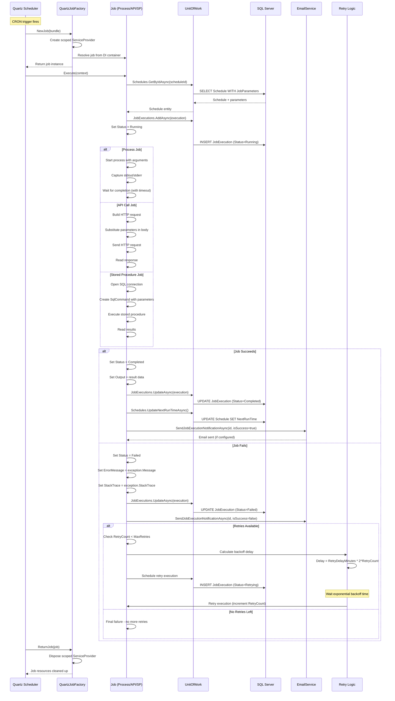
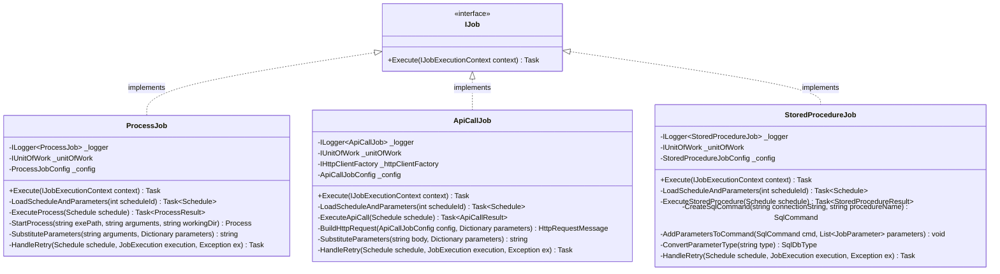
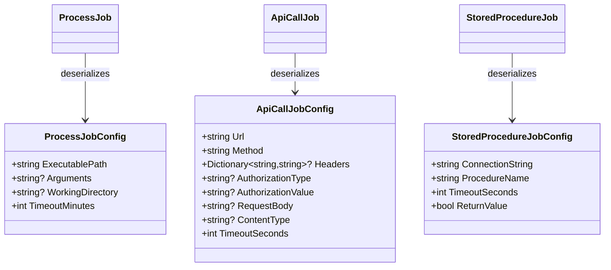
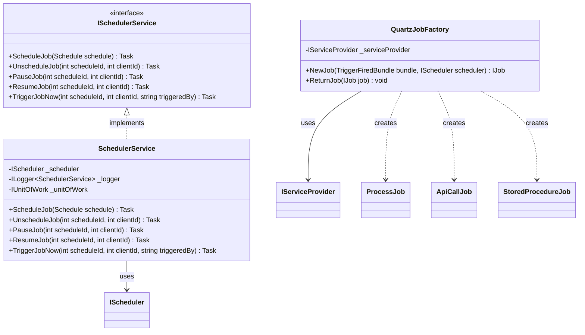
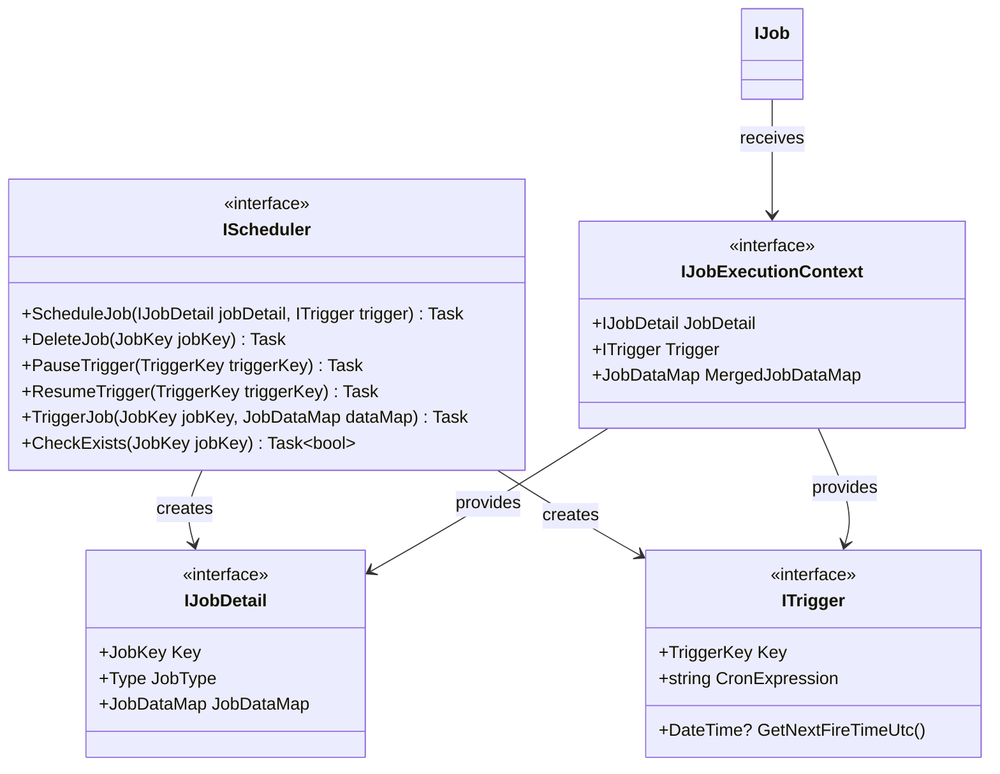
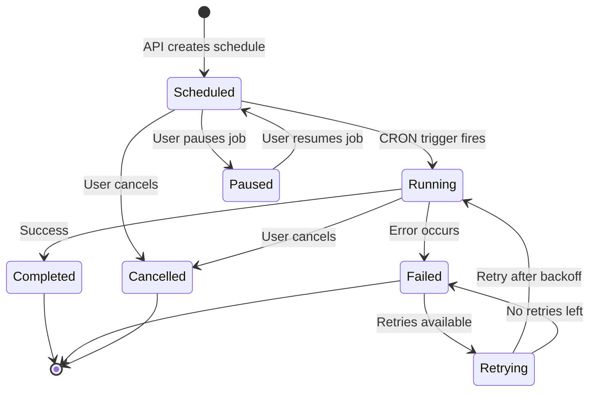

# SchedulerPlatform.Jobs

## Recent Updates (November 2025)

- **Upgraded to .NET 10**: Complete upgrade from .NET 9 to .NET 10 with Quartz.NET 3.15.1
- **NextRunTime Calculation Fix**: Manual triggers no longer incorrectly advance NextRunTime; now calculated from cron expression using CronExpression.GetNextValidTimeAfter()
- **Schedule Hydration on Startup**: ScheduleHydrationService loads all enabled schedules into Quartz when API starts, ensuring 24/7 automatic execution
- **Deleted Schedule Filtering**: Soft-deleted schedules are no longer loaded into Quartz or executed
- **Misfire Handling**: Configured WithMisfireHandlingInstructionFireAndProceed for missed schedules

## Business Overview

The Jobs project is the "execution engine" of the SchedulerPlatform - it actually runs your scheduled tasks at the right time. When a schedule's time comes, this project springs into action to execute the configured process, call an API, or run a stored procedure.

**What It Provides:**
- **Automatic Execution**: Jobs run automatically based on CRON schedules without manual intervention
- **Three Job Types**: Support for running Windows processes, calling REST APIs, and executing SQL stored procedures
- **Retry Logic**: Automatically retries failed jobs with smart exponential backoff
- **Failure Handling**: Captures errors, logs stack traces, and sends email notifications
- **Manual Triggering**: Allows on-demand execution of any scheduled job
- **Job Lifecycle Management**: Pause, resume, or cancel running jobs

**Why It Matters:**
This is where the actual work happens. While other projects handle user interfaces, authentication, and data storage, the Jobs project executes your business processes. It's the difference between having a schedule on paper and actually getting the work done.

**Business Value:**
- **Reliability**: Built-in retry logic ensures critical processes complete successfully
- **Visibility**: Every execution is logged with detailed output and error information
- **Flexibility**: Three different job types cover most automation needs
- **Control**: Start, stop, pause jobs without redeploying code
- **Monitoring**: Real-time execution tracking for operational awareness

## Key Components

### Job Implementations

#### ProcessJob
**Purpose**: Executes Windows processes, executables, batch files, or PowerShell scripts.

**Use Cases:**
- Run legacy batch processing scripts
- Execute compiled executables (.exe)
- Trigger PowerShell automation scripts
- Launch third-party command-line tools

**Configuration Format** (JobConfiguration JSON):
```json
{
  "ExecutablePath": "C:\\BatchJobs\\InvoiceProcessor.exe",
  "Arguments": "-mode production -date {CurrentDate}",
  "WorkingDirectory": "C:\\BatchJobs",
  "TimeoutMinutes": 30
}
```

**Key Features:**
- Supports command-line arguments with parameter substitution
- Captures standard output and standard error streams
- Enforces timeout to prevent hanging processes (uses Schedule.TimeoutMinutes if configured)
- Logs exit codes for success/failure detection
- Handles process cleanup on failure or timeout

**Parameter Substitution**:
- Dynamic parameters from database queries replace placeholders in Arguments
- Example: `{CurrentDate}` replaced with value from `SELECT GETDATE()` query
- Supports multiple parameters: `{AccountId}`, `{FileName}`, `{Environment}`, etc.

#### ApiCallJob
**Purpose**: Makes HTTP requests to external REST APIs.

**Use Cases:**
- Sync data with third-party services (CRM, ERP, marketing platforms)
- Trigger webhooks on external systems
- Pull data from external APIs for processing
- Send notifications to messaging services (Slack, Teams)

**Configuration Format**:
```json
{
  "Url": "https://api.example.com/v1/sync",
  "Method": "POST",
  "Headers": {
    "X-API-Key": "your-api-key",
    "Content-Type": "application/json"
  },
  "AuthorizationType": "Bearer",
  "AuthorizationValue": "your-bearer-token",
  "RequestBody": "{\"syncDate\":\"{SyncDate}\",\"clientId\":{ClientId}}",
  "ContentType": "application/json",
  "TimeoutSeconds": 300
}
```

**Supported HTTP Methods:**
- GET: Retrieve data from APIs
- POST: Create resources or send data
- PUT: Update existing resources
- PATCH: Partial updates
- DELETE: Remove resources

**Key Features:**
- Custom headers support (authentication, tracking IDs)
- Multiple authentication types (Bearer, Basic, API keys)
- Request body templating with parameter substitution
- Response validation (throws on non-success status codes)
- Enforces timeout to prevent hanging API calls (uses Schedule.TimeoutMinutes if configured)
- Automatic retry with exponential backoff for transient failures
- Logs full request and response for debugging

**Retry Strategy**:
- Initial retry: Wait 5 seconds
- Second retry: Wait 10 seconds (2x)
- Third retry: Wait 20 seconds (4x)
- Configurable via Schedule.MaxRetries and Schedule.RetryDelayMinutes

#### StoredProcedureJob
**Purpose**: Executes SQL Server stored procedures.

**Use Cases:**
- Data archival and cleanup processes
- Complex data transformations
- Report generation and aggregation
- Database maintenance tasks
- ETL (Extract, Transform, Load) operations

**Configuration Format**:
```json
{
  "ConnectionString": "Server=localhost;Database=MyDb;Trusted_Connection=True;",
  "ProcedureName": "usp_ArchiveOldRecords",
  "TimeoutSeconds": 600,
  "ReturnValue": true
}
```

**Key Features:**
- Supports all SQL parameter types (int, string, datetime, decimal, bit, nvarchar)
- Automatic type conversion from JobParameter.ParameterType
- Can capture return value or result sets
- Handles NULL parameters correctly
- Enforces command timeout to prevent long-running queries (uses Schedule.TimeoutMinutes if configured)
- Logs SQL output for audit trail

**Parameter Type Mapping**:
- `int` → SqlDbType.Int
- `string` → SqlDbType.NVarChar
- `datetime` → SqlDbType.DateTime
- `decimal` → SqlDbType.Decimal
- `bit` → SqlDbType.Bit
- `nvarchar` → SqlDbType.NVarChar

**Dynamic Parameters**:
- Static parameters: Value directly from JobParameter.ParameterValue
- Dynamic parameters: Execute SourceQuery to get runtime value
- Example: `SELECT GETUTCDATE()` for current timestamp parameter

### Scheduling Services

#### SchedulerService
**Purpose**: Manages job scheduling lifecycle using Quartz.NET.

**Methods:**

1. **ScheduleJob(Schedule schedule)**
   - Creates Quartz JobDetail and Trigger from Schedule entity
   - Maps JobType to concrete job class (ProcessJob, ApiCallJob, StoredProcedureJob)
   - Sets up CRON trigger with misfire handling
   - Assigns job to group based on ClientId (multi-tenancy)
   - Updates existing jobs if already scheduled

2. **UnscheduleJob(int scheduleId, int clientId)**
   - Removes job from Quartz scheduler
   - Pauses trigger first to prevent concurrent execution
   - Deletes both trigger and job definition
   - Used when schedule is deleted or disabled

3. **PauseJob(int scheduleId, int clientId)**
   - Temporarily suspends job execution without removing it
   - Trigger remains configured but won't fire
   - Can be resumed later with ResumeJob

4. **ResumeJob(int scheduleId, int clientId)**
   - Reactivates a paused job
   - Trigger resumes firing based on CRON expression
   - Next execution calculated from current time

5. **TriggerJobNow(int scheduleId, int clientId, string triggeredBy)**
   - Executes job immediately regardless of schedule
   - Bypasses CRON trigger, runs on-demand
   - Tracks who triggered the job (username)
   - Useful for testing or manual intervention

**Key Design Decisions:**
- Uses job groups per client for isolation
- Job identity: `Job_{scheduleId}`
- Trigger identity: `Trigger_{scheduleId}`
- Group identity: `Group_{clientId}`
- Misfire handling: FireAndProceed (execute missed jobs immediately)

#### ISchedulerService
**Purpose**: Interface defining scheduler operations for dependency injection.

**Why It Exists:**
- Enables unit testing with mock scheduler
- Decouples API layer from Quartz.NET specifics
- Supports future implementations (different schedulers)

### Quartz.NET Integration

#### QuartzJobFactory
**Purpose**: Custom job factory for dependency injection integration.

**How It Works:**
1. Quartz requests new job instance via `NewJob()`
2. Factory creates scoped service provider
3. Job is resolved from DI container with all dependencies
4. Scope stored in JobDataMap for later disposal
5. When job completes, `ReturnJob()` disposes scope

**Why Custom Factory Needed:**
- Quartz creates job instances, not ASP.NET DI container
- Jobs need scoped dependencies (DbContext, UnitOfWork, HttpClient)
- Proper disposal of scoped services after execution
- Avoids memory leaks from long-running scheduler

**Dependency Injection Benefits:**
- Jobs can inject IUnitOfWork for database access
- Jobs can inject ILogger for structured logging
- Jobs can inject IConfiguration for settings
- Jobs can inject IHttpClientFactory for HTTP calls

#### SchedulerExtensions (Inferred)
**Purpose**: Extension methods for registering Quartz.NET services.

**Typical Functionality** (based on common patterns):
- Registers Quartz scheduler as singleton
- Configures QuartzJobFactory as IJobFactory
- Registers job classes (ProcessJob, ApiCallJob, StoredProcedureJob) as transient
- Registers SchedulerService as scoped
- May configure Quartz persistence (RAMJobStore or AdoJobStore)

## For Developers

### Job Execution Flow



### Architecture Patterns

**Job Pattern**:
- Each job type implements Quartz.NET `IJob` interface
- Single method: `Execute(IJobExecutionContext context)`
- Async execution for non-blocking operations
- DisallowConcurrentExecution attribute prevents overlapping runs

**Dependency Injection Pattern**:
- Jobs receive dependencies via constructor injection
- Scoped lifetime: New instances per job execution
- Automatic disposal after execution completes

**Retry Pattern**:
- Exponential backoff: delay = base_delay × 2^retry_count
- Example: 5min → 10min → 20min → 40min
- Configurable MaxRetries per schedule
- Each retry logged as separate JobExecution record

**Template Method Pattern** (Common Job Logic):
1. Load schedule from database
2. Create JobExecution record (Status=Running)
3. Execute job-specific logic (process/API/SP)
4. Update JobExecution with result
5. Send email notification
6. Handle retry if failed

### UML Class Diagrams

#### Job Implementations



#### Job Configuration Models



#### Scheduling Services



#### Quartz.NET Integration



### Job Lifecycle States



### Retry Logic Deep Dive

**Exponential Backoff Calculation**:
```csharp
// Base delay from Schedule.RetryDelayMinutes (e.g., 5 minutes)
// Retry attempt: 0, 1, 2, 3...
int delayMinutes = baseDelayMinutes * (int)Math.Pow(2, retryAttempt);

// Example with baseDelayMinutes = 5:
// Attempt 0: 5 * 2^0 = 5 minutes
// Attempt 1: 5 * 2^1 = 10 minutes
// Attempt 2: 5 * 2^2 = 20 minutes
// Attempt 3: 5 * 2^3 = 40 minutes
```

**Retry Decision Logic**:
```csharp
if (execution.RetryCount < schedule.MaxRetries)
{
    // Schedule retry
    var delayMinutes = schedule.RetryDelayMinutes * Math.Pow(2, execution.RetryCount);
    var retryTime = DateTime.UtcNow.AddMinutes(delayMinutes);
    
    // Create new execution record
    var retryExecution = new JobExecution
    {
        ScheduleId = schedule.Id,
        StartTime = retryTime,
        Status = JobStatus.Scheduled,
        RetryCount = execution.RetryCount + 1,
        TriggeredBy = "Retry"
    };
    
    await _unitOfWork.JobExecutions.AddAsync(retryExecution);
    await _unitOfWork.SaveChangesAsync();
}
else
{
    // Final failure - send critical alert
    _logger.LogError("Job {ScheduleId} exhausted all {MaxRetries} retries", 
        schedule.Id, schedule.MaxRetries);
}
```

### Parameter Substitution Algorithm

**Step 1: Load Parameters**:
```csharp
var parameters = await _unitOfWork.JobParameters
    .FindAsync(p => p.ScheduleId == scheduleId);
```

**Step 2: Resolve Dynamic Values**:
```csharp
foreach (var param in parameters.Where(p => p.IsDynamic))
{
    using var connection = new SqlConnection(param.SourceConnectionString);
    var value = await connection.QueryFirstOrDefaultAsync<string>(param.SourceQuery);
    param.ParameterValue = value;
}
```

**Step 3: Replace Placeholders**:
```csharp
string substituted = template;
foreach (var param in parameters)
{
    substituted = substituted.Replace($"{{{param.ParameterName}}}", param.ParameterValue);
}
```

**Example**:
- Template: `"C:\Process.exe -account {AccountId} -date {CurrentDate}"`
- Parameters:
  - AccountId: "12345" (static)
  - CurrentDate: "2025-10-24" (from `SELECT CONVERT(VARCHAR(10), GETDATE(), 120)`)
- Result: `"C:\Process.exe -account 12345 -date 2025-10-24"`

## Dependencies

| Package | Version | Purpose |
|---------|---------|---------|
| Quartz | 3.15.0 | Job scheduling engine |
| Quartz.Extensions.DependencyInjection | 3.15.0 | DI integration for Quartz |
| Quartz.Serialization.Json | 3.15.0 | JSON serialization for job data |
| Microsoft.Data.SqlClient | 5.1.1 | SQL Server connectivity (for StoredProcedureJob) |
| Dapper | 2.1.66 | Lightweight ORM for parameter queries |
| SchedulerPlatform.Core | (project reference) | Domain entities and interfaces |
| SchedulerPlatform.Infrastructure | (project reference) | UnitOfWork and repositories |

## Integration

**Referenced By:**
- `SchedulerPlatform.API`: Controllers use ISchedulerService to schedule/control jobs

**References:**
- `SchedulerPlatform.Core`: Uses Schedule, JobExecution, JobParameter entities; JobType, JobStatus enums
- `SchedulerPlatform.Infrastructure`: Uses IUnitOfWork for database operations; IEmailService for notifications

**External Dependencies:**
- **Quartz.NET**: Distributed job scheduling engine
- **SQL Server**: For StoredProcedureJob execution and parameter queries
- **SMTP Server**: Via EmailService for notifications (transitive)

**Startup Configuration** (in API/Program.cs):
```csharp
// Register Quartz
builder.Services.AddQuartz(q =>
{
    q.UseMicrosoftDependencyInjectionJobFactory();
    q.UseSimpleTypeLoader();
    q.UseInMemoryStore();
    q.UseDefaultThreadPool(tp => tp.MaxConcurrency = 10);
});

// Register Quartz hosted service
builder.Services.AddQuartzHostedService(options =>
{
    options.WaitForJobsToComplete = true;
});

// Register job classes
builder.Services.AddTransient<ProcessJob>();
builder.Services.AddTransient<ApiCallJob>();
builder.Services.AddTransient<StoredProcedureJob>();

// Register scheduler service
builder.Services.AddScoped<ISchedulerService, SchedulerService>();
```

## Known Issues

### Job Execution Issues

1. **No Concurrent Execution Control**
   - **Issue**: `[DisallowConcurrentExecution]` attribute prevents same job running multiple times, but not enforced for manual triggers
   - **Impact**: TriggerJobNow can start duplicate executions if job already running
   - **Recommendation**: Check job state before manual trigger
   - **Example**: User clicks "Run Now" twice rapidly → two executions

2. **Process Job Timeout Not Configurable Per Execution**
   - **Issue**: TimeoutMinutes in JobConfiguration is static
   - **Impact**: Can't adjust timeout for specific execution (e.g., month-end processing takes longer)
   - **Recommendation**: Allow runtime timeout override in TriggerJobNow

3. **No Job Cancellation Support**
   - **Issue**: No way to gracefully cancel a running job
   - **Impact**: Long-running jobs can't be stopped without killing entire application
   - **Recommendation**: Implement CancellationToken support in job Execute methods
   - **Estimated Effort**: 1 week (requires refactoring all job classes)

4. **Missing Job Heartbeat**
   - **Issue**: No periodic "still alive" signal from long-running jobs
   - **Impact**: Job appears stuck, no way to know if truly hung or just slow
   - **Recommendation**: Update JobExecution.UpdatedAt every 30 seconds during execution
   - **Estimated Effort**: 4 hours

### Retry Logic Issues

1. **Retry Scheduling Not Persistent**
   - **Issue**: Retries scheduled in-memory via Quartz triggers
   - **Impact**: If application restarts before retry executes, retry is lost
   - **Recommendation**: Save retry schedule to database (JobExecution with future StartTime)
   - **Estimated Effort**: 1 day

2. **No Max Total Execution Time**
   - **Issue**: Job can retry indefinitely if each execution times out quickly
   - **Example**: MaxRetries=10, TimeoutMinutes=1 → could run for 10 minutes total
   - **Impact**: Resource exhaustion if job consistently fails quickly
   - **Recommendation**: Add MaxTotalExecutionMinutes to Schedule entity

3. **Retry Backoff Not Configurable**
   - **Issue**: Exponential backoff formula hardcoded (delay × 2^attempt)
   - **Impact**: Can't customize retry strategy per job type
   - **Recommendation**: Add RetryBackoffMultiplier to Schedule entity (default: 2)

4. **No Jitter in Retry Delays**
   - **Issue**: All retries execute at exact calculated time
   - **Impact**: Thundering herd problem if many jobs fail simultaneously
   - **Recommendation**: Add random jitter (±20%) to retry delays
   - **Example**: 10min delay becomes 8-12min randomly

### Parameter Handling Issues

1. **Parameter Query Errors Not Handled**
   - **Issue**: If SourceQuery fails, job crashes without clear error
   - **Impact**: Difficult to diagnose why job failed (was it query or job logic?)
   - **Files**: All job classes
   - **Recommendation**: Wrap parameter resolution in try-catch with detailed error message
   - **Example Error**: "Failed to resolve parameter 'CurrentDate' using query 'SELECT GETDATE()': Invalid column name"

2. **No Parameter Validation**
   - **Issue**: Parameters substituted into commands without validation
   - **Impact**: Potential SQL injection in StoredProcedureJob, command injection in ProcessJob
   - **Mitigation**: Use parameterized queries (StoredProcedureJob ✓), escape arguments (ProcessJob ✗)
   - **TODO**: Add validation/escaping to ProcessJob.Arguments

3. **Large Parameter Values Truncated**
   - **Issue**: JobParameter.ParameterValue is nvarchar(max) but may be truncated in logging
   - **Impact**: Can't see full parameter value in execution logs
   - **Recommendation**: Store large parameters separately or compress in database

### API Call Job Issues

1. **No Request/Response Size Limits**
   - **Issue**: Can download/upload unlimited data
   - **Impact**: Memory exhaustion if API returns gigabytes of data
   - **Recommendation**: Add MaxResponseSizeBytes config, stream large responses to disk
   - **Estimated Effort**: 1 day

2. **Missing Response Validation**
   - **Issue**: Only checks HTTP status code, not response content
   - **Impact**: Job marked as successful even if response contains error JSON
   - **Example**: API returns 200 OK but body is `{"error": "Invalid token"}`
   - **Recommendation**: Add optional response body validation (regex or JSON path)

3. **No Circuit Breaker Pattern**
   - **Issue**: Continues calling failing API until max retries exhausted
   - **Impact**: Wastes resources, may get API key banned for excessive failures
   - **Recommendation**: Implement circuit breaker using Polly library
   - **Example**: After 5 consecutive failures, stop attempting for 15 minutes

4. **Certificates Not Validated**
   - **Issue**: TLS/SSL certificate validation uses default settings
   - **Impact**: May accept self-signed certs in dev, reject in production
   - **Recommendation**: Make certificate validation configurable per API call

### Stored Procedure Job Issues

1. **No Output Parameter Support**
   - **Issue**: Only captures return value, not OUTPUT parameters
   - **Impact**: Can't retrieve output from procedures that use OUTPUT params
   - **Example**: `EXEC @RowCount = usp_Process @Input, @Output OUTPUT` - @Output lost
   - **Recommendation**: Add output parameter mapping in JobParameter
   - **Estimated Effort**: 8 hours

2. **Result Sets Not Captured**
   - **Issue**: Procedure SELECT statements are read but not stored
   - **Impact**: Can't see query results in job execution logs
   - **Recommendation**: Capture first result set as JSON and save to JobExecution.Output
   - **Alternative**: Skip capturing if ReturnValue=false to save space

3. **No Transaction Control**
   - **Issue**: Stored procedure runs in its own transaction, no coordination
   - **Impact**: Can't roll back job execution record if procedure fails
   - **Recommendation**: Use TransactionScope to wrap both procedure and EF Core updates

4. **Connection String Security**
   - **Issue**: Connection strings stored in plain text in JobConfiguration
   - **Impact**: Database credentials exposed in database
   - **Recommendation**: Reference VendorCredential by ID instead of storing connection string
   - **Alternative**: Encrypt connection strings in database

### Process Job Issues

1. **No Standard Error Separate from Output**
   - **Issue**: Both stdout and stderr combined in single Output field
   - **Impact**: Can't distinguish informational messages from errors
   - **Recommendation**: Add StdError column to JobExecution, capture separately
   - **Estimated Effort**: 4 hours (migration + job update)

2. **Exit Code Not Stored**
   - **Issue**: Process.ExitCode not saved to JobExecution
   - **Impact**: Can't analyze failure patterns based on exit codes
   - **Recommendation**: Add ExitCode column to JobExecution entity
   - **Files**: ProcessJob.cs, JobExecution.cs, migration

3. **Working Directory Not Created**
   - **Issue**: If WorkingDirectory doesn't exist, process fails
   - **Impact**: Confusing error message, not obvious directory is missing
   - **Recommendation**: Create WorkingDirectory if not exists, or fail fast with clear error

4. **Environment Variables Not Supported**
   - **Issue**: Can't pass environment variables to spawned process
   - **Impact**: Some executables require env vars (PATH, TEMP, custom vars)
   - **Recommendation**: Add EnvironmentVariables dictionary to ProcessJobConfig

### Scheduler Service Issues

1. **No Schedule Validation**
   - **Issue**: ScheduleJob doesn't validate CRON expression before scheduling
   - **Impact**: Invalid CRON causes runtime exception when trigger fires
   - **Recommendation**: Validate CRON using CronExpression.IsValidExpression() before scheduling
   - **Estimated Effort**: 1 hour

2. **Group Naming Collision Risk**
   - **Issue**: Job groups based on ClientId only
   - **Impact**: If multiple applications share same Quartz instance, collisions possible
   - **Recommendation**: Add application prefix to group names (e.g., `SchedulerPlatform_Group_{clientId}`)

3. **No Job Priority Support**
   - **Issue**: All jobs have equal priority
   - **Impact**: Low-priority jobs may run before high-priority jobs
   - **Recommendation**: Add Priority column to Schedule, set Quartz job priority accordingly

4. **Missing Misfire Handling Options**
   - **Issue**: Always uses FireAndProceed for misfires
   - **Impact**: May not be appropriate for all job types
   - **Example**: Daily report should use DoNothing if missed, not run late
   - **Recommendation**: Make misfire handling configurable per schedule

### Logging Issues

1. **Insufficient Structured Logging**
   - **Issue**: Many log messages use string concatenation, not structured
   - **Impact**: Can't filter logs by scheduleId or clientId in log aggregators
   - **Example**: `_logger.LogInformation("Job " + scheduleId + " failed")` (bad)
   - **Should Be**: `_logger.LogInformation("Job {ScheduleId} failed", scheduleId)` (good)
   - **Files**: All job classes

2. **No Correlation IDs**
   - **Issue**: Can't trace single job execution across all log entries
   - **Impact**: Hard to debug when logs from multiple jobs interleaved
   - **Recommendation**: Add CorrelationId to JobExecution, include in all log messages
   - **Estimated Effort**: 1 day

3. **Log Levels Not Consistent**
   - **Issue**: Some errors logged as warnings, some warnings as information
   - **Impact**: Important errors may be missed, log noise too high
   - **Recommendation**: Establish logging standards document

### Testing Issues

1. **No Unit Tests**
   - **Issue**: Job classes have zero test coverage
   - **Impact**: Risk of regressions when making changes
   - **Recommendation**: Add xUnit project with tests for:
     - Parameter substitution logic
     - Retry calculation
     - Configuration deserialization
     - Error handling
   - **Estimated Effort**: 2 weeks

2. **No Integration Tests**
   - **Issue**: Jobs not tested against real Quartz scheduler
   - **Impact**: Scheduling issues only found in production
   - **Recommendation**: Add integration tests using Quartz TestScheduler

3. **No Mock Job for Testing**
   - **Issue**: Must use real ProcessJob/ApiCallJob/StoredProcedureJob for testing
   - **Impact**: Tests are slow and brittle
   - **Recommendation**: Create MockJob that succeeds/fails based on configuration

### Performance Issues

1. **Synchronous Database Calls in Hot Path**
   - **Issue**: Some database calls not fully async
   - **Impact**: Thread pool exhaustion under heavy load
   - **Files**: Review all `.Result` or `.Wait()` calls in job classes

2. **No Connection Pooling for SQL Stored Procedures**
   - **Issue**: New SqlConnection created for each execution
   - **Impact**: Connection overhead for high-frequency jobs
   - **Mitigation**: Connection pooling enabled by default in connection string
   - **TODO**: Verify Max Pool Size configured appropriately

3. **Parameter Queries Not Cached**
   - **Issue**: SourceQuery executed every time, even if same query
   - **Impact**: Database load from repeated parameter resolution
   - **Recommendation**: Cache query results for N minutes (configurable)

### Security Issues

1. **Job Configuration Not Encrypted**
   - **Issue**: API keys, passwords, connection strings in plain text
   - **Impact**: Security risk if database compromised
   - **Recommendation**: Encrypt JobConfiguration column, decrypt in job classes
   - **Alternative**: Reference VendorCredential for API keys

2. **No Job Execution User Context**
   - **Issue**: All jobs run as application service account
   - **Impact**: Can't audit who triggered job, permission issues
   - **Recommendation**: Capture and store user principal in JobExecution.TriggeredBy

3. **Process Job Can Execute Any Executable**
   - **Issue**: No whitelist of allowed executables
   - **Impact**: Security risk if malicious user gains admin access
   - **Recommendation**: Add AllowedExecutables config, validate ExecutablePath against whitelist

## Best Practices for Job Development

1. **Always Use Async/Await**: Never block threads with `.Result` or `.Wait()`
2. **Idempotent Jobs**: Jobs should be safe to run multiple times with same parameters
3. **Detailed Logging**: Log key steps, parameters, and results for debugging
4. **Fail Fast**: Validate inputs early, throw clear exceptions
5. **Capture Context**: Save enough information to reproduce failures
6. **Handle Timeouts**: All external operations should have timeouts
7. **Clean Up Resources**: Use `using` statements for disposable resources
8. **Test Retry Logic**: Simulate failures to verify retry behavior
9. **Monitor Execution Time**: Alert if jobs suddenly take much longer than usual
10. **Document Job Configuration**: Provide examples in code comments

## Future Improvements

1. **Add More Job Types**: Email job, FTP job, database backup job
2. **Job Chaining**: Support for dependent jobs (run B after A succeeds)
3. **Parallel Execution**: Run multiple instances of same job simultaneously
4. **Job History Pruning**: Automatically archive old execution records
5. **Performance Metrics**: Track average execution time, success rate per job
6. **Job Dashboard**: Real-time visualization of running jobs
7. **Job Templates**: Pre-configured job templates for common scenarios
8. **Distributed Execution**: Scale across multiple servers using Quartz clustering
9. **Job Approval Workflow**: Require approval before scheduling critical jobs
10. **Webhook Notifications**: Alternative to email for job completion events
