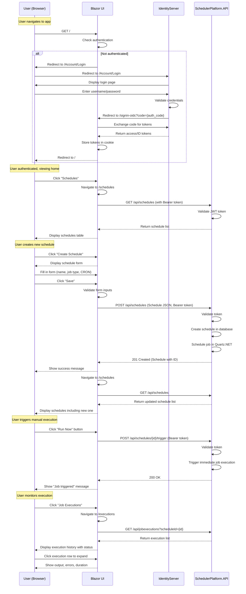
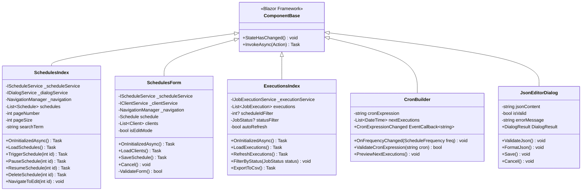
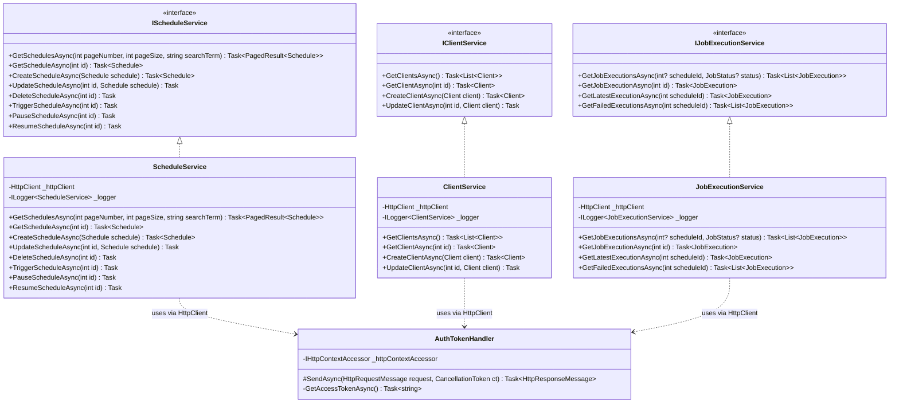
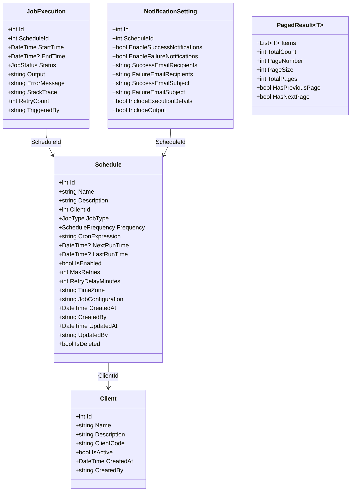

# SchedulerPlatform.UI

## Recent Updates (November 2025)

- **Upgraded to .NET 10**: Complete upgrade from .NET 9 to .NET 10 with all packages updated
- **OIDC Login Cancellation Handling**: Graceful error handling when users click Cancel on login page, redirects to home instead of showing exception
- **Admin User Management Page**: New /admin/users page for managing users and permissions (system admin only)
- **Permission-Based UI**: Buttons and menu items now respect user permissions (Create, Read, Update, Delete, Execute)
- **OIDC Logout Fix**: Proper logout flow that clears session and redirects to home page
- **HttpClient Authentication Fix**: API calls now properly include JWT tokens in Authorization header

## Business Overview

The UI project is the "front door" of the SchedulerPlatform - it's the web application that users interact with to manage schedules, monitor job executions, and configure the system. Built with Blazor Server and MudBlazor components, it provides a modern, responsive interface that works seamlessly on desktop and mobile devices.

**What It Provides:**
- **Schedule Management**: Create, edit, delete, and monitor scheduled jobs
- **Job Execution Monitoring**: View real-time status, history, and results of job runs
- **User-Friendly Forms**: Intuitive interfaces for configuring complex job parameters
- **CRON Expression Builder**: Visual tool for creating CRON schedules without code
- **Authentication Integration**: Secure login via IdentityServer with single sign-on
- **Real-Time Updates**: Blazor Server provides live updates without page refreshes

**Why It Matters:**
This is how business users interact with the scheduling platform. A well-designed UI makes complex scheduling tasks simple and accessible. Users don't need to understand CRON syntax, JSON configuration, or API calls - the UI handles all that complexity behind the scenes.

**Business Value:**
- **Accessibility**: Web-based interface accessible from any device with a browser
- **Ease of Use**: MudBlazor components provide a polished, Material Design experience
- **Productivity**: Users can create schedules in minutes instead of hours
- **Visibility**: Dashboard views provide instant insight into system health
- **Security**: Authentication ensures only authorized users can access schedules

**Technology Context**:
- **Originally Angular**: This project started as an Angular SPA (Single Page Application)
- **Converted to Blazor**: Mid-development, the stack changed to Blazor Server with MudBlazor
- **Current State**: Fully functional Blazor application, some Angular artifacts removed during cleanup
- **POC Status**: Proof of concept documenting current implementation

## Key Components

### Pages

#### Home.razor
**Purpose**: Landing page/dashboard after login.

**Features**:
- Welcome message with user name
- Quick stats (total schedules, recent executions)
- Links to main features (Schedules, Executions)
- System status indicators

**Route**: `/` (home page)

#### Schedules/Index.razor
**Purpose**: List and manage all schedules.

**Features**:
- **Data Table**: Displays all schedules with pagination
- **Search/Filter**: Filter by name, client, job type, status
- **Actions**: Edit, delete, pause, resume, trigger now
- **Status Indicators**: Visual indication of enabled/disabled, next run time
- **Sorting**: Click column headers to sort
- **Pagination**: Navigate large schedule lists
- **Create Button**: Navigate to schedule creation form

**Key Functionality**:
```csharp
@inject IScheduleService ScheduleService
@inject NavigationManager Navigation
@inject IDialogService DialogService

private async Task LoadSchedules()
{
    schedules = await ScheduleService.GetSchedulesAsync(pageNumber, pageSize);
}

private async Task TriggerSchedule(int id)
{
    await ScheduleService.TriggerScheduleAsync(id);
    await LoadSchedules(); // Refresh list
}

private async Task DeleteSchedule(int id)
{
    bool? confirm = await DialogService.ShowMessageBox(
        "Confirm Delete", 
        "Are you sure?", 
        yesText: "Delete", 
        cancelText: "Cancel");
    
    if (confirm == true)
    {
        await ScheduleService.DeleteScheduleAsync(id);
        await LoadSchedules();
    }
}
```

#### Schedules/Form.razor
**Purpose**: Create or edit a schedule.

**Features**:
- **Job Type Selection**: Dropdown for Process, API Call, Stored Procedure
- **Basic Information**: Name, description, client selection
- **Frequency Options**: One-time, daily, weekly, monthly, custom CRON
- **CRON Builder Component**: Visual CRON expression builder
- **Job Configuration Editor**: JSON editor with validation
- **Job Parameters**: Dynamic parameter inputs
- **Notification Settings**: Email notification configuration
- **Retry Configuration**: Max retries, retry delay
- **Save/Cancel Actions**: Validates and saves to API

**Dynamic Form Rendering**:
```csharp
@if (schedule.JobType == JobType.Process)
{
    <MudTextField @bind-Value="schedule.JobConfiguration.ExecutablePath" 
                  Label="Executable Path" Required />
    <MudTextField @bind-Value="schedule.JobConfiguration.Arguments" 
                  Label="Arguments" />
}
else if (schedule.JobType == JobType.ApiCall)
{
    <MudTextField @bind-Value="schedule.JobConfiguration.Url" 
                  Label="API URL" Required />
    <MudSelect @bind-Value="schedule.JobConfiguration.Method" 
               Label="HTTP Method">
        <MudSelectItem Value="@("GET")">GET</MudSelectItem>
        <MudSelectItem Value="@("POST")">POST</MudSelectItem>
        <MudSelectItem Value="@("PUT")">PUT</MudSelectItem>
    </MudSelect>
}
```

**Route**: `/schedules/new` (create) or `/schedules/edit/{id}` (edit)

#### Executions/Index.razor
**Purpose**: View job execution history and status.

**Features**:
- **Execution List**: All job executions with status, time, duration
- **Status Filters**: Filter by Completed, Failed, Running
- **Schedule Filter**: View executions for specific schedule
- **Execution Details**: Expandable rows showing output, errors, stack traces
- **Status Colors**: Green for success, red for failure, blue for running
- **Refresh Button**: Manually refresh execution list
- **Auto-Refresh**: Optional periodic refresh for monitoring
- **Export**: Download execution history as CSV

**Status Display**:
```csharp
<MudChip Color="@GetStatusColor(execution.Status)">
    @execution.Status.ToString()
</MudChip>

private Color GetStatusColor(JobStatus status) => status switch
{
    JobStatus.Completed => Color.Success,
    JobStatus.Failed => Color.Error,
    JobStatus.Running => Color.Info,
    _ => Color.Default
};
```

**Route**: `/executions`

#### Account/Login.razor
**Purpose**: Redirect to IdentityServer for authentication.

**How It Works**:
1. User navigates to protected page while unauthenticated
2. Blazor redirects to `/Account/Login`
3. Login page redirects to IdentityServer
4. User enters credentials on IdentityServer login page
5. IdentityServer redirects back to `/signin-oidc` with authorization code
6. Blazor OIDC handler exchanges code for tokens
7. User redirected to originally requested page

**Implementation**:
```csharp
@page "/Account/Login"
@inject NavigationManager Navigation

@code {
    protected override void OnInitialized()
    {
        // Redirect to IdentityServer login
        Navigation.NavigateTo($"/Account/Challenge?returnUrl={ReturnUrl}", true);
    }
}
```

**Route**: `/Account/Login`

#### Account/Logout.razor
**Purpose**: Sign user out of application and IdentityServer.

**Logout Flow**:
1. User clicks logout button
2. Navigates to `/Account/Logout`
3. Blazor signs user out locally
4. Redirects to IdentityServer `/connect/endsession`
5. IdentityServer signs user out
6. Redirects back to application home page

**Route**: `/Account/Logout`

### Components

#### CronBuilder.razor
**Purpose**: Visual tool for building CRON expressions.

**Features**:
- **Frequency Tabs**: Simple (daily, weekly, monthly) and Advanced (custom CRON)
- **Simple Mode**: Dropdown selections for common patterns
- **Advanced Mode**: Manual CRON expression input with validation
- **Preview**: Shows next 5 execution times
- **Validation**: Real-time validation using Quartz CronExpression
- **Copy Button**: Copy generated CRON to clipboard

**Usage Example**:
```csharp
<CronBuilder @bind-CronExpression="schedule.CronExpression" />
```

**CRON Validation**:
```csharp
private bool ValidateCronExpression(string cron)
{
    try
    {
        var cronExpression = new CronExpression(cron);
        return true;
    }
    catch
    {
        return false;
    }
}
```

#### JsonEditorDialog.razor
**Purpose**: Modal dialog for editing JSON configuration.

**Features**:
- **Syntax Highlighting**: Color-coded JSON syntax
- **Validation**: Real-time JSON validation
- **Format Button**: Auto-format JSON with proper indentation
- **Error Display**: Shows parsing errors with line numbers
- **Save/Cancel**: Apply changes or discard

**Used For**:
- JobConfiguration JSON editing
- Job parameter values
- Any JSON-based configuration

#### ExecutionDetailsDialog.razor
**Purpose**: Modal dialog displaying comprehensive job execution details.

**Features**:
- **Execution Metadata**: ID, schedule name, status, timestamps
- **Duration Calculation**: Start time, end time, and elapsed duration
- **Retry Information**: Retry count and retry delay
- **User Tracking**: Shows who triggered the execution and who cancelled it (if applicable)
- **Error Details**: Full error messages and stack traces for failed executions
- **Output Logs**: Complete output from job execution
- **Timezone Display**: Shows times in local timezone with abbreviations (ET, CT, MT, PT)
- **Responsive Layout**: Works on desktop and mobile

**Usage Example**:
```csharp
private async Task ViewExecutionDetails(int executionId)
{
    var execution = await JobExecutionService.GetJobExecutionAsync(executionId);
    var parameters = new DialogParameters { ["Execution"] = execution };
    var options = new DialogOptions { MaxWidth = MaxWidth.Large, FullWidth = true };
    await DialogService.ShowAsync<ExecutionDetailsDialog>("Execution Details", parameters, options);
}
```

**Timezone Abbreviation Logic**:
```csharp
private string GetLocalTimeZoneAbbreviation()
{
    var timeZone = TimeZoneInfo.Local;
    return timeZone.StandardName switch
    {
        var tz when tz.Contains("Eastern") => timeZone.IsDaylightSavingTime(DateTime.Now) ? "EDT" : "EST",
        var tz when tz.Contains("Central") => timeZone.IsDaylightSavingTime(DateTime.Now) ? "CDT" : "CST",
        var tz when tz.Contains("Mountain") => timeZone.IsDaylightSavingTime(DateTime.Now) ? "MDT" : "MST",
        var tz when tz.Contains("Pacific") => timeZone.IsDaylightSavingTime(DateTime.Now) ? "PDT" : "PST",
        _ => timeZone.StandardName
    };
}
```

### Pages (Additional)

#### Calendar/Index.razor
**Purpose**: Calendar view for visualizing scheduled jobs by date.

**Features**:
- **Monthly Calendar Grid**: MudCalendar component showing current month
- **Schedule Markers**: Visual indicators on dates with scheduled jobs
- **Date Navigation**: Previous/next month navigation
- **Schedule List**: Shows all schedules for selected date
- **Quick Actions**: Trigger, edit, or view schedule details from calendar
- **Color Coding**: Different colors for different job types or statuses
- **Responsive Design**: Works on desktop and mobile devices

**Route**: `/calendar`

**Key Functionality**:
```csharp
@inject IScheduleService ScheduleService

private List<ScheduleCalendarItem> calendarItems = new();
private DateTime selectedDate = DateTime.Today;

private async Task LoadCalendarData()
{
    var schedules = await ScheduleService.GetSchedulesAsync();
    calendarItems = schedules
        .Select(s => new ScheduleCalendarItem
        {
            Date = s.NextRunTime ?? DateTime.Today,
            ScheduleName = s.Name,
            JobType = s.JobType
        })
        .ToList();
}
```

#### Dashboard/Index.razor (Enhanced)
**Purpose**: Enhanced dashboard with comprehensive system overview and analytics.

**Recent Enhancements**:
- **Multi-Select Status Filter**: Filter executions by multiple statuses simultaneously using `MultiSelection="true"`
- **Execution Trends Chart**: Line chart showing execution counts over the last 7 days
- **Status Breakdown**: Pie chart showing distribution of execution statuses
- **Top Longest Executions**: Table showing the 10 longest-running job executions
- **Real-Time Metrics**: Active jobs count, success rate, failure rate

**Multi-Select Status Filter**:
```csharp
<MudSelect T="JobStatus" 
           @bind-SelectedValues="selectedStatuses" 
           MultiSelection="true"
           Label="Filter by Status" 
           Variant="Variant.Outlined">
    <MudSelectItem T="JobStatus" Value="JobStatus.Completed">Completed</MudSelectItem>
    <MudSelectItem T="JobStatus" Value="JobStatus.Failed">Failed</MudSelectItem>
    <MudSelectItem T="JobStatus" Value="JobStatus.Running">Running</MudSelectItem>
</MudSelect>
```

**Dashboard Data Retrieval**:
```csharp
@inject IDashboardService DashboardService

private DashboardOverview overview;
private List<ExecutionTrendItem> trends;
private List<StatusBreakdownItem> statusBreakdown;
private List<TopLongestExecutionItem> longestExecutions;

protected override async Task OnInitializedAsync()
{
    overview = await DashboardService.GetDashboardOverviewAsync();
    trends = await DashboardService.GetExecutionTrendsAsync(7);
    statusBreakdown = await DashboardService.GetStatusBreakdownAsync();
    longestExecutions = await DashboardService.GetTopLongestExecutionsAsync(10);
}
```

#### Schedules/Index.razor (Enhanced)
**Recent Enhancements**:
- **Date Filter**: MudDatePicker allows filtering schedules by next run date
- **Smart Alert System**: Shows alert when date filter is active to remind users filtering is applied
- **Timezone Display**: Shows local timezone abbreviation (ET, CT, MT, PT) next to timestamps

**Date Filter Implementation**:
```csharp
<MudDatePicker Label="Filter by Date" 
               @bind-Date="filterDate" 
               Clearable="true"
               DateFormat="yyyy-MM-dd" />

@if (filterDate.HasValue)
{
    <MudAlert Severity="Severity.Info" Class="mt-2">
        Showing schedules for @filterDate.Value.ToString("yyyy-MM-dd"). 
        <MudButton Size="Size.Small" OnClick="ClearDateFilter">Clear Filter</MudButton>
    </MudAlert>
}
```

#### Executions/Index.razor (Enhanced)
**Recent Enhancements**:
- **Timezone Abbreviations**: Display timestamps with local timezone abbreviations using `GetLocalTimeZoneAbbreviation()`
- **Execution Details Dialog**: Click on execution row to open detailed dialog with full information
- **Cancel Execution**: Ability to cancel running executions with user tracking

### Services

#### ScheduleService.cs
**Purpose**: HTTP client wrapper for Schedule API endpoints.

**Methods**:
```csharp
public class ScheduleService : IScheduleService
{
    private readonly HttpClient _httpClient;
    
    public async Task<PagedResult<Schedule>> GetSchedulesAsync(
        int pageNumber = 1, 
        int pageSize = 10, 
        string? searchTerm = null)
    {
        var response = await _httpClient.GetAsync(
            $"/api/schedules?pageNumber={pageNumber}&pageSize={pageSize}&searchTerm={searchTerm}");
        response.EnsureSuccessStatusCode();
        return await response.Content.ReadFromJsonAsync<PagedResult<Schedule>>();
    }
    
    public async Task<Schedule> GetScheduleAsync(int id)
    {
        return await _httpClient.GetFromJsonAsync<Schedule>($"/api/schedules/{id}");
    }
    
    public async Task<Schedule> CreateScheduleAsync(Schedule schedule)
    {
        var response = await _httpClient.PostAsJsonAsync("/api/schedules", schedule);
        response.EnsureSuccessStatusCode();
        return await response.Content.ReadFromJsonAsync<Schedule>();
    }
    
    public async Task UpdateScheduleAsync(int id, Schedule schedule)
    {
        var response = await _httpClient.PutAsJsonAsync($"/api/schedules/{id}", schedule);
        response.EnsureSuccessStatusCode();
    }
    
    public async Task DeleteScheduleAsync(int id)
    {
        var response = await _httpClient.DeleteAsync($"/api/schedules/{id}");
        response.EnsureSuccessStatusCode();
    }
    
    public async Task TriggerScheduleAsync(int id)
    {
        var response = await _httpClient.PostAsync($"/api/schedules/{id}/trigger", null);
        response.EnsureSuccessStatusCode();
    }
    
    public async Task PauseScheduleAsync(int id)
    {
        var response = await _httpClient.PostAsync($"/api/schedules/{id}/pause", null);
        response.EnsureSuccessStatusCode();
    }
    
    public async Task ResumeScheduleAsync(int id)
    {
        var response = await _httpClient.PostAsync($"/api/schedules/{id}/resume", null);
        response.EnsureSuccessStatusCode();
    }
}
```

#### ClientService.cs
**Purpose**: HTTP client wrapper for Client API endpoints.

**Methods**:
- `GetClientsAsync()`: Retrieve all clients
- `GetClientAsync(int id)`: Get specific client
- `CreateClientAsync(Client client)`: Create new client (Admin only)
- `UpdateClientAsync(int id, Client client)`: Update client (Admin only)

#### JobExecutionService.cs
**Purpose**: HTTP client wrapper for JobExecution API endpoints.

**Methods**:
- `GetJobExecutionsAsync(int? scheduleId, JobStatus? status)`: List executions with filters
- `GetJobExecutionAsync(int id)`: Get detailed execution information including output, error messages, and user tracking
- `GetLatestExecutionAsync(int scheduleId)`: Get most recent execution for schedule
- `GetFailedExecutionsAsync(int scheduleId)`: Get all failures for schedule
- `CancelJobExecutionAsync(int id)`: Cancel a running job execution and track who cancelled it
- `ExportJobExecutionsAsync(...)`: Export executions to CSV or Excel format

**New Methods (Recent Additions)**:
```csharp
public async Task<JobExecution> GetJobExecutionAsync(int id)
{
    return await _httpClient.GetFromJsonAsync<JobExecution>($"/api/jobexecutions/{id}");
}

public async Task CancelJobExecutionAsync(int id)
{
    var response = await _httpClient.PostAsync($"/api/jobexecutions/{id}/cancel", null);
    response.EnsureSuccessStatusCode();
}
```

#### DashboardService.cs
**Purpose**: HTTP client wrapper for Dashboard API endpoints providing analytics and metrics.

**Methods**:
```csharp
public class DashboardService : IDashboardService
{
    private readonly HttpClient _httpClient;
    
    public async Task<DashboardOverview> GetDashboardOverviewAsync()
    {
        return await _httpClient.GetFromJsonAsync<DashboardOverview>("/api/dashboard/overview");
    }
    
    public async Task<List<ExecutionTrendItem>> GetExecutionTrendsAsync(int days = 7)
    {
        return await _httpClient.GetFromJsonAsync<List<ExecutionTrendItem>>(
            $"/api/dashboard/execution-trends?days={days}");
    }
    
    public async Task<List<StatusBreakdownItem>> GetStatusBreakdownAsync()
    {
        return await _httpClient.GetFromJsonAsync<List<StatusBreakdownItem>>(
            "/api/dashboard/status-breakdown");
    }
    
    public async Task<List<TopLongestExecutionItem>> GetTopLongestExecutionsAsync(int count = 10)
    {
        return await _httpClient.GetFromJsonAsync<List<TopLongestExecutionItem>>(
            $"/api/dashboard/top-longest?count={count}");
    }
}
```

**Dashboard Data Models**:
- `DashboardOverview`: Total schedules, active jobs, success/failure rates, last 24h execution counts
- `ExecutionTrendItem`: Date and execution count for trend charts
- `StatusBreakdownItem`: Status name and count for pie charts
- `TopLongestExecutionItem`: Schedule name, duration, and status for performance monitoring

#### AuthTokenHandler.cs
**Purpose**: HTTP message handler that adds authentication tokens to API requests.

**How It Works**:
```csharp
public class AuthTokenHandler : DelegatingHandler
{
    private readonly IHttpContextAccessor _httpContextAccessor;
    
    protected override async Task<HttpResponseMessage> SendAsync(
        HttpRequestMessage request, 
        CancellationToken cancellationToken)
    {
        // Get access token from current user's authentication cookie
        var accessToken = await _httpContextAccessor.HttpContext
            .GetTokenAsync("access_token");
        
        if (!string.IsNullOrEmpty(accessToken))
        {
            // Add Bearer token to Authorization header
            request.Headers.Authorization = 
                new AuthenticationHeaderValue("Bearer", accessToken);
        }
        
        return await base.SendAsync(request, cancellationToken);
    }
}
```

**Registration** (in Program.cs):
```csharp
builder.Services.AddTransient<AuthTokenHandler>();

builder.Services.AddHttpClient<IScheduleService, ScheduleService>(client =>
{
    client.BaseAddress = new Uri("https://localhost:5000"); // API URL
})
.AddHttpMessageHandler<AuthTokenHandler>();  // Automatically adds tokens
```

### Models

#### Schedule.cs
**Purpose**: Client-side model for Schedule entity.

**Properties**: Mirrors API Schedule model
- Basic info: Id, Name, Description, ClientId
- Job config: JobType, JobConfiguration (JSON string)
- Scheduling: Frequency, CronExpression, NextRunTime, LastRunTime
- Status: IsEnabled, IsDeleted
- Retry: MaxRetries, RetryDelayMinutes
- Audit: CreatedAt, CreatedBy, UpdatedAt, UpdatedBy

#### Client.cs
**Purpose**: Client-side model for Client entity.

#### JobExecution.cs
**Purpose**: Client-side model for JobExecution entity.

**Properties**:
- Tracking: Id, ScheduleId, StartTime, EndTime
- Status: Status (enum), Output, ErrorMessage, StackTrace
- Retry: RetryCount
- Metadata: TriggeredBy

#### NotificationSetting.cs
**Purpose**: Client-side model for NotificationSetting entity.

#### PagedResult.cs
**Purpose**: Generic wrapper for paginated API responses.

```csharp
public class PagedResult<T>
{
    public List<T> Items { get; set; } = new();
    public int TotalCount { get; set; }
    public int PageNumber { get; set; }
    public int PageSize { get; set; }
    public int TotalPages => (int)Math.Ceiling(TotalCount / (double)PageSize);
    public bool HasPreviousPage => PageNumber > 1;
    public bool HasNextPage => PageNumber < TotalPages;
}
```

### Program.cs Configuration

#### Authentication Setup
```csharp
builder.Services.AddAuthentication(options =>
{
    options.DefaultScheme = CookieAuthenticationDefaults.AuthenticationScheme;
    options.DefaultChallengeScheme = OpenIdConnectDefaults.AuthenticationScheme;
})
.AddCookie(CookieAuthenticationDefaults.AuthenticationScheme)
.AddOpenIdConnect(OpenIdConnectDefaults.AuthenticationScheme, options =>
{
    options.Authority = "https://localhost:5001";  // IdentityServer URL
    options.ClientId = "scheduler-blazor";
    options.ClientSecret = "secret";
    options.ResponseType = "code";
    options.SaveTokens = true;
    options.GetClaimsFromUserInfoEndpoint = true;
    
    options.Scope.Clear();
    options.Scope.Add("openid");
    options.Scope.Add("profile");
    options.Scope.Add("email");
    options.Scope.Add("scheduler-api");
    
    options.TokenValidationParameters = new TokenValidationParameters
    {
        NameClaimType = "name",
        RoleClaimType = "role"
    };
});
```

#### MudBlazor Registration
```csharp
builder.Services.AddMudServices(config =>
{
    config.SnackbarConfiguration.PositionClass = Defaults.Classes.Position.BottomRight;
    config.SnackbarConfiguration.PreventDuplicates = false;
    config.SnackbarConfiguration.VisibleStateDuration = 3000;
});
```

#### HTTP Client Services
```csharp
builder.Services.AddHttpContextAccessor();
builder.Services.AddTransient<AuthTokenHandler>();

// Register all service interfaces with their implementations
builder.Services.AddHttpClient<IScheduleService, ScheduleService>(/* ... */)
    .AddHttpMessageHandler<AuthTokenHandler>();
    
builder.Services.AddHttpClient<IClientService, ClientService>(/* ... */)
    .AddHttpMessageHandler<AuthTokenHandler>();
    
builder.Services.AddHttpClient<IJobExecutionService, JobExecutionService>(/* ... */)
    .AddHttpMessageHandler<AuthTokenHandler>();
```

#### Blazor Server Setup
```csharp
builder.Services.AddRazorComponents()
    .AddInteractiveServerComponents();  // Enable Blazor Server
```

## For Developers

### User Journey Flow



### Architecture Patterns

**Blazor Server Pattern**:
- Server-side rendering with SignalR for real-time updates
- Component state maintained on server
- DOM updates sent to client via WebSocket
- Form inputs sent to server via SignalR

**Service Layer Pattern**:
- UI components depend on service interfaces (IScheduleService, etc.)
- Services handle all HTTP communication with API
- AuthTokenHandler automatically adds authentication to requests
- Dependency injection for loose coupling

**Component-Based UI**:
- Reusable components (CronBuilder, JsonEditorDialog)
- Page components for each route
- Layout components for structure (MainLayout, NavMenu)
- MudBlazor provides base UI components (tables, buttons, dialogs)

### UML Class Diagrams

#### Pages & Components



#### Services Layer



#### Models



### Authentication Flow in Blazor

**OIDC Configuration**:
- Uses `Microsoft.AspNetCore.Authentication.OpenIdConnect`
- Cookie authentication stores tokens after login
- AuthTokenHandler extracts token for API calls
- Automatic token refresh using refresh tokens

**Authorization in Components**:
```csharp
@attribute [Authorize]  // Requires authentication
@attribute [Authorize(Roles = "Admin")]  // Requires Admin role

// In code:
var authState = await AuthenticationStateProvider.GetAuthenticationStateAsync();
var user = authState.User;
var isAdmin = user.IsInRole("Admin");
var userId = user.FindFirst(ClaimTypes.NameIdentifier)?.Value;
```

### Error Handling Strategy

**API Call Error Handling**:
```csharp
try
{
    await _scheduleService.CreateScheduleAsync(schedule);
    Snackbar.Add("Schedule created successfully!", Severity.Success);
    NavigationManager.NavigateTo("/schedules");
}
catch (HttpRequestException ex) when (ex.StatusCode == HttpStatusCode.Unauthorized)
{
    Snackbar.Add("Your session has expired. Please login again.", Severity.Error);
    NavigationManager.NavigateTo("/Account/Login");
}
catch (HttpRequestException ex) when (ex.StatusCode == HttpStatusCode.BadRequest)
{
    Snackbar.Add("Invalid schedule data. Please check your inputs.", Severity.Warning);
}
catch (Exception ex)
{
    Logger.LogError(ex, "Error creating schedule");
    Snackbar.Add("An error occurred. Please try again.", Severity.Error);
}
```

**Global Error Boundary**:
```csharp
<ErrorBoundary>
    <ChildContent>
        @Body
    </ChildContent>
    <ErrorContent Context="exception">
        <MudAlert Severity="Severity.Error">
            <p>An error occurred: @exception.Message</p>
            <MudButton OnClick="@(() => RecoverState())">Reload</MudButton>
        </MudAlert>
    </ErrorContent>
</ErrorBoundary>
```

## Dependencies

| Package | Version | Purpose |
|---------|---------|---------|
| Microsoft.AspNetCore.App | 8.0 | ASP.NET Core framework |
| Microsoft.AspNetCore.Authentication.OpenIdConnect | 8.0 | OIDC client authentication |
| MudBlazor | 8.13.0 | Material Design component library |
| System.Net.Http.Json | 8.0 | JSON serialization for HTTP |

## Integration

**Consumed By:**
- End users via web browsers (desktop and mobile)

**Consumes:**
- `SchedulerPlatform.API`: All data operations via HTTP/JSON
- `SchedulerPlatform.IdentityServer`: Authentication via OIDC/OAuth2

**External Dependencies:**
- **IdentityServer**: For login and token issuance
- **API**: For all business operations (CRUD schedules, view executions)

## Known Issues

### Authentication & Authorization Issues

1. **No Role-Based UI Customization**
   - **Issue**: All authenticated users see same UI regardless of role
   - **Impact**: Client users see admin-only features they can't use (create client, etc.)
   - **Example**: "Create Client" button visible to all, but API rejects non-admin requests
   - **Recommendation**: Hide/disable features based on user role
   - **Estimated Effort**: 1 day

2. **No Token Refresh UI**
   - **Issue**: When access token expires, no graceful refresh happens
   - **Impact**: Users see "Unauthorized" errors until they refresh page or re-login
   - **Recommendation**: Implement automatic token refresh using refresh token
   - **Estimated Effort**: 2-3 days

3. **Session Timeout Not Visible**
   - **Issue**: No warning when session is about to expire
   - **Impact**: Users lose unsaved work when session expires
   - **Recommendation**: Add session timeout warning dialog
   - **Estimated Effort**: 1 day

### UI/UX Issues

1. **No Loading Indicators**
   - **Issue**: Long API calls have no visual feedback
   - **Impact**: Users don't know if app is working or frozen
   - **Files**: All page components
   - **Recommendation**: Add MudProgressCircular or skeleton screens during data loading
   - **Example**: `<MudProgressCircular Indeterminate="true" />`
   - **Estimated Effort**: 1 day

2. **No Error Details for Users**
   - **Issue**: Generic error messages don't help users understand what went wrong
   - **Impact**: Users can't self-diagnose issues (e.g., invalid CRON expression)
   - **Recommendation**: Display specific error messages from API validation responses
   - **Estimated Effort**: 2-3 days

3. **No Confirmation Dialogs**
   - **Issue**: Destructive actions (delete, trigger now) have no confirmation
   - **Impact**: Accidental deletions or unwanted job executions
   - **Files**: Schedules/Index.razor
   - **Partial Fix**: Delete has confirmation, but trigger/pause/resume don't
   - **Recommendation**: Add MudDialog confirmation for all destructive actions
   - **Estimated Effort**: 4 hours

4. **No Dashboard/Overview Page**
   - **Issue**: Home page is basic, no system overview
   - **Impact**: Users can't see high-level metrics (active schedules, recent failures, etc.)
   - **Recommendation**: Create dashboard with:
     - Total schedules count
     - Active/paused schedules
     - Recent executions chart
     - Failure rate statistics
   - **Estimated Effort**: 1 week

5. **No Real-Time Updates**
   - **Issue**: Execution status doesn't auto-refresh
   - **Impact**: Users must manually refresh to see job completion
   - **Recommendation**: Use Blazor Server's SignalR to push updates from server
   - **Alternative**: Add auto-refresh timer on Executions page
   - **Estimated Effort**: 2-3 days

### Schedule Form Issues

1. **No Job Configuration Templates**
   - **Issue**: Users must know exact JSON format for each job type
   - **Impact**: High error rate, frustrating user experience
   - **Recommendation**: Provide form fields for common job configurations instead of raw JSON
   - **Example**: For ProcessJob, show ExecutablePath, Arguments, WorkingDirectory fields
   - **Estimated Effort**: 1 week

2. **CRON Builder Not Integrated**
   - **Issue**: CRON builder exists but may not be properly integrated into form
   - **Impact**: Users still need to manually enter CRON expressions
   - **TODO**: Verify CronBuilder component is actually used in Schedules/Form.razor
   - **Estimated Effort**: 4 hours if needs integration

3. **No Validation on JobConfiguration JSON**
   - **Issue**: Invalid JSON accepted and saved to database
   - **Impact**: Job fails at runtime with cryptic errors
   - **Recommendation**: Validate JSON structure and required fields before saving
   - **Estimated Effort**: 1 day

4. **No Parameter Builder**
   - **Issue**: Job parameters must be added manually, no UI guidance
   - **Impact**: Complex to set up dynamic parameters (SourceQuery, ParameterType)
   - **Recommendation**: Create dedicated parameter configuration UI
   - **Estimated Effort**: 1 week

### Data Display Issues

1. **No Column Customization**
   - **Issue**: Schedule table shows fixed columns, can't customize view
   - **Impact**: Important information hidden, unimportant info visible
   - **Recommendation**: Add column visibility toggles, save user preferences
   - **Estimated Effort**: 2-3 days

2. **No Advanced Filtering**
   - **Issue**: Basic search only, no filters by date, status, client, job type
   - **Impact**: Difficult to find specific schedules in large lists
   - **Recommendation**: Add MudDataGrid with built-in filtering or custom filter panel
   - **Estimated Effort**: 1 week

3. **No Sorting**
   - **Issue**: Tables not sortable by column
   - **Impact**: Can't order by next run time, last execution, etc.
   - **Recommendation**: Make all table columns sortable
   - **Estimated Effort**: 1 day

4. **No Export Functionality**
   - **Issue**: Can't export schedule list or execution history
   - **Impact**: Can't analyze data in Excel, create reports
   - **Recommendation**: Add CSV/Excel export buttons
   - **Estimated Effort**: 2-3 days

### Performance Issues

1. **No Pagination on Executions**
   - **Issue**: Executions/Index loads ALL executions
   - **Impact**: Slow page load with thousands of executions
   - **Files**: Executions/Index.razor, JobExecutionService.cs
   - **Recommendation**: Implement pagination like Schedules page
   - **Estimated Effort**: 1 day

2. **Services Not Cached**
   - **Issue**: Every page load calls API for same data (clients list)
   - **Impact**: Unnecessary API calls, slower page loads
   - **Recommendation**: Implement client-side caching for rarely-changing data
   - **Estimated Effort**: 2-3 days

3. **Large JSON Responses**
   - **Issue**: API returns full entities with all properties
   - **Impact**: Network overhead, slow serialization
   - **Recommendation**: Use DTOs to return only needed fields
   - **Estimated Effort**: 1 week (API changes required)

### Accessibility Issues

1. **No Keyboard Navigation**
   - **Issue**: Complex forms difficult to navigate with keyboard
   - **Impact**: Not accessible to keyboard-only users
   - **Recommendation**: Test and fix tab order, add keyboard shortcuts
   - **Estimated Effort**: 1 week

2. **Missing ARIA Labels**
   - **Issue**: Screen readers can't properly describe UI elements
   - **Impact**: Not accessible to visually impaired users
   - **Recommendation**: Add aria-label attributes to all interactive elements
   - **Estimated Effort**: 1 week

3. **No Dark Mode Support**
   - **Issue**: Only light theme available
   - **Impact**: Eye strain for users who prefer dark themes
   - **Recommendation**: MudBlazor supports dark mode, add theme toggle
   - **Estimated Effort**: 1-2 days

### Mobile Responsiveness Issues

1. **Desktop-Only Layout**
   - **Issue**: Layout not optimized for mobile screens
   - **Impact**: Difficult to use on phones/tablets
   - **Files**: MainLayout.razor, NavMenu.razor
   - **Recommendation**: Use MudBlazor's responsive grid, test on mobile devices
   - **Estimated Effort**: 1 week

2. **Tables Don't Wrap**
   - **Issue**: Wide tables overflow on mobile
   - **Impact**: Can't see all columns, horizontal scrolling required
   - **Recommendation**: Use MudDataGrid with mobile-responsive templates
   - **Estimated Effort**: 3-4 days

### Testing Issues

1. **No Unit Tests**
   - **Issue**: Components and services have no test coverage
   - **Impact**: Risk of regressions when making changes
   - **Recommendation**: Add bUnit tests for components, Moq for services
   - **Estimated Effort**: 2-3 weeks

2. **No E2E Tests**
   - **Issue**: No automated testing of user workflows
   - **Impact**: Manual testing required for every change
   - **Recommendation**: Add Playwright or Selenium tests for critical paths
   - **Estimated Effort**: 2 weeks

3. **No Visual Regression Testing**
   - **Issue**: UI changes might break layout without being noticed
   - **Impact**: Inconsistent UI appearance across releases
   - **Recommendation**: Add Percy or similar visual testing tool
   - **Estimated Effort**: 1 week

### Technology Stack Issues

1. **Angular Artifacts May Remain**
   - **Issue**: Project converted from Angular, some configs might remain
   - **Impact**: Confusing files in codebase, potential build issues
   - **Files**: Check for tsconfig.json, angular.json, .angular directory
   - **Status**: node_modules deleted during current cleanup
   - **Recommendation**: Remove any remaining Angular configuration files
   - **Estimated Effort**: 2 hours

2. **POC Status Unclear**
   - **Issue**: Project is POC but unclear which features are production-ready
   - **Impact**: Risk of deploying incomplete features
   - **Recommendation**: Document feature maturity levels in this README
   - **Estimated Effort**: 1 day

## Best Practices for Blazor Development

1. **Component Reusability**: Extract common UI patterns into reusable components
2. **Service Abstraction**: Always depend on interfaces, not concrete implementations
3. **Error Handling**: Wrap service calls in try-catch, show user-friendly errors
4. **Loading States**: Always show loading indicators for async operations
5. **State Management**: Use cascading parameters for shared state, avoid static variables
6. **Dispose Resources**: Implement IDisposable for components with subscriptions/timers
7. **Optimize Rendering**: Use `@key` directive to help Blazor identify component instances
8. **Lazy Loading**: Load large datasets on demand, not all at once
9. **Validate User Input**: Client-side validation for instant feedback, server-side for security
10. **Test on Multiple Browsers**: Blazor Server works differently across browsers

## Future Improvements

1. **Real-Time Job Monitoring**: SignalR hub for live execution status updates
2. **Schedule Templates**: Pre-configured schedule templates for common scenarios
3. **Bulk Operations**: Select multiple schedules for bulk pause/resume/delete
4. **Advanced Analytics**: Charts and graphs for execution history and trends
5. **User Preferences**: Save user settings (theme, table columns, default filters)
6. **Schedule Versioning**: Track changes to schedules over time
7. **Job Execution Comparison**: Compare outputs between executions
8. **Mobile App**: Native mobile app using Blazor Hybrid
9. **Offline Support**: PWA with offline capabilities
10. **Notifications**: Browser notifications for job completion/failure
11. **Multi-Language Support**: Internationalization (i18n) for multiple languages
12. **Audit Trail UI**: View all changes made to schedules (who, when, what)
13. **Role-Based Dashboards**: Different dashboard views for Admin vs Client users
14. **Schedule Calendar View**: Visual calendar showing when jobs will run
15. **Job Dependency Visualization**: Graph showing job dependencies and execution order
